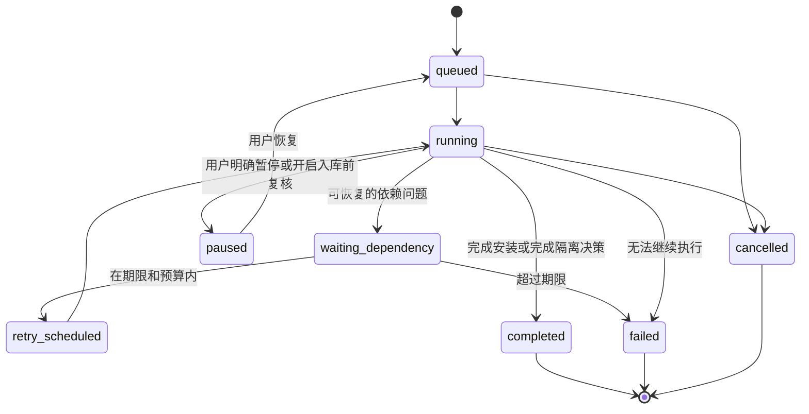

# Dictation 工作台自动化优化与代码实施方案

> 核查日期：2026-09-12。分析对象：当前工作区中的实际代码和本地内容，不以 README 或历史方案代替实现事实。
>
> 本文是待实施的设计与开发任务书。本次仅分析并编写文档，没有修改业务代码、批量通过内容、重新调用模型或执行入库。
>
> 用户目标：尽可能减少人的介入，尤其不再要求常规内容逐句、逐页复核；保留用户主动打开的人工复核和编辑能力。

阅读导航：[当前流程](#3-现在的工作方法和工作逻辑) · [问题清单](#4-问题清单及代码依据) · [默认自动化契约](#5-默认自动化与人工选项的产品契约) · [模块优化](#9-各功能模块的具体优化) · [前端改版](#10-前端信息架构与交互实施) · [开发任务](#13-可直接拆分执行的开发任务) · [验收场景](#15-必须通过的验收场景)

## 1. 结论与实施目标

现在工作台的主要问题是：**自动生产、质量判断、修复和入库没有形成统一闭环，很多技术性步骤最后交给了人。** 应把默认流程改为：

```text
添加素材 → 自动识别和去重 → 自动处理 → 机器校验 → 按问题定点修复
                                             ↓
                        达到目标用途要求 → 自动装入相应内容库
                        暂时缺依赖       → 有期限的自动等待与重试
                        证据不足/修复耗尽 → 自动隔离并结束本轮，不要求人接手

用户主动操作：查看结果 / 查看异常 / 打开人工复核 / 编辑 / 撤回某次变更
```

不是所有素材都能自动成为可靠练习内容。自动化的验收目标包含两部分：**合格内容自动可用；不合格内容自动停止、保留原因，并且不拖住其他任务。** 不能用“全部标为已复核”提高表面完成率。

优先实施以下六项：

1. 用真实质量问题生成异常队列，取消“没有手工保存记录就需要全量复核”的默认逻辑。
2. 建立持久化任务和统一调度，让自动入库、重试、恢复都在服务端完成。
3. 把模型分析从文字报告扩展成结构化问题、可验证补丁和局部重跑。
4. 接通 PDF 的抽取、独立对账、装配、校验、入库，解决“复核完成仍无法入库”。
5. 前端改为“添加素材、任务、内容库、设置”，人工编辑按需打开，技术参数默认折叠。
6. 分开记录机器验证、人工检查、学习用途资格、对外发布资格，避免相互冒充。

**成功路径的交互目标：用户选文件或粘贴链接后，只需要一次“开始自动处理”；之后无需选择模型、翻页、保存、点击通过或手动安装。** 文件选择不计入处理链中的人工复核动作。高级选项和手动模式不计入默认路径。

## 2. 核查范围、方法与当前基线

### 2.1 覆盖范围

主对象是 `src/studio_server.py` 和 `src/studio_web/`，即默认端口 4174 的制课工作台。学习端默认端口 4173，只在内容资格、入库可见性、学习记录兼容等关联位置纳入分析。

| 范围 | 核查对象 |
|---|---|
| 工作台界面 | 制课、教材入库、课程库、复核编辑器、运维五个页面 |
| 后台任务 | BuildJob、单项/批量构建、单项/批量模型分析、模型服务控制 |
| 内容生产 | 音频 ASR、视频字幕核验、PDF OCR、真题和词汇语法草稿 |
| 校验与修复 | 课程质量、候选修改、修订号、人工审听、词汇题资格、内容装配 |
| 内容消费 | 精听课程、词汇语法练习、真题、分发与发布判定的关联 |
| 实际内容 | courses、lexicon、exams、studio-work/builds 中已有结果的只读统计 |

另做了真实 Chromium 页面检查：1440×1000 和 390×844 两种视口，五个页面及一个 PDF 草稿详情。使用临时工作区引用已有只读产物、空 provider 配置，关闭真实模型/GPU探测；未运行生成、保存和安装。浏览器发现见 §4。**这不构成模型准确率测试或全流程入库验收。**

当前工作区已有大量未提交内容。本方案以检查时文件为准，后续执行前应重新核对函数与测试，不能直接重置工作区。

### 2.2 只读统计结果

| 项目 | 本次实测 | 对自动化的含义 |
|---|---:|---|
| 已安装精听课程 | 62 门，共 16,568 句 | 需要支持存量重新评估，而不只是优化新导入 |
| 工作台手工编辑记录覆盖 | 0 句 | 当前逻辑会把全部 62 门课程送入复核队列 |
| 课程机器审计，启用讲解检查 | 60 `needs_review`、2 `passed`、0 `failed` | `needs_review` 不能直接等同内容损坏或必须人工 |
| PDF 构建目录 | 40 个，39 个有 `build-result.json` | 不把缺结果目录自动算作已完成任务 |
| 有结果的 PDF 草稿 | 39 个，全部 `needs_review` 且 `reviewRequired=true` | 待复核状态是流程默认设置，不能代表逐份风险结论 |
| PDF 草稿类型 | grammar 18、word 6、exam 15 | 内容类型不同，不能共用一个“保存每页后入库”流程 |
| 草稿复核单位 | 合计 10,502 页，未发现 `review-progress.json` | 是保留草稿页数，可能有重复来源，不代表唯一教材页数 |
| word/grammar 草稿 | 24 个，只有 6 个抽取条目数大于 0 | 上游分类和版式抽取是关键瓶颈，不能只优化人工点击 |
| 工作台待复核首页 | 101 项：39 草稿 + 62 课程 | 真实浏览器显示，与源码统计一致 |
| 已有词汇语法包 | 2 包、516 条，包质量均 passed | 包级机器质量与题目资格不是一回事 |
| 其中 authored exerciseTemplates | 2,185 个，均为 `machine_checked`，正式资格为 0 | 需要新的机器验证资格；不意味着整个词汇模块没有可练题 |
| 已有真题文件 | 41 个 `exam.json`，机器审计均 passed | 结构通过不能替代答案真实性与来源验证 |

上述数字是 2026-09-12 的本地快照，不写进产品逻辑。README 中“两门课程”“2,085 个模板”等历史数字不能作为本次基线。存量精听还存在 ASR 质量字段缺失，但不同年代、不同来源的数据应分层评估，不能把缺某个新字段统一判为错误。

### 2.3 现有资产值得保留

- Python 本地服务、已有 CLI 构建器和原生 HTML/JS 前端可以继续使用，无需为了自动化全面更换框架。
- 已有 provider 具名配置、多模型 OCR、视频字幕与 ASR 核验、质量审计函数，是自动执行的基础。
- 草稿/课程编辑已有修订冲突检查、备份；继续扩展为统一补丁和发布事务。
- 已有内容 ID、修订号、补丁与别名机制，应尽量复用，保护学习进度。
- 运维已经从主表单拆出，不应再把完整 GPU 控制面板搬回主界面。

## 3. 现在的工作方法和工作逻辑

### 3.1 用户可见模块

| 模块 | 当前职责 | 当前需要人做的事 | 目标职责 |
|---|---|---|---|
| 制课 `/` | 音频/视频来源、模型选择、构建日志 | 选择多个技术参数；音频成功后点击安装 | 添加素材、确认目标，后台自动处理 |
| 教材入库 `/import.html` | PDF 上传、类型与等级、OCR 管线 | 等草稿，再进入编辑器逐页检查和命令行装配 | PDF 自动生产并进入真题库/词汇库/文档库 |
| 课程库 `/library.html` | 列出 `courses/` 的内容，跳转编辑 | 通过目录/标题找内容，再逐句编辑 | 聚合已安装内容，首要操作为预览/学习 |
| 复核编辑器 `/editor.html` | 待复核清单、逐句/逐页保存、候选修改、分析报告 | 全量复核、看报告、复制/保存模型结果、批量标记 | 主动打开的专业工具，默认只定位具体问题 |
| 运维 `/ops.html` | GPU/本地模型状态、启动停止服务 | 判断缺什么模型、何时启动、何时重试 | 日常自动管理依赖，页面用于诊断和高级设置 |

### 3.2 音频流程


代码事实：`studio_jobs.js` 的 `applyJob()` 只显示安装按钮，`install()` 由点击触发，没有在成功回调中自动安装。批量构建也没有全批自动装库闭环。不要把 README 的“一键装入”理解为服务端自动完成。

### 3.3 视频流程

用户粘贴链接、探测来源，选择字幕策略及语言，再启动 `build_video_course.py`。已有字幕+本地 ASR 双源核验选项，构建器直接写入课程目录；与音频 ZIP 安装流程不同。

问题不在于完全没有自动入库，而在于**没有统一的候选区和安装状态协议**：音频“构建成功但尚未安装”、视频“直接写最终目录”、PDF“结果路径指向草稿”被挤进近似的界面状态。后续应统一为候选产物验证后提交，避免半成品被发现为正式内容。

### 3.4 PDF 流程


`build_pdf_course.py` 已自动完成 OCR 和部分结构化，但结尾统一写 `reviewRequired=true`。`Studio.install()` 对 PDF 直接拒绝；保存页面和批量标记并不自动触发装配。页面写着“已复核草稿可入库”，实际没有完整的对应动作。

PDF 不只差“减少检查次数”。当前抽取器存在版式适配不足：例如教材按“周/日”组织的假设不适合所有词汇、汉字和综合参考书。24 份词汇/语法草稿中 18 份为零条目，应先分类为抽取失败或不支持，而不应生成几百页的人工复核任务。

### 3.5 模型复核与人工复核实际是不同系统

| 当前机制 | 实际记录/产物 | 能证明什么 | 不能证明什么 |
|---|---|---|---|
| `workbenchEdits`、`review-progress.json` | 保存过的句子 ID/页面名 | 存在编辑或标记操作 | 不证明用户审听，也不证明当前版本内容正确 |
| 单句/单页模型修订 | `proposal`，`saved:false` | 模型给出一份候选 | 不表示已应用、已复验或已入库 |
| 整课/批量模型分析 | Markdown 报告 | 模型给出分析意见 | 不会自动成为可执行问题单或补丁 |
| `human_review.py` | 绑定内容/音频版本的人工检查证据 | 满足对应人工检查契约 | 不能由机器或“批量标记”自动生成 |
| 词汇 authored 模板 review | 状态、reviewer、contentHash | 对应题目的审核资格 | 不等于整个包审计通过 |

新的自动化系统应为机器验证建立自己的证据和状态，不能借用人工身份字段。

## 4. 问题清单及代码依据

P0 表示先修正状态、证据和数据可靠性；P1 表示自动化主链；P2 表示进一步降低操作和资源成本。

| 优先级 | 问题 | 当前依据 | 优化要求 |
|---|---|---|---|
| P0 | 全部未手工编辑内容默认待复核 | [studio_server.py](../src/studio_server.py) `_course_review_progress()` 约 1058 行、`review_targets()` 约 1071 行 | 队列由未解决 issue/显式人工请求产生 |
| P0 | PDF 永久停草稿，没有安装闭环 | [build_pdf_course.py](../src/build_pdf_course.py) `build()` 约 529 行；`Studio.install()` 约 1031 行 | 按资格装配和提交，失败有具体终态 |
| P0 | 编辑历史被当作质量凭据 | `save_course_sentence()`、`batch_approve()`；[human_review.py](../src/human_review.py) | 分离 edit history、machine evidence、human evidence |
| P0 | 草稿原图请求鉴权错误 | [editor_draft.js](../src/studio_web/editor_draft.js) `loadDraftImage()` 第 66 行使用不存在的 `state.token` | 统一通过 Core 的带 token 二进制请求加载；失败明确显示原因 |
| P0 | HTML hidden 被局部样式覆盖 | [editor.css](../src/studio_web/editor.css) 与 editor.html 的隐藏面板 | 建立 `[hidden]` 隐藏不变量并做真实浏览器回归 |
| P0 | 首次状态探测先于会话初始化 | [studio.js](../src/studio_web/studio.js)、[editor.js](../src/studio_web/editor.js) 先 `wire()/mount()` 后 `session()` | 会话成功后才启动需要鉴权的轮询 |
| P0 | 工作台编辑审计没有检查完整讲解质量 | `course()`、`save_course_sentence()`、`batch_approve()` 使用 `require_enrichment=False` | 按用途执行完整检查，未通过不能显示学习就绪 |
| P1 | 音频需手动安装、视频直接落正式目录 | [studio_jobs.js](../src/studio_web/studio_jobs.js)、`start_video_build()` | 自动安装归服务端，统一候选区与提交协议 |
| P1 | 重启恢复不完整 | `Studio.__init__()`、`_restore_review_drafts()`、`_restore_analyses()` | 持久化所有任务阶段、输入、预算、检查点与失败原因 |
| P1 | 调度为内存线程/子进程，批次间无统一资源约束 | `start_batch_build()`、`_run_batch()`、`_run_job()` | 统一任务仓库、worker lease 和 CPU/GPU/模型资源槽 |
| P1 | 模型分析不产出可自动执行的修复 | `revise_*()`、`_run_analysis()`、`_run_batch_analysis()` | issue→patch→验证→应用→复验闭环 |
| P1 | 仅给模型 OCR/文本，却让其承担原始内容核对 | `revise_draft_page()`、`_analysis_items()` | 涉及原文、答案、时间轴的修复必须携带原图/原音频定位证据 |
| P1 | PDF 识别与抽取失败转成人工整本检查 | `classify_document()`、[lexicon_import.py](../src/lexicon_import.py) | 页型识别、版式适配、零产出检测、独立覆盖率对账 |
| P1 | 课程库分类有 PDF，数据却仅来自 courses | `Studio.courses()`、[install_course.py](../src/install_course.py) `list_courses()` | 统一聚合 courses/exams/lexicon/document 实际内容 |
| P1 | 已有 authored 词汇题受人工状态硬限制 | [lexicon_exercise.py](../src/lexicon_exercise.py) `qualification()` 约 49 行 | 增加可验证的自动资格，先从可机械校验题型开放 |
| P1 | 前端轮询失败即停；任务选择会被 active 任务覆盖 | `studio_jobs.js` `poll()` 约 112 行 | 自动退避重连、保留当前选择、完整任务历史 |
| P2 | 上传重复识别不足 | `store_upload()` 与每次新建 build 的方式 | 按源哈希、管线版本、参数复用，避免整本重复 OCR |
| P2 | 顶层暴露模型、绝对路径和工程说明 | index/import.html、studio_setup.js | 主界面呈现处理目标和结果；工程信息移到高级/详情 |
| P2 | 固定多模型状态和人工启动维护成本高 | `LOCAL_MODEL_*`、ops 页面 | 按任务需求检查和启动允许管理的服务，不要求全部在线 |

浏览器核查确认：五页未出现未捕获 JS 异常，390px 下页面根节点未发生横向溢出；但初始状态请求和 PDF 图片请求出现 403，PDF 原图呈现破图。还观察到未进入连续复核时多课导航仍显示、打开草稿时待复核选择面板仍显示。因此现状不能只评价为“布局太复杂”，还包括可见性与初始化次序错误。无 JS 异常不代表功能正确。

## 5. 默认自动化与人工选项的产品契约

### 5.1 默认配置

```json
{
  "automationMode": "auto",
  "manualReviewMode": "off",
  "autoInstall": true,
  "exceptionAction": "quarantine",
  "networkPolicy": "local_only",
  "qualityPolicyId": "personal-learning-v1",
  "retryPolicyId": "bounded-local-v1"
}
```

这是**拟新增的配置契约**，当前代码尚不支持。`local_only` 表示默认不向云端模型发送原始内容；导入远程视频仍需要访问用户提供的视频来源。网络策略必须分开规定内容来源访问与模型数据发送，不能用一个字段误拦视频，也不能自动换云端。

`manualReviewMode` 的语义：

| 值 | 行为 |
|---|---|
| `off`，默认 | 成功后自动入库；异常自动隔离，不要求用户处理 |
| `on_demand` | 自动主链相同，但用户可把具体对象加入人工工作清单 |
| `before_install`，用户主动开启 | 对该任务的最终提交设置人工 hold；机器处理仍照常执行 |

UI 中默认只需要“入库前由我复核”开关，默认关闭；“打开人工编辑”始终可从详情的更多操作进入。后台支持以上枚举，避免把“能不能打开编辑器”和“是否阻止自动安装”混为一个布尔值。

人工选项关闭时：

- 不自动跳到编辑器，不要求“确认通过”，不创建全书逐页待办。
- 可以显示“3 个问题已自动隔离”，但通知不要求用户必须处理。
- 单项失败不能中断其他独立素材的处理；同一内容内部存在依赖时，只停止受影响子图。
- 无法确定的答案、原文、结构不进入正式计分/练习；原件和可预览产物仍可保留。
- 用户未来开启人工功能，可以从问题直接定位到句子、页面、题目或条目。

### 5.2 用途资格必须分开

建议新增 `capabilities`，至少区分：

| 用途 | 最低检查 | 不应默认要求 |
|---|---|---|
| 原件/草稿预览 | 文件安全可读、明确草稿状态 | 全量人工检查 |
| 本地精听/听写练习 | 媒体可用、时间轴有效、原文具备足够证据；听写答案可评估 | 对每句点击保存 |
| 含翻译讲解的完整学习课程 | 上述条件 + 翻译/讲解完整性与一致性检查 | 重复查看所有无问题句子 |
| 词汇客观题正式计分 | 题干、答案、变体、唯一性/可接受范围通过对应校验 | 所有类型无差别人工签字 |
| 真题正式计分/模考 | 题号、选项、答案源、计分范围、关联材料完整 | 无问题题逐题手工标记 |
| 对外发布/再分发 | 延续现有 release/distribution 的独立条件 | 不能因本地 auto_ready 自动获得该资格 |

结构检查通过是必要条件，不是全部条件。关闭人工复核不会关闭内容验证。对外发布限制属于当前项目已有的独立契约，本次自动化方案不通过改字段绕过它。

### 5.3 部分可用的边界

允许合格内容先可用，但必须按用户能理解的范围发布：

- 精听：可以提供明确标注的可用片段，显示缺失区间；不得宣称全文完整。
- 词汇：可发布完整且通过对账的单元；未完成单元不进入“全书已完成”进度。
- 真题：可发布经验证的专项题集；缺题/缺答案时不自动宣称整卷或完整模考可用。
- 只有达到目标类型 schema、引用完整性和覆盖率要求的子集才可以独立提交；不能把失败条目删掉后让原有“整包通过”检查自然变绿。

第一阶段可以只支持整件合格后入库；不具备独立子集发布能力时整件隔离。部分发布应作为明确实现任务，不是隐含兜底。

## 6. 后端目标架构与持久化任务

### 6.1 在现有工程内渐进拆分

不引入新的分布式队列作为第一步。首版使用 Python 标准库 SQLite 保存任务，单机 worker 执行已有构建器。`studio_server.py` 当前约 2,853 行，应逐步保留 HTTP 接口与编排入口，业务逻辑迁入独立模块。

```text
studio_server.py                 HTTP、认证、输入验证、旧接口兼容
  ├─ studio_job_store.py         SQLite 任务、阶段、事件、租约、幂等键
  ├─ studio_pipeline.py          阶段依赖、恢复、调度、取消
  ├─ studio_resources.py         模型/GPU资源槽、依赖准备、超时
  ├─ studio_assets.py            上传素材、源哈希、重复来源与缓存索引
  ├─ studio_artifacts.py         各类产物、提交/回滚、内容库聚合
  ├─ quality_issues.py           问题、检查和证据 schema
  ├─ quality_policy.py           规则到用途资格的统一决策
  ├─ studio_repair.py            修复计划、候选补丁、局部重验
  └─ studio_analysis.py          结构化分析；Markdown 由结构化结果生成

现有构建器和审计函数通过 adapter 接入，先复用，再拆内部阶段。
```

以上为拟新增文件名；实施前检查重名，不覆盖现有功能。首版阶段可用有依赖的有序任务列表实现，不要求上复杂 DAG 引擎。

### 6.2 分离四类状态

一个 `status=needs_review` 不能同时表达运行阶段、质量、人工义务和是否入库。

| 维度 | 建议枚举 | 说明 |
|---|---|---|
| `executionStatus` | queued / running / waiting_dependency / retry_scheduled / paused / completed / failed / cancelled | 执行状态；`paused` 仅用于明确暂停/人工 hold |
| `qualityDecision` | pending / passed / limited / rejected / unknown | 机器基于证据形成的决策 |
| `availabilityStatus` | candidate / installed / installed_partial / quarantined / rolled_back | 内容在何处、是否可消费 |
| `humanReviewStatus` | not_requested / requested / in_progress / completed / stale | 只描述用户主动参与的检查 |

任务额外带 `outcomeCode`，例如 `installed`、`duplicate_reused`、`source_incomplete`、`unsupported_layout`、`quality_rejected`、`dependency_timeout`、`budget_exhausted`。质量隔离可为 `executionStatus=completed`、`availabilityStatus=quarantined`；处理已结束，但产物不可用于指定练习。基础设施错误为 failed。前端不能把所有 completed 渲染成绿色“可学习”。

阶段名统一为：`ingest → preflight → extract → structure → enrich → validate → repair → assemble → verify_artifact → install`。不适用阶段记 `not_applicable`，不能虚称已经运行。repair 可返回 validate，但次数由预算限制。



重试已结束任务应产生新的 attempt 或关联的新任务，保留上一轮的终态和报告；不能抹掉失败史。隔离项只有输入、策略、代码版本变化，或者用户明确重试时才重新计算。

### 6.3 SQLite 最小表结构

数据库放 `studio-work/studio.sqlite3`，启用 WAL、外键、busy timeout 和事务迁移。不要与学习进度数据库混用。

| 表 | 最少字段 |
|---|---|
| `assets` | id、source_kind、source_sha256、canonical_source_key、stored_path、metadata_json、created_at |
| `jobs` | id、batch_id、asset_id、target_type、policy_id/version、policy_snapshot、pipeline_version、params_json、execution_status、outcome_code、quality_decision、availability_status、manual_review_mode、cancel_requested、budget_limit_json、budget_used_json、budget_reserved_json、attempt、version、created_at、finished_at |
| `job_steps` | id、job_id、stage、item_id、input_digest、status、attempt、lease_owner、lease_epoch、lease_expires_at、checkpoint_ref、result_ref、started_at、finished_at |
| `job_events` | seq INTEGER PRIMARY KEY AUTOINCREMENT、job_id、type、payload_json、created_at |
| `issues` | id、job_id、subject_id、revision、code、severity、status、blocked_capabilities_json、evidence_refs_json、repair_attempts |
| `evidence` | id、subject_id、revision、check_id/version、input_hashes_json、result、artifact_ref、created_at |
| `patches` | id、job_id、subject_id、base_revision、patch_hash、status、evidence_refs_json、result_revision |
| `artifact_versions` | id、logical_content_id、artifact_revision、content_revision、kind、manifest_ref、validation_ref、install_state、created_at |
| `idempotency_keys` | scope、key、request_digest、response_ref、created_at；scope+key 唯一 |

长日志、原始模型输出、大报告放文件；数据库保存索引和摘要。API 不把本地绝对路径作为前端可任意访问的资源句柄，只返回服务端生成的 ID 和允许的资源 URL。

### 6.4 断点恢复与幂等

1. 提交 API 先落库再返回 `202`，进程异常不能让用户拿到不存在的任务。
2. worker 在短事务内领取 lease并递增 `lease_epoch`；模型调用不占数据库长事务。checkpoint、补丁应用和安装前必须校验epoch仍是最新，拒绝过期worker的晚到结果。
3. 每阶段完成先写校验后的不可变结果，再提交 step 成功和 checkpoint。
4. 启动时检查过期 lease，不直接把 running 改成成功。核对并终止或隔离旧worker/子进程，使其失去写入资格，再安全重跑当前阶段。只检查lease过期时间而没有epoch隔离会造成两个worker同时提交。
5. checkpoint 复用要求 source hash、参数、provider/model版本、prompt版本、extractor版本一致。模型版本不可确定时标 unknown，并采用保守缓存策略。
6. 请求幂等键相同且请求摘要相同返回同一任务；同键不同请求返回 `409`。
7. 相同 patch hash 已应用不再重复应用；安装提交有独立幂等键。
8. 安装过程被中断后，通过提交日志判断仍是旧版还是新版，不能重复导入、覆盖学习记录。

预算在调用前事务预留，调用后结算，重启必须恢复已用/预留数量和取消标记；不因新attempt把任务总预算归零。已发出但结果未知的调用保守计入消耗或待核实额度，避免进程反复重启获得无限重试预算。

当前日志用截断为 4,000 行的 list 长度充当 cursor，达到上限后可能收不到新日志。新接口用**单调递增事件 seq**，与保留条数无关；过期 cursor 返回 `cursorExpired=true` 和快照恢复位置。

### 6.5 调度、资源与停止

- 同一来源/同一版本阶段去重；同一目标内容只能有一个提交者。
- GPU 任务按设备和 profile 并发限制调度；默认单个重型本地推理槽。CPU 解压、解析、哈希可独立限流。
- 已配置的本地服务可以按需自动启动；只启动当前任务所需服务，不要求全部模型在线。
- 运维“停止全部”需识别在用服务：默认先排空依赖任务，再停止；强制停止应明确显示影响的任务。
- 未配置模型时不能让浏览器提交任意命令；继续只接受可信配置中的 profile ID。
- 取消设置持久化 `cancel_requested`，传播到模型请求和子进程树；先温和终止，再超时强制终止，释放 lease。
- 安装提交的短临界区必须可恢复：取消到达时若已提交，返回“已完成提交，后续未执行”，不能伪称内容未安装；回滚作为独立动作。
- 临时音频、渲染图、失败候选按保留策略清理；当前安装版本、来源追溯证据、未保存人工草稿不得误删。

### 6.6 初始自动重试预算

下列是实施起点，需要用实际耗时标定，**不是已证明最优的配置**：

| 预算 | 初始建议 |
|---|---|
| 确定性修复 | 每规则每内容版本只执行一次 |
| 模型语义修复 | 每问题最多 2 轮，每轮最多生成者/验证者各 1 次调用 |
| 暂时网络/服务错误 | 同一步最多 3 次，指数退避加抖动；服从上层总预算 |
| 模型服务等待 | 例如 10 分钟；按模型启动历史耗时配置 |
| 页/句处理耗时 | 按任务单位设置；大书总预算由页数和单页限额推导 |
| 全任务预算 | 显式记录剩余调用数、运行时间、可计量费用；任一耗尽即停止新增调用 |

不能让“每阶段 3 次”“每问题 2 轮”“每供应商重试”相乘造成无界调用。所有底层调用从同一个任务预算扣除；调用是否计费未知时记录 unknown，不默认当免费。未来云端模式需使用用户已保存的额度策略。

## 7. 质量决策、证据与结构化问题

### 7.1 检查结果采用四值逻辑

每条 check 的结果为 `pass / fail / unknown / not_applicable`。`unknown` 是没有足够证据；`not_applicable` 需有规则适用性依据。不能把缺字段当通过，也不能把所有未知都变为人工任务。

建议规范产物：

```json
{
  "schemaVersion": 1,
  "subject": {"kind": "course_sentence", "id": "s-012", "revision": "sha256:..."},
  "checkId": "transcript.source_alignment",
  "checkVersion": "1",
  "result": "unknown",
  "severity": "blocking",
  "blockedCapabilities": ["dictation_scoring"],
  "reasonCode": "source_evidence_missing",
  "inputHashes": {"text": "sha256:...", "media": "sha256:..."},
  "evidenceRefs": [],
  "observed": null,
  "threshold": null,
  "createdAt": "2026-09-12T00:00:00Z"
}
```

Issue 从失败/未知检查派生，包含：稳定 issue ID、对象与位置、风险等级、受影响用途、自动修复动作、来源证据、当前状态、已尝试次数。相同 `subject+revision+code+location` 合并，避免每次分析新增一堆重复问题。

`severity` 与 `automationAction` 分开：严重问题也可能机械可修，轻微问题也可能没有足够证据自动改写。

### 7.2 决策矩阵

| 问题 | 默认处理 | 自动通过条件 | 处理后仍不确定 |
|---|---|---|---|
| 标点/Unicode/空白/字段别名 | 确定性规范化 | 语义与锚点不变，schema 通过 | 保留原值并记录 notice |
| 翻译/讲解缺失 | 局部生成与验证 | 源文绑定、覆盖完整、没有关键实体/数字矛盾 | 仅停用依赖字段的完整课程能力，或隔离整件 |
| 译文/讲解已有乱码或矛盾 | 即使 enrich 可选也检查 | 原有内容合法性、实体/否定/数量一致 | 不能因 `require_enrichment=False` 放过损坏字段 |
| 低置信/速度异常/超短超长句 | 结合来源定点复查 | 媒体和时间轴证据通过；阈值已按来源标定 | 受影响片段不进入正式听写 |
| 正文 OCR 漏字/复杂版式 | 原图区域再识别、版式专用抽取 | 图文锚点、覆盖率、结构和局部检查共同通过 | 隔离页/单元；不把整书推给人 |
| 零条目/零题目 | 检查类型、页型和抽取器支持情况 | 重路由后有有效产出且覆盖检查通过 | `unsupported_layout` 或 `extraction_empty` 终态 |
| 目录与正文数量不符 | 对缺失单元/范围重新抽取 | 独立目录/索引账本与条目身份映射一致 | 不允许用实际抽取量覆盖预期量 |
| 真题答案缺失/冲突 | 定位印刷答案来源并重新读取 | 题号映射、范围、原图证据充分，无未解决冲突 | 预览可用，正式计分不可用 |
| 多义词/题目多解 | 按义项/读音上下文校验 | 接受答案集合清晰，干扰项有排除依据 | 改为自评或暂不投放该题 |
| 来源版权/分发条件未知 | 保持既有来源限制 | 来自真实已有记录/规则的结论 | 本地质量通过不改变分发状态 |
| 模型离线/资源不足 | 自动准备、等待、有限重试 | 依赖就绪 | 依赖超时结束，不无限挂起 |

当前课程 2,913 条 warning 中，2,418 条是翻译/讲解缺失，54 条是 `transcript_review_flag`，其余 441 条包括速度、句长等规则风险。应优先自动补齐学习字段，对原文风险定点重验，而不是复核所有 16,568 句。

### 7.3 证据要求

- 证据由服务端分配 ID，模型只能引用允许集合。不存在的页码、坐标、片段 ID 必须拒绝。
- 原图证据记录源 PDF hash、页码、坐标、渲染参数和裁剪 hash；音频证据记录媒体 hash、时间范围、转写器和原始结果。
- 生成模型不能用“我有 99% 把握”作为校验结果；ASR 的 confidence、`exp(avgLogprob)` 不是经过校准的正确概率。
- 两模型一致是信号，不能代替来源、覆盖和结构检查；不同 profile 若实际上使用同模型，也不能假装是两个独立验证器。
- 只给模型 OCR 文本，就不能声称它已经核对扫描原图；只给转写文本，就不能声称它听过音频。
- 内容/答案/时间改变后，使依赖该字段的旧证据失效；不能沿用旧 confidence、asrQuality 或人工记录继续显示通过。
- Markdown 报告是便于阅读的派生产物；机器执行结构化 JSON，不解析截断的自然语言报告。

## 8. 自动修复闭环与变更保护

### 8.1 修复执行步骤

```text
读取源版本 → 收集 issue → 选择规则/模型和最小上下文 → 生成补丁候选
→ 校验补丁结构与证据 → 应用到隔离候选 → 重验受影响检查与全局不变量
→ 比较原候选与新候选 → 接受有效改进 / 丢弃退化候选
→ 达到用途条件则提交；仍有问题则在剩余预算内继续或隔离
```

修复单位优先是字段、句子、题目、条目或页区域；不能发现一处错字就重跑整本 PDF 或整个课程。翻译可批处理，但同一批内各条目保留独立结果、失败原因和进度。

### 8.2 补丁契约

```json
{
  "schemaVersion": 1,
  "patchId": "patch-uuid",
  "subjectId": "course-123",
  "baseRevision": "sha256:old",
  "sourceSha256": "sha256:media",
  "issueIds": ["issue-123"],
  "operations": [
    {
      "op": "replace_field",
      "itemId": "s-012",
      "field": "translation",
      "expectedValueHash": "sha256:old-field",
      "value": "候选译文",
      "evidenceRefs": ["evidence-456"]
    }
  ],
  "idempotencyKey": "job-step-inputdigest"
}
```

首版只允许 `replace_field` 白名单；拆合句、移动条目、修改答案等用独立操作类型和验证器。现有 `content_patch.py` 有摘要绑定和区间检查，应复用这些保护，不另写一个随意覆盖 JSON 的路径。

必须拒绝：未知字段、越界时间、NaN/Infinity、重叠补丁、跨对象写入、伪造证据、过期修订、超出授权 profile 的命令或地址。模型输出始终是候选数据。

### 8.3 接受候选的必要条件

1. 没有新增 schema/引用/媒体硬错误。
2. 目标 issue 被有效消除，或得到可衡量改善；相同补丁和反复往返修改立即停止。
3. 不通过删掉难句、减少题数、丢失例句来“改善审计分数”。比较语音覆盖、正文范围、条目数、答案覆盖、来源引用。
4. 时间轴修改不越媒体长度，不产生非预期重叠；原文改动有对应来源支持。
5. 修改提交使用目标锁和 `baseRevision` 比较；冲突返回 `409`，不后写覆盖先写。
6. 不直接改当前安装版本；在不可变候选上重验后提交。

### 8.4 停止条件

每个修复循环必须能因以下条件退出：全部通过、没有支持的修复动作、来源缺失、连续无改善、候选退化、次数/时间/费用耗尽、用户取消。输出保存“尝试过什么、为什么没有继续、现在哪些能力可用”。不以 `needs_review` 无限等待替代结束。

### 8.5 人工修改与自动任务并存

打开编辑器不自动暂停整个生产队列。用户真正进入编辑时，对当前对象建立短期编辑 lease 或独立草稿分支；自动生成可以继续，但该对象提交必须检查修订和 lease。

保存编辑和声明人工检查是两个动作。保存仅更新草稿并触发重验；只有用户明确选择已检查的项目，才生成绑定当前 revision 的人工记录。用户没有开启人工模式时，后台绝不调用 `batch_approve()`、写 reviewer 或生成人工 attestation。

## 9. 各功能模块的具体优化

### 9.1 上传、素材识别和去重

**输入尽量统一，内部处理按内容类型分流。** 音频/PDF 拖拽与视频链接可以出现在同一个添加页，但不要把 PDF 假装成听写课程 manifest。

实施要求：

- 支持追加文件、移除未提交项、只重试上传失败项；已经成功上传的项不能因第二次选择文件被清空。
- 文件流式落临时文件并计算 SHA256，完成后再登记，避免单次把 512 MB 文件全部读入内存。
- 上传成功和生产完成是不同状态；提交失败保留上传成功的 asset，可再次提交。
- 重复源按哈希关联已有任务和成品。源相同、参数和管线相同则复用；源相同但算法版本更新则创建关联重处理任务。
- 视频键包含规范化平台标识、videoId、截取范围和语言策略；还要记录所取字幕/音轨的实际内容 hash 与提取时间，不能认为相同 URL 永远同内容。
- 标题和等级可自动推断，但允许 unknown、多等级和用户覆盖；`N1-N5` 参考书不能仅因首个匹配就当成 N1 教材。
- 正式 `courseId/packId/examId` 首次确定后保持稳定，标题变更不重建身份。重复源是否同一内容由内容注册表管理。

### 9.2 音频和视频

音频新增自动提交选项，并默认开启；这一动作由 pipeline 的 install stage 执行，不依赖浏览器仍在轮询。成功后任务返回真实安装 revision 和学习入口。

自动检查建议按风险分层：

1. 全量机械检查媒体可读、句子非空、时间范围、顺序、重复、异常语速、标点和学习字段。
2. 有原始 ASR diagnostics 时保留并正确绑定；旧素材没有该字段时依据其实际来源选择验证方式。
3. 只对规则异常、字幕冲突、讲解指出误听、关键数字/人名等目标做第二轮识别或对齐。
4. 将源文、译文、讲解作为同一内容版本检查，重点检查否定、数量、专名和逻辑矛盾。
5. 原文修改后使依赖旧原文的翻译/讲解校验失效，按需重生成；只改译文不要求重跑 ASR。

视频保留已有字幕+ASR能力；自动探测字幕与源音轨是否可获得，并记录实际采取的路径。原站媒体暂不可用、字幕与 ASR 明显冲突时有限重试，超限给出受限能力或隔离状态，不能静默选“读起来更自然”的文本。

音视频统一先产候选再安装。将 `build_video_course.py` 的直接写正式目录路径改为可指定 staging，避免部分生成失败时影响原有课程。

### 9.3 PDF OCR 与版式

当前 `build_pdf_course.py` 的 OCR 参数会传 `--force`，且异常页重试路径会删除旧页面缓存。建议重构成下面的页级策略：

```text
识别每页类型和文字层质量
├─ 可用文字层：先解析文本+坐标，校验乱码、阅读顺序、覆盖
├─ 扫描页：首轮 OCR
└─ 复杂/异常区域：裁剪区域的第二路 OCR/视觉核验
       ↓
保留候选 A/B/C + 质量检查 → 选择合格候选 → 结构化抽取
```

- 不能因为 PDF 有文字层就完全跳过图形、表格和注音；需要检查提取质量，必要区域继续 OCR。
- 同一页失败只重跑该页或裁剪区域；正常页不轮流调用三种模型。
- 第二轮质量更差时保留第一轮，不能先删除唯一好结果再覆盖。
- 页型至少包括封面、目录、正文、索引、练习、答案、空白、混合；空白页不生成“没有条目”的错误，正文页零产出需报错。
- 版式 adapter 至少区分周/日语法教材、图解词汇、多栏汉字/词汇表、真题、一般文档；版式不支持时明确结束为 `unsupported_layout`。
- 混合文档可按章节路由不同抽取器；全文关键字投票不能决定每页都按同一模板处理。

### 9.4 PDF → 词汇/语法内容包

完整自动路径应是：

```text
正文页抽取 + 独立索引/目录/单元证据抽取
→ 页/单元/条目锚点对齐 → 数量与身份对账
→ 释义/接续/例句补齐 → 来源与新增内容分别标注
→ assemble_pack → audit_pack → 模板资格校验 → 原子装入 lexicon
```

具体要求：

- 现有 `units.txt` 的 `?` 不能直接替换为正文抽出来的数量。应从印刷索引、目录计数或经过验证的独立清单得到 expectedCount。
- 独立区域可以来自同一本书，但要有不同的提取路径和原始区域证据；这仍不是“绝对正确”的保证，必须结合覆盖、身份映射和版式检查。
- 只有标题没有条目数的目录，不能凭空补数字。若仍要自动装配，需新增适用于该版式的覆盖契约并验证；在此之前保持隔离，不能绕过现有对账。
- 对账不只比较总数：逐单元、逐索引键、来源页范围检查，防止“漏一条、重复一条”后总数恰好一致。
- 中文原书已有时优先抽取，字段来源标为教材 OCR；模型新增译文/例句标为生成补充，不能伪称原书内容。
- 周/日抽取失败不应反复让通用模型改整页 JSON；需要增加适配器与有代表性的页型 fixture。
- 首次确定 `packId` 后冻结，保留 `entry-keys.json` 身份注册表；正式包 ID 不能随着上传文件名或标题变化。
- 已有 [词汇语法草稿装配计划](词汇语法草稿装配计划.md) 可作为六份具体草稿的样本和已知版式问题来源。该文中的单本处理步骤需转为可重复的 adapter 和证据提取任务，避免继续依赖每本手写修复脚本。

### 9.5 词汇题的自动资格

包审计通过和题模板可用于正式判分必须单独计算。推荐保留 `reviewStatus` 的现有人类语义，新增：

```json
{
  "verification": {
    "status": "auto_verified",
    "policyId": "lexicon-reading-v1",
    "contentHash": "sha256:current-question",
    "checkRefs": ["check-a", "check-b"],
    "verifiedAt": "2026-09-12T00:00:00Z"
  },
  "humanReview": {"status": "not_requested"}
}
```

`qualification()` 支持“有效人工记录”或“当前策略允许的有效自动证据”。但必须先执行撤回和对象状态的硬否决：模板 `withdrawn`、条目 `draft/disputed/retired` 等现有限制不能被OR分支绕过。解除撤回需要独立恢复记录和重验，不能因为旧verification仍有效就重新投放。仅有 `auto_verified` 字符串而缺证据、hash过期、策略不适用于该题型，一律不能成为正式题。

| 题型 | 自动资格检查 | 处理优先级 |
|---|---|---|
| 读音/受控表记 | 词典允许的表记-读音-义项组合、来源一致、接受变体规则 | 首批 |
| 例句填空 | 答案重插可还原句子、目标唯一、可接受活用受控 | 首批 |
| 释义选择 | 正确义项来源、上下文、每个干扰项排除、多解检测 | 第二批 |
| 语法排序 | 正确序列、等价排列、语法语义与上下文 | 第二批，未达到证据要求先保留自评 |
| 听力题 | 媒体真实可播放、目标区间、答案与音频关联 | 依赖音频验证后开放 |
| 开放表达/写作 | 不强求伪精确唯一答案，提供参考与自评 | 不自动归入确定性客观判分 |

不能把存量 2,185 个 `machine_checked` 模板批量改状态。按题型在后台重新评估，合格一个开放一个；失败项不阻止其他题型。仍保留源码派生的现有结构题路径。

### 9.6 PDF → 真题

完整自动路径：页型识别 → 题目/文章/图表抽取 → 题号和跨页关系恢复 → 印刷答案表独立读取 → 答案映射校验 → assemble_exam → audit_exam → 用途资格 → 入库。

- 原答案表存在时，自动定位、读取、记录原图坐标和 hash；题号连续性、部分/大题边界、选项范围、缺格、多格必须检查。
- 答案源缺失时，不能让模型自行解题并冒充原始答案表。可另存“模型参考解答”，但不据此开放原卷正式计分。
- 不同提取通道冲突时重查原图；无法裁决则隔离相关题/试卷能力。
- 跨页文章、图片、表格、听力素材必须能解析到实际资源；有选项而无音频的听力题不获得完整听力能力。
- 先接现有文件型题库安装；若同时接数据库版 `/api/v1` 发布，必须通过相同资格服务。当前数据库发布的权利检查不能代替内容审计和答案证据检查。
- 原印刷答案存在争议时保留 `keyNote` 等记录，不能用自动“修正”抹去争议来源。

### 9.7 分析与报告模块

整课分析保留为高级诊断，但不再是常规制作必经步骤。自动流程调用按 issue 定位的小范围分析，规范输出结构化结果。

报告摘要至少给出：处理范围、自动修复数量、剩余问题、每个问题影响什么用途、失败原因、来源和版本、总调用数/耗时。默认不要求用户读长报告才能操作。

每一分析批次独立保存结果和 checkpoint。部分批次失败明确呈现 partial，不得只要有一份汇总 Markdown 就恢复为“全量分析成功”。旧版本分析不能作为当前版本通行凭据。

## 10. 前端信息架构与交互实施

### 10.1 主导航与页面关系

推荐四个一级入口：**添加素材｜任务｜内容库｜设置**。人工复核从任务/内容详情中的“更多 → 手动复核与编辑”打开。保留旧 `editor.html?course=...`、`?build=...` 深链接。

可以继续采用多页 HTML，不强制 SPA 或框架迁移。先复用 `core.js` 和现有页面模块，再抽共享导航、状态、任务列表、详情与表单组件。

| 页面 | 主要内容 | 默认收起/移出 |
|---|---|---|
| 添加素材 | 拖拽/链接、自动识别摘要、一次提交 | 模型 profile、字幕语言顺序、OCR管线、严格模式、路径 |
| 任务 | 全部任务、阶段、完成结果、异常筛选、单任务重试 | 原始日志、模型原文、硬件明细 |
| 内容库 | 真实内容类型、可用能力、标题、规模、学习/预览入口 | 文件夹名、复核计数、底层存储路径 |
| 设置 | 默认策略、人工开关、模型服务、资源预算、保留策略 | 不把设置作为每次生产前置步骤 |
| 任务详情 | 当前阶段、问题摘要、自动处理记录、产物与限制 | 手动编辑默认关闭 |
| 手动编辑 | 问题定位、原始证据、字段编辑、差异、保存和检查记录 | 整页 JSON 只保留专家模式 |

### 10.2 添加素材页线框

```text
添加素材      任务 3      内容库      设置                   自动处理可用

┌─────────────────────────────────────────────────────────┐
│ 拖入音频 / PDF，或粘贴视频链接                            │
│ lesson.mp3  上传完成  日语音频                            │
│ grammar.pdf 上传完成  语法教材 · 等级待识别               │
└─────────────────────────────────────────────────────────┘

处理后自动加入内容库
[ ] 入库前由我复核                   [更多设置 ▾]
[开始自动处理 2 项]

最近任务       当前阶段                 结果/操作
lesson.mp3     自动校验 18/25 句         查看进度
words.pdf      已完成                   打开词汇包
exam.pdf       已结束 · 缺可核验答案     预览原件 / 查看原因
```

此为布局草图，示例数字非当前任务。只需显示与用户决策有关的信息，后台命令和“浏览器可能执行任意程序”等实现说明放到帮助/高级设置；权限边界仍在服务端执行。

视频链接稳定后可防抖自动探测；请求绑定当前 URL，切换链接时取消旧请求。元信息探测结果不能越过服务端最终输入验证。

### 10.3 任务中心和详情

- 服务端是任务状态唯一来源，断网只改变 `connectionState`，不把服务端任务改显示为 failed。
- 提供 running、completed、quarantined、failed、用户主动复核等筛选；“异常”表示系统已处理后的结果，不等于待用户清零的义务。
- 用 `selectedJobId` 与 `followActiveJob` 分离选中和跟随；轮询不能把用户正在看的历史任务切走。
- 进度使用真实单位，例如“32/80 页”；缺总量就显示阶段，不编造百分比和预计时间。
- 用轮询即可实现首版：运行时短间隔、后台页降低频率、失败指数退避；后续可加 SSE。无论哪种方式，事件序号和重连都必须正确。
- 成功主动作“开始学习/打开内容”；隔离主动作“查看原因/预览”；人工编辑为次级入口。
- 批量任务显示各子任务终态和汇总，不因其中一个失败停止后续；只重试失败步骤。

### 10.4 内容库

聚合 `courses/`、`lexicon/`、`exams/` 与纯文档产物。后端返回 `contentType/sourceKind/levels/capabilities`，前端不再主要靠标题正则猜分类。

分类和等级从数据动态生成，包含未知、N4、N5、多等级；不能总数计入但固定分组漏显示。主表列建议为标题、类型、规模、可用状态、更新时间、操作；文件路径和来源信息放详情。

工作台与学习端端口不同，学习 URL 应由服务端配置的 learner base URL 和各类型路由生成；不能拼成工作台同源下不存在的 `/listening` 或 `/lexicon`。保留已有用户数据 origin，不为了导航随意更换学习端端口。

### 10.5 按需人工编辑器

```text
返回任务   当前问题：第 42 页 / 第 3 条     [只看未解决] [上一项] [下一项]

问题列表        原始证据                     当前内容 / 候选差异
漏接续          扫描图 + 高亮区域             接续字段和证据说明
义项冲突        原始 OCR 可展开              接受候选 / 放弃 / 自行编辑

[保存草稿并重新校验]   [标记我已检查此项]   [结束人工模式]
```

实施要点：

- 默认进入具体问题，不要求从第一页或第一句开始。无问题内容也能主动浏览编辑。
- 原图、原音频、当前字段、候选差异联动；原始 JSON 放高级折叠区。
- 候选不直接覆盖编辑框，先保留原稿与差异；拒绝候选不丢当前手工修改。
- 切句、搜索、切页、切课程、离开页面有 dirty 保护；先保存草稿或明确放弃，不能静默丢失。
- 异步结果绑定 target ID、item ID、baseRevision、request sequence；过期结果进入原对象候选历史，不覆盖新目标。
- 图片通过共享 `fetchBlob()` 获取 token，失败显示“原图加载失败，可重试”，不静默破图。
- 修复 hidden 样式；另外独立修复 `EditorTargets.load()` 无条件显示选择面板的逻辑。列表与详情由显式视图状态控制。
- 保存提示持久到用户下一次编辑，避免 render 后立即清空；键盘焦点和屏幕阅读器反馈明确。
- “标记我已检查”作用于当前可见范围和版本；不提供没有范围说明的批量全部通过。
- 音频复核说明随源语言和媒体能力生成，不使用固定日语提示处理所有语言。

## 11. 新 API 合同与兼容方式

以下接口均为建议新增，不代表现有接口已经存在。建议统一前缀 `/api/v2/studio`，继续使用当前会话、Host/Origin校验和 profile白名单。

| 方法与路径 | 输入/结果 | 关键约束 |
|---|---|---|
| `POST /assets` | 文件或受支持来源 → assetId、hash、duplicateOf | 不接受客户端任意文件路径 |
| `POST /jobs` | assetIds、目标、policyId、允许的覆盖项 → jobs、batchId | 一个 asset 对应一个持久任务；要求幂等键 |
| `GET /jobs` | 分页、状态/类型筛选 → 摘要列表 | 不返回全量日志；稳定分页 |
| `GET /jobs/{id}` | 阶段、进度、质量、能力、人工状态、可执行动作 | 所有完成/可用判断来自服务端 |
| `GET /jobs/{id}/events?after=seq` | 增量事件和 nextCursor | seq 不受日志截断影响 |
| `POST /jobs/{id}/cancel` | 取消请求 | 幂等；返回实际取消阶段 |
| `POST /jobs/{id}/pause` | expectedVersion、reason | 在安全阶段暂停；已进入提交临界区时返回实际状态 |
| `POST /jobs/{id}/resume` | expectedVersion、reason；释放hold另带candidateArtifactRevision | `user_resume/release_manual_hold`明确区分；只放行指定版本 |
| `POST /jobs/{id}/retry` | 允许重试范围、源版本 → 新 attempt | 禁止无输入变化的无限自触发 |
| `GET /jobs/{id}/issues` | 问题、定位、证据、修复历史 | 权限和来源范围受限 |
| `POST /jobs/{id}/manual-review` | off/on_demand/before_install、expectedVersion | 开关必须持久化；过期状态冲突为409 |
| `GET /content` | 聚合内容、类型、能力、openUrl | 保证未知类型不丢失 |
| `GET /content/{id}/versions` | 当前/历史版本及差异摘要 | 不直接暴露可任意读取的路径 |
| `POST /content/{id}/rollback` | targetRevision、expectedCurrentRevision | 原子更新、重新核对能力、留审计记录 |
| `POST /patches/{id}/apply` | baseRevision、幂等键 | 仅已验证补丁；人工和worker复用同一服务 |

例：

```json
{
  "assetIds": ["asset-a", "asset-b"],
  "targetType": "auto",
  "policyId": "personal-learning-v1",
  "options": {"manualReviewMode": "off", "autoInstall": true},
  "idempotencyKey": "client-generated-request-id"
}
```

服务端保存解析后的 policy快照，前端不能直接上传任意规则来取消质量检查。目标类型、预算等覆盖项有 schema和范围校验。

`before_install` 只影响尚未commit的候选，已安装内容不能通过开关倒退成“等待检查”。解除人工hold是用户允许该候选继续提交，不自动填写 `humanReviewStatus=completed`；真实人工检查记录仍需独立操作。暂停阶段尚无候选时resume只绑定任务version，释放安装hold时必须同时绑定待提交artifactRevision。

例：任务摘要应同时返回：

```json
{
  "id": "job-a",
  "executionStatus": "completed",
  "stage": "verify_artifact",
  "outcomeCode": "source_incomplete",
  "qualityDecision": "limited",
  "availabilityStatus": "quarantined",
  "humanReviewStatus": "not_requested",
  "progress": {"done": 80, "total": 80, "unit": "page"},
  "capabilities": {"preview": true, "exam_scoring": false},
  "issueSummary": {"unresolved": 2, "blocking": 2},
  "actions": ["preview", "show_issues", "open_manual_editor"],
  "version": 7
}
```

旧 `/api/builds`、`/api/pdf/builds`、`/api/video/builds`、`/api/review-targets` 等保留适配层，逐步转到新服务。旧字段 `reviewRequired` 仅作为兼容投影，不能继续作为核心决策输入。旧编辑器和 CLI 不能绕过新提交服务写入正式版本。

## 12. 安装、版本、回滚与学习记录兼容

### 12.1 统一安装协议

当前音频目录替换、视频直接输出、词汇逐文件 `os.replace` 的语义不同。自动化扩大后，需要保证读取者只看到完整旧版或完整新版。

建议最终采用**不可变版本目录 + 原子替换的小型 current 指针文件**，跨平台避免依赖替换非空目录。必须区分三个版本：

- `contentRevision`：保持现有学习内容语义，不为了换一份验证报告就重置学习状态。
- `answerVersion`：仅表示判分答案契约，用于旧作答兼容。
- `artifactRevision`：对完整产物文件摘要计算的版本，涵盖manifest、媒体/媒体引用、证据与报告；目录和current指针使用这个版本。

现有 `course_schema.content_revision()` 不包含媒体hash、标题或验证报告，不能直接当不可变安装目录名。计算artifactRevision时排除current/提交日志等自引用元数据，证据先绑定contentRevision及来源hash，避免摘要循环。

```text
courses/<course-id>/
  current.json                     artifactRevision、contentRevision及manifest摘要
  versions/<artifactRevision>/     不可变的manifest、媒体引用、证据、报告

lexicon/<pack-id>/                  同样的版本结构，内部产物使用 pack schema
exams/<exam-id>/                    同样的版本结构，内部产物使用 exam schema
```

这是需要显式实施的存储变更。现有扫描器直接寻找 `manifest.json/pack.json/exam.json`，**只增加 current.json 不会生效**。必须提供共享版本解析函数，改造 `install_course.list_courses()`、`local_backend.CourseStore` 的list/get/get_manifest_path、学习端 `serve_course.py`、`Studio._course_manifest_path()`、`LexiconStore`、`ExamStore` 及相关媒体路由，并兼容 `start_dictation.py` 的默认manifest入口。兼容旧布局：没有指针则读取原路径；有指针则以指针指定版本为准。

读取流程在一次内容请求/学习会话内锁定artifactRevision，媒体与JSON URL带产物版本；不能先读新版manifest再通过旧路径拿旧音频。Service Worker及其他缓存也必须以产物版本区分内容，保留旧学习会话所需版本。下文安装提交中的“revision”均指artifactRevision；学习记录继续使用contentRevision/answerVersion。

必须同时改造 `serve_course.switch_course()` 当前覆盖共享预览manifest和复制音频的路径。建议学习端提供固定版本资源路由，例如 `/content/<id>/versions/<artifactRevision>/manifest.json` 和该前缀下受限的媒体资源，音频支持Range；列表返回这些实际可打开的URL。新路由延续当前Host/Origin与资源访问约束，不接受任意文件系统路径，并保证媒体元素能按现有鉴权机制访问。两个标签页分别打开旧版/新版时，各自的manifest和媒体保持一致；旧全局预览路由只保留兼容，不作为新版本会话的唯一资源地址。

提交顺序：

1. 在目标文件系统的独立 staging 目录生成完整产物，检查所有文件/hash/schema/用途资格。
2. 写安装事务日志，含目标 ID、旧 revision、新 revision、文件摘要和当前阶段。
3. 将候选转为不可变版本目录；持久化文件，不能只 flush Python 缓冲。
4. 在目标目录中写临时指针，再用 `os.replace` 原子替换 `current.json`。
5. 通过与学习端相同的 resolver 读取并核对，随后把数据库安装状态置为 committed。
6. 崩溃恢复以完整版本和指针为依据对账；指针已提交但数据库未更新时补写完成，不重复安装。

SQLite 和文件系统不能假定同一个事务原子提交；需要以上 journal/reconcile。首版改造若暂时保持旧目录布局，只能称为过渡方案，并通过崩溃恢复测试；不能宣称已经实现全读者原子可见。

### 12.2 不破坏学习记录

| 变化 | ID/历史策略 |
|---|---|
| 仅验证记录或说明文案更新 | 不改变学习内容身份，不重置 SRS |
| 标题、展示分类变化 | 稳定 courseId/packId/examId |
| 同一条目的非答案字段修正 | 保留 itemId；更新内容 revision 和对应校验证据 |
| 答案或允许答案集变化 | 更新 answerVersion；旧作答保留旧版本，不悄悄按新答案改写历史 |
| 句子拆分/合并 | 建立 lineage/alias；只有确定的 exact 映射自动迁移掌握度 |
| 多对多模糊映射 | 保留旧笔记/尝试和来源链接；新项重新评估掌握度，不强迫人工映射才能装库 |
| 撤回或回滚 | 切换内容版本；历史记录不删除，过期/撤回题不继续投放 |

复用 `course_schema.content_revision()`、`content_candidate.build_segment_aliases()`、词汇 `entryKey` 注册表、`review_content_hash()`、`answer_version()`。现有 fuzzy alias 标记需人工确认的语义不得静默改成自动迁移；自动流程可以保留未映射历史，避免冒认掌握。

### 12.3 存量迁移

1. 先生成只读 inventory，记录每个源、产物、ID、hash、版本、旧质量状态和来源限制。
2. 将可恢复的旧PDF结果导入jobs，来源标记为 `legacy_imported`；缺结果目录使用 `outcomeCode=interrupted`、`qualityDecision=unknown`，有可靠恢复条件则 `executionStatus=retry_scheduled`，否则failed，不能猜成成功或引入未定义执行状态。
3. `workbenchEdits`、review-progress 迁为 `legacy_activity`，不转换为机器通过或真正人工审听记录。
4. 对存量课程/题包运行新策略的 shadow 模式，仅记录“建议如何处理”，不立即改内容或统一封禁现有课程。
5. 按类型启用自动补充、局部修复和候选安装；只提交通过回归保护的版本。影子评估发现明确硬错误时遵循已有阻断行为，并单独处理，不以“保留兼容”为由放过损坏内容。
6. 源 hash 相同的历史构建先标重复关联，再由保留策略管理；迁移过程不直接删除用户草稿或学习记录。
7. 2,185 authored 模板逐题重新验证，不批量改标签；真实人工证据保持原内容绑定，过期则 stale。
8. 新策略、schema 和安装方式可独立回滚。回滚自动化开关只停止未来自动应用，不卸载已经通过验证的课程。

## 13. 可直接拆分执行的开发任务

建议每行作为一个可审阅的变更单。优先完成基础契约，再接自动提交，最后扩大覆盖；不要先删除复核页面或批量修改状态。

| ID / 阶段 | 文件或模块 | 实施内容 | 完成定义与依赖 |
|---|---|---|---|
| A01 / M0 | 新 `scripts/studio_inventory.py` | 只读汇总源、产物、问题、资格和重复 hash，JSON/MD 输出 | 与 §2 数字可复现；不读密钥、不写业务状态 |
| A02 / M0 | `core.js`、`editor_draft.js`、页面 bootstrap | `sessionReady`、认证 blob、请求错误归一；状态探测晚于会话 | 首次无403；原图正常；无模型配置也能浏览内容 |
| A03 / M0 | `studio.css`、`editor.css`、`editor_targets.js`、`editor_course.js` | hidden不变量、列表/详情状态、dirty保护、异步版本绑定、保存提示 | 无错页覆盖/丢稿；参见T02、T03 |
| A04 / M0 | `quality_issues.py`、`quality_policy.py`、`bundle_quality.py` | 四值检查、issue、用途策略；拆分“字段必须存在”和“已有字段合法” | 新/旧内容都可解释；纯转写不被错误要求讲解；已有坏讲解不漏检 |
| A05 / M0 | `studio_server.py`、editor状态展示 | review-targets按真实问题/显式请求构建；编辑记录不再代表质量 | 无人工记录但合格内容不进强制队列；旧统计仍能在历史查看 |
| B01 / M1 | 新 `studio_job_store.py`、SQLite迁移 | jobs/steps/events/leases/idempotency；旧任务导入 | 重启不丢任务；4000+日志持续；依赖A01/A04 |
| B02 / M1 | 新 `studio_pipeline.py`、`studio_resources.py` | 阶段执行、预算、资源槽、重试/取消、依赖准备 | 页面关闭继续运行；取消与崩溃恢复正确；依赖B01 |
| B03 / M1 | 新 `studio_artifacts.py`、共享版本解析器；`install_course.py`、`local_backend.CourseStore`、`serve_course.py`、`start_dictation.py`、Studio和lexicon/exam stores | artifact/content版本分离、staging、指针、安装日志、switch_course和固定版本资源路由、统一回滚 | 每个崩溃注入点只读到完整旧/新版；双标签页/旧布局兼容 |
| B04 / M1 | `build_course.py`、`build_video_course.py`、`studio_server.py` | builder adapter；音频后台自动装库、视频候选输出 | 无前端安装调用也完成；失败不改当前版本；依赖B02/B03/A04 |
| B05 / M1 | 新 `studio_assets.py`、`studio_uploads.js` | 流式上传、素材索引、去重、批次追加 | 同源同配置复用；中断可重试；不清空成功项 |
| C01 / M2 | 新 `studio_analysis.py`、analysis端点 | 结构化issue为主产物，逐批checkpoint，MD派生 | 不从自然语言自动执行；旧报告可读但不作通过依据 |
| C02 / M2 | 新 `studio_repair.py`；`content_patch.py`、`asr_quality.py` | 白名单补丁、CAS、来源证据、证据失效、局部重验 | 幻造证据/过期补丁拒绝；同补丁不重复；依赖A04/B01/C01 |
| C03 / M2 | `enrichment.py`、现有补充/修复脚本、audio/video adapters | 自动补译文讲解、规则清洗、异常片段再识别 | 2,418缺失警告对应能力可处理；不以生成成功代表验证通过 |
| D01 / M3 | `build_pdf_course.py`、`pdf_ocr/` | 文字层优先、页型/版式路由、候选保留、缓存键 | 正常文字页不强制全量OCR；退化候选不覆盖旧候选 |
| D02 / M3 | 新 PDF 目录/索引证据模块；`lexicon_import.py` | 独立账本、版式adapter、条目身份和覆盖对账 | 零产出明确失败；数量伪对齐被拒绝；依赖D01/A04 |
| D03 / M3 | 新 PDF 答案证据模块；`exam_ocr_to_pages.py`、`exam_import.py` | 答案页读取、跨页引用、题号映射与证据 | 缺答案不能自动猜答；完整fixture能自动装配 |
| D04 / M3 | PDF adapter、`build_pdf_course.py`、`studio_artifacts.py` | 替换固定needs_review，assemble/audit/install闭环 | 词汇和真题各有一条无人工成功路径；异常有限隔离 |
| E01 / M4 | `lexicon_exercise.py`、`lexicon_schema.py`、`lexicon_store.py` | verification证据与qualification分支、题型validator | 自动资格hash有效；旧reviewed兼容；旧machine_checked不自动放行 |
| E02 / M4 | `exam_store.py`、`exam_api_v1.py`、相关schema/rights | 文件与数据库发布统一用途资格服务 | 任一发布入口都无法跳过内容和答案证据检查 |
| F01 / M1→M5 | index/import.html、studio_setup/pipelines | 统一添加页、技术选项折叠、一次提交、人工开关默认关 | 默认不要求选模型/去运维/点安装；依赖后端能力渐进启用 |
| F02 / M1→M5 | 新 tasks页面和JS；`studio_jobs.js`、`editor_analysis.js` | 任务中心、服务端历史、增量事件、断线重连、保留选择 | 页面刷新恢复；短暂断线不显示任务失败 |
| F03 / M5 | library页面、`studio_courses.js`、内容聚合API | 真正统一内容库、动态分类/等级、能力和学习入口 | 62课程+词汇/真题各类可见；未知类别不遗漏 |
| F04 / M5 | editor*.html/js/css | 按问题人工工作台、diff、原件定位、保存与检查分离 | 默认未开启不显示编辑/人工待办；人工明确开启后可完整操作 |
| F05 / M5 | ops页面、status_pill、模型管理 | 当前任务依赖状态、预算/清理策略、排空后停模型 | 缺无关模型不报警；运行依赖不被无提示停掉 |
| G01 / M6 | 新评估脚本、fixtures、docs/ADR.md、README | 分层评估、shadow→按类自动、指标、兼容文档 | 达到预设准确性和介入率标准后扩大默认自动范围 |

补充实施约束：

- 这些文件名为建议，不要求把单个辅助函数强行拆成文件；以职责和可测试性为准。
- 变更 `manual-required` 语义时同步更新 README、界面文案和 ADR；本用户目标已明确要求默认减少人工，不应再次把逐页手工确认写成固定前提。
- CLI、工作台、批量脚本应调用同一质量与提交服务。不能网页变成自动，CLI仍可以无检查直接覆盖同一正式目录。
- 模型配置仅做已配置profile解析与路由；不要将可信命令配置迁成前端自由文本。

## 14. 里程碑与交付顺序

### M0：先消除错误状态和可见缺陷

交付 A01–A05。已有数据不被批量改成“通过”。用户能打开原图、看准确质量状态；默认复核清单不再因“没手工保存”堆积。新增政策先可只读计算，UI明确区分“尚未迁移评估”和“已验证”。

### M1：第一条完整无人值守路径

交付 B01–B05 及最小 F01/F02。先拿小型音频和视频样本实现“提交一次→关页面→服务端校验→自动装库→重新打开可学习”。必须同时通过重启和安装崩溃测试，再称为无人值守。

### M2：自动修复减少异常率

交付 C01–C03。优先处理有来源的学习字段缺失、确定性格式错误及少量时间轴异常。用“实际消除了多少问题、多少错误被隔离”衡量，不用“生成多少份模型报告”衡量。

### M3：接通 PDF 后半流程

交付 D01–D04。优先选择有明确索引的单一版式教材、有印刷答案的完整试卷各一套，先证明自动闭环，再扩大版式。零条目和缺答案样本必须与成功样本一起验收。

### M4：开放可靠的自动题目资格

交付 E01/E02。先开放机械验证充分的题型，再开放语义更复杂的题型。后台批量评估存量模板，不依赖用户逐个打开。

### M5：完成前端收敛

完成 F01–F05。任务和产物成为核心导航；人工复核在详情主动开启。可在前几阶段逐步上线页面，不必等全部模型策略完善，但尚未支持的能力应如实显示。

### M6：按数据扩大自动化

交付 G01。按语言、媒体来源、教材版式和题型分别设置可自动应用的策略版本。开发评测的可信样本/抽样检查属于策略校准，不转化成每次导入必须人工复核的流程。

第一轮不做的扩展：多机器分布式任务平台、全站框架重写、自动向外发布或批量替换全部现有内容。这些不是完成当前目标的必要条件。

## 15. 必须通过的验收场景

### 15.1 自动流程、异常与恢复

| 编号 | 场景 | 必须断言 |
|---|---|---|
| T01 | 默认导入一份合格音频/视频/PDF样本 | 一次提交后自动入正确库；没有调用人工批准API，没有写假人工证据 |
| T02 | 打开PDF原图、首次加载页面、未进入人工模式 | 原图200且显示；鉴权请求在session后；隐藏控件不可见/不可聚焦 |
| T03 | 正在改第1页时切页；模型旧请求晚返回 | 用户草稿不丢；旧结果不覆盖第2页；修订冲突返回409 |
| T04 | 上传同文件两次，参数相同/不同 | 相同时关联复用；不同时生成明确的新版本任务，无重复安装 |
| T05 | 任务运行时关闭页面并重启工作台服务 | 任务历史存在；未完成阶段安全恢复；已完成阶段不无谓重跑；预算不归零/取消标记不丢失 |
| T06 | 首个文件失败、第二个合格 | 第二个独立继续并完成；批次汇总正确 |
| T07 | 模型临时离线后恢复，随后永久离线 | 临时问题自动恢复；永久问题到依赖超时终态，不无限等待 |
| T08 | 模型持续给相同/反复补丁 | 检测无改善和循环，预算耗尽后隔离；安装版本不变 |
| T09 | 日志超过4000行、事件发生清理 | 新日志仍能增量取回；旧cursor可用快照恢复，不漏报终态 |
| T10 | 页面断线后重连，正在看历史任务 | 不把后台任务伪标失败；恢复状态；保持历史任务选择 |
| T11 | 同目标两个worker/两次请求同时提交；旧lease结果晚返回 | 仅一个生效；过期epoch无法写checkpoint/补丁/安装；无交错文件 |
| T12 | 在安装每个写入点模拟中断 | resolver只见完整旧/新版；journal恢复；无消失课程/混合报告 |
| T13 | 用户在排队、模型调用、提交阶段取消 | 状态与实际效果一致；子进程退出；无未验证产物发布 |
| T14 | 人工开关默认关与主动before_install | 默认无hold；主动开启才暂停提交；用户恢复后继续，不影响其他任务 |

### 15.2 内容质量与学习兼容

| 编号 | 场景 | 必须断言 |
|---|---|---|
| Q01 | 仅缺译文/讲解；另一样本已有乱码讲解 | 自动补齐后验证；enrich可选时仍检测已存在的损坏字段 |
| Q02 | 缺confidence/asrQuality的旧字幕课 | 根据来源适用性评估；不默认正确，不机械判整课错误 |
| Q03 | 修改原文但沿用旧ASR证据 | 旧证据失效；重新验证前不能用旧confidence放行 |
| Q04 | 候选删除难句后error数量减少 | 覆盖回归检查拒绝全量替换；不得仅看error计数 |
| Q05 | 有文字层PDF与复杂扫描PDF | 前者只在必要区域OCR；后者按页型处理，缓存保留 |
| Q06 | 几百页词汇书抽出0条 | 明确extraction_empty/unsupported_layout；不生成几百页强制人工队列 |
| Q07 | 正文自计数与自己一致，但印刷索引不一致 | 对账失败；不能用正文数覆盖账本 |
| Q08 | OCR第二候选更差 | 旧好候选保留；不会因重试丢失唯一原件/结果 |
| Q09 | 真题缺答案页或两路读数冲突 | 正式计分不可用；不猜答案；有原件则允许明确标注预览 |
| Q10 | authored模板仅写auto_verified，无证据/hash过期；有效旧证据但模板withdrawn或条目disputed | qualification拒绝；撤回不会被自动复活；旧reviewed合法记录仍可用 |
| Q11 | 客观题多解、义项/读音组合非法 | 不进入正式唯一答案判分；只影响对应能力/模板 |
| Q12 | 只更新验证信息 vs 修改答案 | 前者不重置SRS；后者变更answerVersion，旧作答保留 |
| Q13 | 拆合句产生模糊映射 | 学习历史/笔记保留；不复制虚假掌握度；无需强制人工映射才能结束 |
| Q14 | 本地机器通过但缺人工发布/来源证据 | 本地用途按策略计算；对外发布资格仍保持原限制 |
| Q15 | 新版本回滚、两个标签页分别开旧/新版；只更换媒体或验证报告 | 当前指针恢复、每页媒体与manifest一致；新artifactRevision不覆盖旧目录，历史作答/SRS不因仅验证更新而丢失 |
| Q16 | 模型伪造证据ID/越权字段/NaN/旧revision | 在写正式内容前拒绝，记录可定位原因 |

### 15.3 测试落点和执行命令

扩展现有测试：

- `tests/test_studio_server.py`：API、旧接口兼容、自动提交、默认无人工记录。
- `tests/test_quality_gate.py`：错误/警告/unknown/用途资格的区别。
- `tests/test_content_patch_revision.py`、`tests/test_content_candidate.py`：补丁绑定、覆盖率、证据失效、身份迁移。
- `tests/test_build_pdf_course.py`、`tests/test_pdf_ocr.py`：页型、候选保留、PDF自动收尾。
- `tests/test_lexicon_content_review.py`、`tests/test_lexicon_review_identity.py`、`tests/test_lexicon_publish.py`：自动题资格、稳定ID、发布一致性。
- `tests/test_exam_schema.py`、`tests/test_exam_v2_rights.py`：答案、引用、资格与现有边界。
- `tests/studio_web.test.mjs`、`tests/studio_web_boot.test.mjs`：资源、符号、启动链；不能替代真实浏览器。

建议新增：`test_studio_job_store.py`、`test_studio_pipeline.py`、`test_quality_policy.py`、`test_studio_repair.py`、`test_studio_artifacts.py`，以及真实 Chromium 的工作台回归脚本。故障恢复和质量反例是真正需要的测试，不为简单CSS颜色变化写实现镜像测试。

在对应改造完成后执行，现有命令：

```bash
python run_tests.py studio_server
python run_tests.py quality_gate
python run_tests.py content_patch_revision
python run_tests.py build_pdf_course
python run_tests.py lexicon_content_review
node --test tests/studio_web.test.mjs tests/studio_web_boot.test.mjs
```

新增测试命名后可通过同一 `python run_tests.py <前缀>` 入口运行。阶段性相关测试通过后，在最终集成变更上运行 `python run_tests.py`；真实浏览器脚本另外执行，不能宣称 Node 启动测试已经覆盖真实浏览器。

生产流水线测试使用 fake providers、固定媒体/原图片段和临时目录。真实模型小样本评估单独记录模型版本、参数、耗时、样本来源，不因模型输出“通过”就把测试置为成功。

**本次已执行的测试边界：两个现有工作台 Node 测试文件共44项通过；上述Chromium只读页面检查已执行。尚未实施自动化代码，因此本文的自动入库、修复、恢复与质量验收用例都是后续必须完成的验收条件。**

## 16. 指标、评估和上线条件

### 16.1 指标定义

| 指标 | 定义 | 防止误读 |
|---|---|---|
| 无人工完成率 | 无人工动作且达到目标用途的任务数 / 有效提交任务数 | 隔离不是成功入库，另列统计 |
| 自动结束率 | 在预算/期限内达到任一明确终态的任务数 / 有效提交任务数 | 不能以长期等待人工的任务算完成 |
| 人工介入率 | 用户在提交后实际编辑/确认/补来源的任务数 / 有效提交任务数 | 仅打开查看结果不算复核 |
| 自动修复成功率 | 通过独立重验且被接受的修复数 / 发起修复数 | 生成候选不算成功 |
| 误放行率 | 可信评估发现错误的自动放行项 / 已评估自动放行项 | 按题型/版式/来源分层，不用总体稀释高风险 |
| 覆盖率 | 已验证条目或页范围 / 独立依据的预期范围 | 没有可靠分母时标unknown |
| 回归率 | 新版导致覆盖、答案、可播放性等退化的任务数 / 自动更新任务数 | 不以机器error下降替代回归检查 |
| 资源成本 | 每页/分钟音频调用数、耗时、显存、失败重试量、可计量费用 | 记录本地和云端不同成本口径 |
| 可恢复性 | 故障注入后不丢产物/任务且不重复提交的比例 | 测试结果与真实故障分别统计 |

### 16.2 首批上线的硬条件

1. 支持范围内的成功fixture提交后人工动作数为0；所有内容类型均有明确成功/隔离结局。
2. 安装、身份和证据边界的全部反例测试通过，尤其缺答案、伪造证据、丢覆盖、过期补丁。
3. 进程重启、前端关闭、事件截断和重复请求不导致丢任务或重复安装。
4. 手工复核功能关闭时可完整走通默认流程，主动开启后仍能查看来源、修改和重验。
5. 自动放行策略先在已有可信样本上评估，再按类型启用；未验证的版式/题型自动隔离。

初期可把“成熟音视频样本的无人工完成率达到90%”设为内部改进目标，但这是**建议目标，非当前实测或准确率承诺**。PDF应先公布已支持版式和实际完成率，不对任意书籍承诺同样比例。误放行率阈值需按用途和样本量设定；小样本未发现错误不能称为错误率0。

## 17. 执行者的边界和最后检查

开发完成后应能回答以下问题：

- 用户是否只需要提供素材并提交一次？关闭浏览器后是否仍会自动装库？
- 是否从实际问题生成异常，而不是从未手工保存的数量生成待办？
- 模型是否真的收到修复所需来源？生成内容是否与原书/原音频来源区分？
- PDF逐页处理后是否真的完成assemble、validate和可读取的安装，而不是仅把status改成success？
- 遇到零条目、缺答案、模型离线、预算耗尽时，系统是否能自行结束并继续其他任务？
- 新内容是否可以被学习端按一致版本读取，旧学习记录是否还在？
- 自动通过是否拥有有效机器证据，人工状态是否保持真实？
- 旧API、CLI、批处理脚本是否仍能绕开新的质量或安装服务？
- 真实浏览器是否验证了原图、隐藏状态、断网恢复、切页保稿和默认无人工步骤？

不要采用以下捷径：全量 `needs_review → succeeded`；批量填 `reviewedPages`；让模型署名 reviewer；把 `strict-quality` 关掉当完成自动化；用正文抽取结果反填预期数量；让模型猜答案后当原答案；前端成功回调中自动点击安装代替持久后台安装。

最终交付应包含实际实现、迁移/回滚说明、测试记录、按来源分类的质量评估和更新后的使用文档。**验收的产品结果是：日常素材由系统处理到底，人工工具由用户主动打开，而不是用户必须替系统完成流水线。**

## 附录 A：关键代码导航

| 主题 | 入口 |
|---|---|
| 工作台服务与所有路由 | [studio_server.py](../src/studio_server.py) |
| 音频/视频/PDF构建 | [build_course.py](../src/build_course.py)、[build_video_course.py](../src/build_video_course.py)、[build_pdf_course.py](../src/build_pdf_course.py) |
| 机器质量与ASR诊断 | [bundle_quality.py](../src/bundle_quality.py)、[asr_quality.py](../src/asr_quality.py) |
| 候选、补丁、内容身份 | [content_candidate.py](../src/content_candidate.py)、[content_patch.py](../src/content_patch.py)、[course_schema.py](../src/course_schema.py) |
| 真人审听和发布资格 | [human_review.py](../src/human_review.py)、[release_readiness.py](../src/release_readiness.py)、[distribution_policy.py](../src/distribution_policy.py) |
| 词汇装配、题资格与发布 | [lexicon_import.py](../src/lexicon_import.py)、[lexicon_exercise.py](../src/lexicon_exercise.py)、[lexicon_schema.py](../src/lexicon_schema.py) |
| 真题装配与读取 | [exam_import.py](../src/exam_import.py)、[exam_schema.py](../src/exam_schema.py)、[exam_store.py](../src/exam_store.py) |
| 前端认证与任务 | [core.js](../src/studio_web/core.js)、[studio_jobs.js](../src/studio_web/studio_jobs.js) |
| 人工编辑与模型候选 | [editor_draft.js](../src/studio_web/editor_draft.js)、[editor_course.js](../src/studio_web/editor_course.js)、[editor_review.js](../src/studio_web/editor_review.js)、[editor_targets.js](../src/studio_web/editor_targets.js) |
| 本地具体教材问题 | [词汇语法草稿装配计划](词汇语法草稿装配计划.md) |

## 附录 B：只读基线复现命令

在 dictation 项目根目录运行。下列命令只读取产物并调用纯审计函数，不调用模型、不修改通过状态；数字以执行时文件为准。

```bash
python - <<'PY'
from pathlib import Path
from collections import Counter
import json
import sys
sys.path.insert(0, 'src')
from bundle_quality import audit_manifest
from lexicon_schema import audit_pack
from lexicon_exercise import qualification, review_state
from exam_schema import audit_exam

def read(path):
    return json.loads(path.read_text(encoding='utf-8-sig'))

courses = [read(p) for p in Path('courses').glob('*/manifest.json')]
quality, issues, activity = Counter(), Counter(), Counter()
for course in courses:
    report = audit_manifest(course, require_enrichment=True)
    quality[report['status']] += 1
    issues.update(item['code'] for item in report.get('issues', []))
    sentences = course.get('sentences', [])
    edits = (course.get('buildMetadata') or {}).get('workbenchEdits') or {}
    recorded = edits.get('sentenceIds') or []
    known = {str(s.get('id') or '') for s in sentences}
    reviewed = (len(set(map(str, recorded)) & known) if recorded
                else min(len(sentences), int(edits.get('count') or 0)))
    activity['courses'] += 1
    activity['sentences'] += len(sentences)
    activity['workbenchReviewed'] += reviewed
    activity['pendingCourses'] += int(reviewed < len(sentences))
print('COURSES', dict(activity), dict(quality))
print('ISSUES', dict(issues))

counts, states, reasons = Counter(), Counter(), Counter()
for path in Path('lexicon').glob('*/pack.json'):
    pack = read(path)
    counts['packs'] += 1
    counts['entries'] += len(pack.get('entries', []))
    counts['quality_' + audit_pack(pack)['status']] += 1
    for entry in pack.get('entries', []):
        for template in entry.get('exerciseTemplates', []):
            passed, codes = qualification(template)
            counts['templates'] += 1
            counts['qualifiedTemplates'] += int(passed)
            states[review_state(template)] += 1
            reasons.update(codes)
print('LEXICON', dict(counts), dict(states), dict(reasons))

exam_counts = Counter(audit_exam(read(p))['status']
                      for p in Path('exams').glob('*/exam.json'))
print('EXAMS', dict(exam_counts))

draft_counts, kinds = Counter(), Counter()
for path in Path('studio-work/builds').glob('*/build-result.json'):
    result = read(path)
    draft_counts['results'] += 1
    draft_counts[str(result.get('status'))] += 1
    draft_counts['reviewRequired'] += int(bool(result.get('reviewRequired')))
    kinds[str(result.get('kind'))] += 1
    if result.get('draftPath'):
        draft_counts['pages'] += len(list((Path(result['draftPath']) / 'pages').glob('*.json')))
print('PDF_DRAFTS', dict(draft_counts), dict(kinds))
print('REVIEW_PROGRESS_FILES', len(list(Path('studio-work').glob('**/review-progress.json'))))
PY
```
