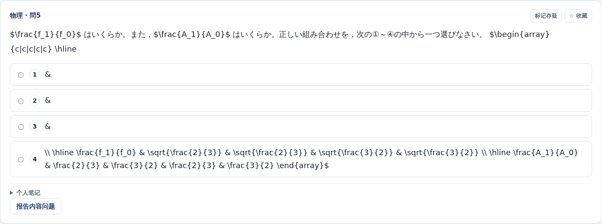

# EJU 题库系统性问题审计

审计日期：2026-09-14。对象：当前工作区的 EJU 题库、制作流水线、学习界面与历史学习数据。

## 1. 结论

**当前题库不能作为可靠的真题练习与判分工具使用。问题贯穿原卷识别、题目切分、图片与表格保留、答案映射、发布验收和学习统计，已经超过页面排版的范围。**

本次发现并整理 **55 项问题或实现缺口**，其中明确区分了实际数据缺陷、浏览器复现、代码缺口和风险推断；另列 8 项尚需扩大人工核验的事项。问题之间可能共同影响同一道题，不能把各项数量相加当成坏题总数。

最关键的证据如下：

- 当前可新建练习的 **149 套卷、2,917 道题**，题目、选项和材料 AST 全部只有 `text` 节点；**图片、公式、表格、下划线和答题空格的结构节点均为 0**。
- **2023 年第 2 回物理第 1 题**：原图和力学条件全部丢失；原卷答案为 **④（60 N）**，数据库却将该题关联到第 2 个答案栏，以 **②（40 N）** 为正解。浏览器中选择④并交卷，确实被判错。
- **59 道数学题、涉及 48 套卷**包含说明页内容。核实的实例把封面上的“问题册注意事项”“答题纸注意事项”当成第 II、III 大题，并要求填写正式答案。
- **959 道题**的实际展示文本含数学标记或 LaTeX 源码；**40 道题**存在完全相同的选项文本；**11 道题**直接显示 HTML 表格代码。
- **12 套数学卷、15 个大题组**存在答案格被多道题同时声明的情况。
- 当前可练的 **2,917 道题没有一条可展示的已复核解析**，日本语只有读解，没有可练的听解、听读解或记述。
- 这些卷 **149/149 均通过现有 `audit_paper` 结构审计**；但它们引用的 **2,269 份页面证明全部被当前证明校验器拒绝**。发布状态与新校验规则没有形成一致的交付门禁。

因此，现阶段“卷能打开”“接口能返回”“按库内答案全对”“自动测试多数通过”，都不能证明真题已经制作准确。

## 2. 审计范围、方法与边界

### 2.1 本次检查了什么

1. 只读备份正式数据库，检查全部 217 套卷的最新版本与交付状态。
2. 全量扫描 149 套可练卷的全部题干、选项、材料引用、答案格、题号、解析、图表节点及元数据。
3. 检查原 PDF、OCR 缓存、题块解析结果、页面合同、答案表、发布版本之间的对应关系。
4. 对物理、生物、化学、综合科目、数学中的代表问题逐页对照原卷。
5. 在隔离数据库上用 Chromium 操作学习界面，复现选项展示、交卷判错、数学说明页作答、表格乱码、首页统计和专项练习材料污染。
6. 对全部可练卷运行结构审计，并对它们引用的页面证明运行当前校验器。
7. 在隔离副本上执行项目测试，区分测试环境不完整造成的失败与代码、测试不匹配造成的失败。

本次仅交付审计文档及证据，未修题、重发卷、停用卷或修改正式学习记录。浏览器创建的练习、交卷和专项预览均发生在临时数据库。

### 2.2 基线

| 项目 | 值 |
|---|---|
| 正式数据库 | `library/eju.db` |
| 数据快照时间 | **2026-09-14 08:14:35 UTC** |
| Git HEAD | `2939a59f5c1e4b0c225bff5432f6d3e39033d4dc` |
| 数据库快照 SHA-256 | `91950d55eac70ba439ae0404f1c3986cfafa391c43e99f7fa4e0dd87ab3d5d0a` |
| 工作区状态 | 原本已有未提交修改，审计期间另有制作任务、代码编辑活动 |
| 浏览器与测试 | 隔离代码副本、隔离数据库；不调用外部模型制作新题 |

**本报告是上述数据库时点的审计结论。** 审计期间其他任务继续修改源码和清单，所以不将不同时间的状态混成一个“当前值”。代码副本的文件哈希见 [code-manifest.json](evidence/eju-audit-2026-09-14/code-manifest.json)，初始状态见 [baseline.json](evidence/eju-audit-2026-09-14/baseline.json)。代码链接用于定位相关模块，随后继续开发可能改变行号或实现。

### 2.3 “全部问题”的解释

本报告覆盖本次系统性检查能够确认的所有问题类别，并输出全量扫描的题目级定位清单。**没有逐字人工校对全部 2,917 道题及其全部原页，因此不能承诺已经找出每一个 OCR 错字、每一个错答案或每一处漏图。**

证据标记：

- **数据**：全量数据库或明确实例直接证明。
- **复现**：原 PDF 对照、解析器输出或浏览器操作证明。
- **代码**：实现路径确实存在相应缺口，但未必已经统计全部受影响题目。
- **风险**：有具体实现依据，尚未证明已经产生对应数量的错误结果。

## 3. 数据现状

### 3.1 可用性与内容结构

| 检查项 | 结果 | 含义 |
|---|---:|---|
| 逻辑试卷 | 217 套 | 不等于全部可练 |
| 历史试卷版本 | 819 个 | `paper_versions.status` 全为 `PUBLISHED`，暂停另由交付状态表控制 |
| 最新版本可练 / 暂停 | 149 / 68 套 | 本报告主要内容扫描只计算可练部分 |
| 可练题目 | 2,917 道 | 包括本报告已证实的坏题，不能称为合格题数 |
| 完整卷 `COMPLETE` | 0 套 | 149 套全部为 `PARTIAL`，仅开放 `PRACTICE` |
| 人工签署等级的可练卷 | 0 套 | 149 套全部为 `MACHINE_ATTESTED` |
| 唯一 AST 节点统计 | 15,931 个 `text` | 按卷中实际存储的 AST 计数，材料不按每次引用重复统计 |
| `figure` / 已关联媒体 | 0 / 0 | 可练版本没有图像节点，也没有 `paper_assets` 关联 |
| `inlineMath` / `displayMath` | 0 / 0 | KaTeX 没有获得结构化公式输入 |
| `table` / `underline` / `answerSlot` | 0 / 0 / 0 | 表格、下划线、空格身份未进入结构化题面 |
| 可练题目的已复核解析 | 0 | `explanation_json` 与对应版本的解析修订均无可展示内容 |
| 音轨 / 音频切点 | 0 / 0 | `audio_tracks`、`audio_cues` 均为空 |
| 题目知识点标签 | 0 道 | 可练题均无 `topicTags` |
| 数据库完整性 / 外键检查 | `ok` / 0 违规 | 排除了数据库损坏作为这些内容问题的直接解释 |

### 3.2 各分科的实际覆盖

| 分科 | 含该分科的可练卷数 | 题数 |
|---|---:|---:|
| 日本语 | 15 | 194，全部为 `READING` |
| 物理 | 41 | 535 |
| 化学 | 36 | 510 |
| 生物 | 38 | 417 |
| 综合科目 | 38 | 957 |
| 数学课程 1 | 28 | 162 |
| 数学课程 2 | 26 | 142 |
| 合计 | 分科卷数不能直接相加为逻辑卷数 | 2,917 |

库中已有的 2024 年 5 套卷，最新版本全部暂停。可练内容年份止于 2023 年。这里仅报告本地库状况，不推断未提供的年份应该有多少套原卷。

### 3.3 全量问题筛查

| 规则 | 命中题数 | 判读限制 |
|---|---:|---|
| 展示文本含 LaTeX 或数学分隔符 | 959 | 按题干、选项和该题实际可见材料计算 |
| 明确的图、图号、图示或图像相关提示词 | 436 | **漏图候选**，不是人工确认的全部漏图数；有些题可由文字独立解答，有些漏图题连提示词也丢了 |
| 展示文本含 HTML 表格标签 | 11 | 已存数据中的实际标签，不是合法表格节点 |
| 选项文本完全重复 | 40 | 已确认重复，重复是否改变唯一解还需结合原卷；已核实例确实丢失区分信息 |
| 下划线、傍线指代词 | 229 | 都没有 `underline` 节点；已核实例的原文标记确实丢失 |
| 数学题含说明页特征文本 | 59，涉及 48 套卷 | 已核实例为说明页伪题；全量命中名单供逐页清理 |
| 含竖线结构文本 | 21 | 仅为表格/公式残留候选，也会命中绝对值和 LaTeX 列格式，不能直接全判为表格坏题 |
| 任一上述规则命中 | 1,497 | 去重后的复核队列，**不是全库坏题总数或精确错误率** |

扫描数据见 [scan-summary.json](evidence/eju-audit-2026-09-14/scan-summary.json)。全部 1,497 道命中题的卷号、分科、题号、题目 ID、PDF 页码与规则见 [question-flags.csv](evidence/eju-audit-2026-09-14/question-flags.csv)。

## 4. 关键问题的原卷对照

### 案例 A：一道物理题同时缺图、缺条件、判错

定位：`eju-2023-2-science-ja`，第 4 版，物理 I 問1，题册 PDF 第 3 页。

题目 ID：`q_24f03615bd3a4d3570529399`。

原卷提供：长 1.2 m、重 10 N 的均匀棒；重物挂在左端起 0.3 m 处；右端绳张力 20 N，并有受力图。数据库题干仅剩：

> Wは何 Nか。最も適当な値を，次の①～⑥の中から一つ選びなさい。 1 N

`materialRefs=[]`，所在物理题组也没有材料。原 OCR 缓存其实包含上述力学条件，但切题时丢掉了 `問1` 之前的文字，不能归咎于“原 PDF 没有识别出来”。

原卷答案表第 3 页写明：物理 I 問1、解答番号 1、正解 4。独立核算也一致：

```text
20 × 1.2 = 10 × 0.6 + W × 0.3
W = 60 N → 选项④
```

数据库却记录：

```json
{"answerRef":"PHYSICS:2","correctAnswer":{"optionKey":"2"}}
```

实际交卷结果：

```text
你的作答：选项 4
正确答案：选项 2
回答错误
```

同卷物理 I 問2 也被关联到 `PHYSICS:3`；原答案为②，当前存为④。已确认至少两道题的对应关系和判分答案错误。

证据：[原题页](evidence/eju-audit-2026-09-14/case-1-pdf.png)、[原答案页](evidence/eju-audit-2026-09-14/key-2023-2-p3.png)、[浏览器结果文字](evidence/eju-audit-2026-09-14/browser.json)、[数据摘录](evidence/eju-audit-2026-09-14/examples.json)。

### 案例 B：数学封面被当成可评分的大题

定位：`eju-2009-1-math-c2-ja`，题册 PDF 第 1 页。

原 PDF 的 I、II、III 分别是考试整体、问题册、答题纸的注意事项，不是正式数学大题。当前库却出现：

- `第II問`：要求不要提前翻卷、填写姓名、确认页数；配有 A～P 共 16 个答案格。
- `第III問`：要求用 HB 铅笔、说明负号、约分与根式填写方式；同样配有 16 个答案格。

其中 `第III問` 的题目 ID 为 `q_95578d7316e8632b7c8922fb`。界面确实展示这些说明并提供下拉框作答。

原因可追到数学解析器：它把罗马数字标题识别为大题，再按 `(group, question)` 去重，重复时保留第一次。说明页抢先占用了正式题目的身份，后面的真正大题可能被丢弃。

证据：[原封面](evidence/eju-audit-2026-09-14/case-3-pdf.png)、[数学界面](evidence/eju-audit-2026-09-14/case-3-ui.png)、[math_questions.py](../eju_bank/ocr/math_questions.py)。

### 案例 C：选项变成三个 `&` 和一整段公式代码

定位：2023-2 物理 I 問5，题册 PDF 第 7 页，`q_9b2621d92fc2d27e6faed438`。

原题以二维表格展示频率比和振幅比的四组组合。当前选项为：

```text
① &
② &
③ &
④ \\ \hline \frac{f_1}{f_0} & ... \end{array}$
```

这是表格结构被切碎造成的信息丢失。即使增加公式渲染，也不能自动恢复每个选项对应的两项数值。



证据：[原题页](evidence/eju-audit-2026-09-14/case-2-pdf.png)、[当前解析器输出](evidence/eju-audit-2026-09-14/details.log)。

### 案例 D：化学选项丢了一整列，六个选项变成三对重复

定位：2004-2 化学 問17，题册 PDF 第 23 页，`q_5950a2c3902d70c70ec16bcc`。

原表格有 `p` 和 `q` 两列：`p` 为异构体数量，`q` 区分顺反异构与光学异构。当前六个选项却是：

```text
q 2 / q 2 / q 3 / q 3 / q 4 / q 4
```

区分奇偶两个选项的文字全丢了。选项个数仍然是六个，因此“数量合法、正解在 1～6 范围内”的检查无法发现问题。

证据：[原表格](evidence/eju-audit-2026-09-14/case-5-pdf.png)、[实际页面](evidence/eju-audit-2026-09-14/case-5-ui.png)。

### 案例 E：综合科目表格裸露为 HTML；新解析路径又将数据表丢弃

定位：2006-2 综合科目 問2(4)，题册 PDF 第 5 页，`q_e7a0bdb0c1c918aefae713fa`。

当前已发布题面直接显示 `<table>`、`<th rowspan="2">`、`<td>` 等代码，人口、GDP、贸易额没有按行列呈现。

另对审计时的解析代码重跑同页：HTML 规范化逻辑已经存在，但非选项数据行被当成 `table_header` 后跳过。重解析的题干只剩“次の表中のA～Dは…”和出处，原表中的人口 `128`、GDP `43,009` 等数据不再出现。

**这属于“旧数据仍显示源码，新逻辑会漏掉题干数据表”的双重问题。仅重跑现有流水线不是可靠修复。**

证据：[原页](evidence/eju-audit-2026-09-14/case-4-pdf.png)、[实际页面](evidence/eju-audit-2026-09-14/case-4-ui.png)、[question_blocks.py](../eju_bank/ocr/question_blocks.py) 中 `_table_to_rows` 与 `parse_page`。

### 案例 F：生物图示完全缺失

定位：2002-2 生物 問2(1)，题册 PDF 第 23 页，`q_aafc67d96ba0c0ce65a9cf9e`。

原题有叶片截面图和茎截面图，标注 `a～f`、`A～E`。子问要求根据这些标记选择组织。当前只保留问句与字母组合选项，两个图都没有进入题库。不同子问依赖同一组图，因此应按材料依赖整体修复。

证据：[原页](evidence/eju-audit-2026-09-14/case-6-pdf.png)、[实际页面](evidence/eju-audit-2026-09-14/case-6-ui.png)。

## 5. 完整问题清单

优先级：**P0**＝不能继续作为可信题面或判分依据；**P1**＝关键功能、内容覆盖或制作闭环缺失；**P2**＝可用性、状态表达和维护问题。风险条目表示“机制缺口需要处理”，不等于已证实全部相关题错误。

### 5.1 真题制作与内容保真：F01～F16

| 编号 | 级别 / 证据 | 问题、影响与定位 | 修复后的验收条件 |
|---|---|---|---|
| F01 | P0 · 数据、复现 | **可练内容没有任何图片。** 149 套卷媒体关联数为 0。物理受力图、生物截面图等已实证缺失；436 道命中图示提示词。当前 `attested_contracts.build_question_contract` 只生成文字题面。 | 原页中的必要图、图形选项、图例、坐标轴、单位和标注都进入题目/材料资产，并在学习页实际可见。 |
| F02 | P0 · 复现、代码 | **题目前置条件被切掉。** `question_blocks.parse_page` 在建立 `問N` 题块前忽略普通行，不能保留 A/B/C 场景段。案例 A 的完整条件存在 OCR 中，却在切题时消失。 | 同时核对题前场景、公共说明、子问条件；每题能从交付内容独立理解变量与条件。 |
| F03 | P0 · 数据、复现 | **数学说明页进入正式题。** 59 道命中说明页特征，涉及 48 套卷；案例 B 已证实整个说明段被配上正式答案格。 | 先分类封面、说明、例题、正文、答案页；说明页不得产生可评分题目。 |
| F04 | P0 · 代码、复现 | **数学同号冲突保留第一条，可能丢弃真题。** `collect_math_questions` 对重复 `(大题, 問)` 直接 `continue`；封面 II/III 抢占身份后，正式大题无法正常收录。 | 同号冲突进入核验，不静默取第一条；以实际正文页确定身份，逐项说明被排除块。 |
| F05 | P0 · 复现 | **表格型选项漏列、列名错配。** 案例 D 丢掉整列异构体名称，仅留下 `q 2` 等残片。 | 原表每一候选行/列能无损映射成完整选项；保留列头与单位，逐格比较。 |
| F06 | P0 · 复现、代码 | **横向/LaTeX 表格被按圈号错误切开。** 案例 C 的三个选项只剩 `&`，全部数值落入最后一个选项。 | 横向候选和纵向候选都支持；表格结构解析先于题目选项切分。 |
| F07 | P0 · 数据 | **重复、空壳选项仍可发布。** 40 道题存在完全相同选项文本，包括 `&`、`</th><th>` 等。现有检查主要检查 key 唯一性，不检查内容是否具备区分能力。 | 检出重复、仅符号、仅标签的选项；无法由原卷解释的重复不得进入可练状态。 |
| F08 | P0 · 复现、代码 | **新版 HTML 规范化会丢掉题干数据表。** `parse_page` 将不以选项编号开头的表格行当表头跳过；案例 E 的数据表重解析后消失。 | 题干数据表、选项表、答案表分类处理；数据行必须保留为 `table` 或经验证的图像。 |
| F09 | P1 · 代码 | **一个页面合同只优先创建第一段共享材料。** `shared = next(...)`，后续不同 `context` 的题不会获得自己的材料引用。尚未穷举全部同页多材料实例。 | 同页多个文章、实验、对话分别建材料；每道题引用自己的依赖，不能以“页”替代材料身份。 |
| F10 | P0 · 数据、复现 | **下划线和指代标记丢失。** 229 道含下线/傍线指代词，但结构中没有下划线；2006-2 综合科目原文的标记未在材料中对应显示。 | 原文的下划线范围、编号和题目引用对应；读者无需猜“下线部”指哪里。 |
| F11 | P1 · 数据、代码 | **段落、对话换行与子问层级被压成连续文字。** 切题大量使用空格拼接，发布 AST 全部为 `text`；材料的段落逻辑和逐行条件不再保留。 | 文段、说话人、列表、子问、行间公式按语义分段，不机械保留扫描换行，也不全部压平。 |
| F12 | P0 · 数据、复现 | **公式保留成源码，未制作成公式节点。** 959 道题含相关标记，当前 `renderAst` 对 `text` 使用 `textContent`，不会解析其中 `$...$`。 | 数学表达式转为 `inlineMath`/`displayMath` 并验证；原式的上下标、分式、根号、矩阵和符号与原页一致。 |
| F13 | P1 · 数据、代码 | **数学答案空格没有保留独立身份。** `answerSlot` 为 0；字母常以普通文本或未渲染的 `\boxed{}` 出现，容易与变量、点名混淆。 | 可见空格与 `answerSpec.slots` 一一对应；区分普通变量、几何点名与作答空格，支持在题面定位对应格。 |
| F14 | P1 · 数据、复现 | **原卷大题结构被压成 `OCR` 题组。** 同一分科/组内合计有 299 个超过唯一题号数的重名标签；例如多个物理题都叫“問1”，界面甚至显示“第 OCR 大题”。 | 保留大题、场景段、子问、解答栏的不同编号；导航和反馈能唯一定位原题。 |
| F15 | P1 · 数据、代码 | **跨页来源只记首个页码，且所有题用相同占位框。** 2,917 道题的 bbox 全为 `[0.08,0.08,0.92,0.92]`；解析器中的多页信息没有完整传到题目证据。 | 一道跨页题保存全部来源页和必要区域；定位框不得冒充真实裁图坐标。 |
| F16 | P1 · 数据 | **页尾声明、答题提示混入选项。** 2004-2 化学 問20 的最后一个选项还包含“化学の問題はこれで終わりです”“解答欄の21～75…”等结束说明。 | 页眉、页脚、结束说明、计算栏与选项分离；末项不得吞掉页面剩余正文。 |

相关模块：[question_blocks.py](../eju_bank/ocr/question_blocks.py)、[math_questions.py](../eju_bank/ocr/math_questions.py)、[attested_contracts.py](../eju_bank/ocr/attested_contracts.py)、[core.js](../eju_bank/web/core.js)。

### 5.2 答案、判分与可信度：F17～F24

| 编号 | 级别 / 证据 | 问题、影响与定位 | 修复后的验收条件 |
|---|---|---|---|
| F17 | P0 · 原卷、浏览器复现 | **正确作答确实被判错。** 2023-2 物理 I 問1 原正解④被存成②；I 問2 原正解②被存成④。错误不在比较器，而在题答关联。 | 以原卷答案表独立建立基准；正确、错误选项均做端到端判分，不能从被测库读取“期望正解”。 |
| F18 | P0 · 复现、代码 | **边栏普通数字被当成答案框号。** 案例 A 的 `slot_cache` 是 `[6,1,3,2,1,6,80]`，包括题号、绳号、选项和数值；连续数过滤最终把该题配到 2。`resolve_slot` 又优先用 `boxed_slot`。 | 必须证明数字处于实际答案框/已核题号位置；冲突、多个候选、带单位框号要显式处理，不能按连续数字推定。 |
| F19 | P0 · 数据 | **同一数学大题的答案格重复归属。** 12 套卷的 15 个组存在重叠，例如大题整体 A～Z 与另一问 O～Z 同时存在。详见重叠清单。 | 每个原卷答案格有唯一计分归属；大题与子问不能重复收录、重复计分。 |
| F20 | P0 · 代码 | **实际数学机器放行分支没有核对题面空格集合。** `attest.clear_source` 按答案表取得 `key_slots`，`build_question_contract` 只查有格、有题干、文字来自 OCR；没有要求“题面需要的格＝答案表声明的格”。旧 `build_math_questions` 的局部字母检查也不能代表该发布路径。 | 正式发布路径校验空格完整性、题目归属、重叠和缺失；没有空格的说明段不能借答案表取得正式作答格。 |
| F21 | P0 · 全量复验 | **结构审计不能证明题目可做。** 上述坏题所在的 149 套卷全部 `audit_paper=passed`；缺图、缺条件、重复选项、说明页伪题均没有阻断。 | 把“结构合法”和“内容可答”作为不同门禁；后者至少覆盖本报告反例集。 |
| F22 | P0 · 全量复验 | **存量卷仍依赖当前校验器已拒绝的旧证明。** 149 套卷引用的 2,269 份证明全部缺 `contractDigest`；其中 2,117 份题册证明使用已废止检查项并缺少新必需项。练习入口仍将这些卷视为可用。 | 校验规则升级时明确重新评估/隔离存量版本，只有满足当前交付策略的版本才能被列为可练。 |
| F23 | P0 · 代码、风险 | **“与 OCR 一致”被用来支撑真题准确性。** 从 OCR 切出的错误文字再与同一 OCR 比对，只能排除部分凭空改写，无法发现 OCR 自身读错、漏图、漏条件或错栏。 | 对关键内容引入独立原页证据；机器证明明确区分转写一致、原卷一致、题答映射与完整可答。 |
| F24 | P0 · 数据、代码 | **覆盖率按自己生成的块计数，无法发现根本没建块的图文。** `inkRegions/accountedRegions` 来自新生成的 `region_ids`，并非独立原页区域清单。数学和理科缺图仍可“覆盖”。 | 先从原页建立待处理区域/要素清单，再逐项核销；未识别对象不能因没有生成块而消失在分母中。 |

证据：[attestation-recheck.json](evidence/eju-audit-2026-09-14/attestation-recheck.json)、[math-overlap.json](evidence/eju-audit-2026-09-14/math-overlap.json)、[assemble_from_ocr.py](../eju_bank/ocr/assemble_from_ocr.py)、[attest.py](../eju_bank/attest.py)、[audit.py](../eju_bank/audit.py)。

### 5.3 内容覆盖与学习价值：F25～F30

| 编号 | 级别 / 证据 | 问题、影响与定位 | 修复后的验收条件 |
|---|---|---|---|
| F25 | P1 · 数据、浏览器 | **没有一套可做整卷模考的完整卷。** 149 套全部 `PARTIAL`，模考入口禁用。界面有入口不等于功能已有可用内容。 | 先交付至少一套经过原卷核验的完整样板卷；完整性、时长、选科与可练题数一致。 |
| F26 | P1 · 数据 | **日本语仅有少量读解。** 194 道全为 `READING`；听解、听读解、记述均为 0，音轨和切点也为 0。 | 按读解、听读解、听解、记述分别列明实际交付状态；支持能力必须用真实可练内容验收。 |
| F27 | P1 · 数据 | **近年已收录原卷没有对应可练版本。** 库中 2024 年 5 套最新版本全部暂停。 | 按年份、回次、科目列出原卷已收到/完成制作/通过验收/可练状态，避免“有卷名”被理解成“有题可练”。 |
| F28 | P1 · 数据、浏览器 | **当前题目全部没有可展示解析。** 历史库虽有 1,754 条解析修订，但没有对应当前 2,917 道可练题的解析；复盘出现“暂无已复核解析”。 | 解析与正确题目版本、答案版本绑定；先核题再核解析，不能直接继承退役题面上的旧解析。 |
| F29 | P1 · 数据 | **知识点专项名义上存在，实际标签为空。** 当前题目 `topicTags` 全部缺失；按知识点过滤没有可用标注基础。 | 先建立科目知识点体系，标注真实题并抽检，检索结果能解释为何属于该知识点。 |
| F30 | P1 · 代码、风险 | **完整性基准依赖已经读出的正解表和题块。** 漏识别的题/答案可能没有进入预期集合；“收录正解表列出的全部解答栏”仍不等于原卷完整。说明页抢占数学身份进一步削弱这个结论。 | 原卷页、题号、答案栏和依赖材料建立独立清单，未识别项仍作为缺口保留；区分“已识别集合齐全”和“原卷齐全”。 |

证据：[paper-inventory.csv](evidence/eju-audit-2026-09-14/paper-inventory.csv)、[review.py](../eju_bank/review.py) 的结构基线与候选组装逻辑。

### 5.4 展示与作答体验：F31～F36

| 编号 | 级别 / 证据 | 问题、影响与定位 | 修复后的验收条件 |
|---|---|---|---|
| F31 | P1 · 数据、浏览器 | **HTML 标签直接显示给学习者。** 11 道实际题面含表格标签；当前渲染器正确地按文本转义，但上游交付了错误节点类型。不能简单改为任意 `innerHTML`。 | 将受支持的表格解析成安全 AST，再渲染；正文中无 `<td>`、`<tr>` 等生产残留。 |
| F32 | P2 · 浏览器、代码 | **恢复/跳题时题干被吸顶栏遮住。** `restoreSession` 等使用默认 `scrollIntoView()`，未预留两层吸顶栏高度；案例 A 刚进入时顶部问句被遮挡，选项先出现。 | 进入、恢复、切换显示范围、跳题都能看到完整题号和首行题干，桌面与手机分别验证。 |
| F33 | P2 · 浏览器、代码 | **长共享材料被每个子问重复铺开，双栏出现大片空白。** 2006-2 综合同一对话在四个子问前分别展开；长表格源码又撑高单侧。 | 共享材料有明确阅读位置，连续子问可方便对照；不要求每次滚过整篇重复文章。 |
| F34 | P1 · 界面、代码 | **学习端没有可靠的“查看该题原页”入口。** 当前可练题无图，题目卡片也不提供原卷页定位；`evidence` 不能替代学习者实际可打开的参考页。 | 在授权范围内提供只读原页/原题区域查看，包含页码与出处；作为核对手段，不能代替完整题面制作。 |
| F35 | P1 · 隔离复现 | **专项练习带入未选题的材料。** 选择 2006-2 综合的 `q_b52b5a89afe9607621ec19b3`，依赖扩展后为 2 题，但保留整组 8 段材料；其余 7 段因无人引用被前端当“整组共用”展示。 | 专项组题只保留所选题的依赖闭包；无关材料不应因复制整组而变成共享材料。 |
| F36 | P1 · 代码 | **专项题集没有继承来源的把关等级与缺口说明。** `create_practice` 构造的快照含 `sourceVersions`，但不带相应 `reviewGrade`、`missingContentReasons`；预览主要显示题数。 | 跨卷组题按来源披露质量状态，坏题/缺依赖题不能通过换一种入口显得合格。 |

证据：[collection-repro.json](evidence/eju-audit-2026-09-14/collection-repro.json)、[learning.py](../eju_bank/learning.py) 的 `create_practice`、[practice.js](../eju_bank/web/practice.js) 的 `getQuestionMaterials`、`restoreSession` 与预览逻辑。

### 5.5 学习记录与统计：F37～F43

| 编号 | 级别 / 证据 | 问题、影响与定位 | 修复后的验收条件 |
|---|---|---|---|
| F37 | P2 · 浏览器、代码 | **首页题量混入暂停卷。** 实际显示“可练149套卷·共4962题”，可练只有2917题，相差2045题。`home.js` 的卷数用 `usable`，题数却累加全部 `papers`。 | 同一句可练统计使用同一交付范围；暂停题量单列。 |
| F38 | P2 · 浏览器、代码 | **学习中心概览随访问标签而失真。** 直接打开历史页，错题和收藏显示0；首页同期显示待复习错题56、收藏1。对应计数仅在进入错题/收藏标签时加载。 | 概览独立取完整数据；未加载显示加载状态，不能用0冒充结果。 |
| F39 | P2 · 数据、代码 | **“练习次数”实际是最近30条记录数量。** `loadSummary` 请求 `history?limit=30`，再显示 `history.length`；快照有67次会话，页面显示30。 | 总次数由服务端聚合；近期次数写明时间范围或条数限制。 |
| F40 | P1 · 数据、代码 | **停用内容的历史判分仍进入学习指标分子、分母。** `learning_summary` 只增加影响提示，没有从 `metric` 剔除；8次已作答题目记录中7次来自暂停版本。 | 保留历史事实，同时单列无效/待复核判分；可信学习结论只用经过对应质量策略确认的记录。 |
| F41 | P1 · 数据、代码 | **历史列表不携带题卷交付质量状态。** 33次已提交、25次进行中会话来自暂停版本，但 `history_page` 返回项没有交付状态，前端仍显示普通成绩或继续练习。 | 历史条目显示原版本、停用原因、成绩有效性；旧会话是否继续作答采用明确且可见的策略。 |
| F42 | P2 · 代码 | **暂停题的“去重练”按钮仍可点击。** 搜索/错题 API 已返回 `available=false`，但 `me.js` 未据此禁用重练按钮，后端创建练习才报错。 | 列表直接说明暂不能重练及原因；不让用户到最后一步才发现不可用。 |
| F43 | P1 · 数据、代码 | **最新版本过滤会隐藏原来的错题。** `search_questions` 对错题/收藏仍要求题在最新卷版本内；快照中有1条错题状态没有任何最新版本对应题，无法通过该列表找到。页码和块序号参与 `localKey` 又增加修题后的身份漂移风险。 | 历史题目有稳定身份、版本沿袭或明确退役入口；不能因新版本删除/重切题就让错题、笔记失去可见入口。 |

相关模块：[home.js](../eju_bank/web/home.js)、[me.js](../eju_bank/web/me.js)、[workflows.py](../eju_bank/workflows.py)、[sessions.py](../eju_bank/sessions.py)。这里没有把“原始正确率不是官方得点”等已经明确说明的设计当作缺陷。

### 5.6 制作和复核闭环：F44～F50

| 编号 | 级别 / 证据 | 问题、影响与定位 | 修复后的验收条件 |
|---|---|---|---|
| F44 | P1 · 代码、数据 | **独立校对可跳过，仍进入发布。** 未选文字模型时 `PROOFREAD_PAPER` 被跳过；扫描时工作目录没有任何 `quality-findings.json`。机器题块证明无法补足内容检查。 | 不要求所有卷必须人工复核，但自动发布必须有完整可答性的确定性检查；未执行的必要检查不能当作通过。 |
| F45 | P1 · 代码、风险 | **整卷文字校对无法核对已丢失的原图细节。** 校对模型看到的是组装题目摘要；缺图、曲线、图中数字若没有进入数据，文字检查不能恢复或确认它们。 | 图题验收能访问原页/裁图及题面对应关系；图不存在时不能仅靠文字模型“没提出问题”放行。 |
| F46 | P1 · 代码、风险 | **复读优劣主要以字数与坏字符比较。** `_better` 在其他条件相同下偏好至少1.25倍长度的结果；多读、混入旁题也可能更长，短而正确的纠正可能不被采用。 | 比较具体信息覆盖与原页一致性；保留差异、关键数字/符号冲突和逐项裁决，不能以字数替代准确率。 |
| F47 | P1 · 代码 | **详解生成的输出格式指令互相冲突。** `explain.SYSTEM` 要求仅JSON，`TEMPLATE` 要求不用JSON、使用 `###TITLE/###POINTS/###SOLUTION`；解析器只按后一种格式拆解。 | 系统提示、用户模板、解析器、回归样本约定同一格式；异常输出不冒充成功。 |
| F48 | P1 · 代码、风险 | **详解被要求不能质疑输入答案。** 提示词要求解释给定“官方答案”，并禁止推导不同答案。当前已确认题答映射错误，这可能把错答案包装成合理解析。 | 先独立核对题答身份；解析生成遇到矛盾必须返回待核状态，并阻止相应题目继续作为可靠练习。 |
| F49 | P1 · 代码 | **复核编辑器不足以高效修复现有结构错误。** `astEditor` 主要编辑已有节点的字符串；表格、ruby等需要完整JSON，缺少把现有文字片段直接变成公式/下划线/答案空格的编辑动作。 | 可以实际完成“选文字→标公式/空格/下划线”“编辑表格行列”“移动内容归属”，并即时按学习端规则预览。 |
| F50 | P1 · 代码 | **裁图不能直接绑定到某个选项或指定题面位置。** `review-clip` 只将 figure 追加到整个题目的 `stemAst` 或材料 `contentAst`。图形选项与行内配图修复仍需手改JSON。 | 裁图可选择题干位置、共享材料或具体选项；保留原页坐标、图注、顺序与可见预览。 |

相关模块：[make_paper.py](../eju_bank/make_paper.py)、[proofread.py](../eju_bank/proofread.py)、[explain.py](../eju_bank/explain.py)、[studio_editor.js](../eju_bank/web/studio_editor.js)。

**注意区分已经存在的改进：** 源码已增加合约摘要校验、部分错误映射检查、人工编辑保护、来源文件身份检查和高风险疑点隔离。本报告不把这些机制一概说成“没有实现”。问题是它们尚未覆盖上述反例，且存量内容没有随新策略完成重新验收。

### 5.7 数据一致性、运维与验收：F51～F55

| 编号 | 级别 / 证据 | 问题、影响与定位 | 修复后的验收条件 |
|---|---|---|---|
| F51 | P1 · 数据 | **清单与正式库发布状态明显不一致。** 同时取得的清单中150个 `publishedVersionId` 在正式数据库里不存在；另外19项版本号字段落后。课程状态不能只信清单。 | 正式数据库与清单使用可追踪的一致发布记录；临时库的版本ID不能写入正式清单。 |
| F52 | P1 · 代码、环境证据 | **只切换 `--database` 不能隔离发布副作用。** `attest_and_publish.py` 的工作区默认仍是项目目录；`ContentWorkspace` 会按该目录更新合同、候选与清单。审计时另有任务使用临时数据库运行该脚本。不能仅因数据库是临时文件就认为是沙箱。 | 测试使用独立工作区/媒体/清单和数据库；参数或启动检查阻止误混，且读操作和写操作边界可验证。 |
| F53 | P2 · 文档、现状对照 | **历史交付文档混合“框架支持”“历史已发布”“当前可用”。** README及多轮完成记录容易使人理解为已具备准确图文、解析和完整题库；当前全text、零解析、零完整卷与之不一致。 | 当前使用说明只引用最新验收事实；历史报告标注历史时点，不作为当前完成证明。 |
| F54 | P1 · 测试 | **5项现有浏览器验收未通过。** 1项仍寻找旧阶段按钮，4项等待不存在的 `stageExtra`。这首先证明工作台改版与验收没有同步，不能直接外推为5个独立业务故障。 | 更新测试到真实可达的新入口，恢复逐页复核到发布、来源状态隔离、数学卷区分等完整流程验证。 |
| F55 | P0 · 数据、测试设计 | **验收没有证明正式真题正确。** 合成夹具可证明图片/公式组件能工作；历史解析测试可证明旧版本有解析；按数据库自己的正解作答可证明比较逻辑自洽。这三者都不能发现案例A～F。 | 固定原PDF、独立人工核验结果、最终题目版本和真实浏览器展示，形成对真实内容的回归基准。 |

证据：[inventory-discrepancies.json](evidence/eju-audit-2026-09-14/inventory-discrepancies.json)、[attest_and_publish.py](../scripts/attest_and_publish.py)、[pytest.log](evidence/eju-audit-2026-09-14/pytest.log)。

## 6. 尚未完全核实、必须纳入后续清查的事项

这些不是已经确认的新增故障，不能混入上面的实际坏题数量。

| 项目 | 为什么需要核查 | 如何确认 |
|---|---|---|
| U01 全量答案准确率 | 已确认至少两道错映射，其他题可能存在不同形式的错栏、跨科错配 | 按原答案PDF独立抄录并双人/双通道复核，再与题目身份逐条对比 |
| U02 全量数值、公式与日文错字 | 与OCR一致不能保证与原卷一致，分式、负号、小数点、单位尤其敏感 | 对数理科公式和关键数值优先逐字核验；普通正文分层抽查并扩大异常来源 |
| U03 图形选项、表格和图中文字的全部漏失 | 提示词只能发现部分图题，漏条件可能把提示词一起删掉 | 以原PDF区域为分母检查，包含无“図”字的图形选项、地图与实验装置 |
| U04 数学别解、顺序不问、等价填写 | 当前判分严格比较一组tokens，不能由此确认所有原卷别解都已覆盖 | 找出正解表中别解/順不同注释，逐个验证可接受答案集合与展示规则 |
| U05 手机端复杂图文和辅助功能 | 本次390px数学页未发现横向溢出，但正式题库缺图，无法用现有卷证明真实图题、表格、读屏可用 | 用修复后的长表格、图形选项、长公式与听力材料做手机、键盘和读屏验收 |
| U06 大批重制后的题目身份和历史迁移 | 当前ID受切块影响，已有1条错题不在最新版本列表中 | 模拟插入材料、跨页重切、修改选项，检查旧错题、收藏、笔记和新版本的沿袭 |
| U07 大规模任务中断与恢复 | 审计没有主动中断正式制作任务 | 在隔离工作区测试断电式中止、取消、重跑、替换源文件和数据库锁冲突 |
| U08 存量解析的学科正确性 | 1754条历史解析未逐篇核对；“存在/已标记复核”不等于论证正确 | 与被验证后的题面和答案重新绑定，逐篇抽检推导，不能直接迁移为合格解析 |

## 7. 根因链与整改顺序

### 7.1 根因链

```text
原PDF包含文字、图、表、题号、答案框和版面关系
    ↓ 主要提取为文字，图文关系没有完整结构化
切题丢前置条件；表格被压平；说明页被认成大题
    ↓
用边栏数字连续性与正解值范围拼接答案
    ↓
自生成块的覆盖统计 + 与同一OCR一致性检查
    ↓
结构审计通过，题面仍不可答，部分答案已经错配
    ↓
全部text进入界面，图、公式、表格渲染能力无从发挥
    ↓
错误判分、无解析、受污染的错题与学习统计
```

这条链上的首要问题是**制作结果没有以“与原卷一致且完整可答”为最终验收对象**。仅美化UI、提高模型规模、增加输出字数或扩大批量发布都会保留这类问题。

### 7.2 第一阶段：恢复可信边界

1. 以本报告快照保留历史，不直接覆盖旧卷和旧学习记录。
2. 对已证实错答案、缺必要材料、说明页伪题、空壳选项的题建立明确的不可练状态，隔离范围包含其依赖题。
3. 对使用旧证明的存量版本进行策略重新评估；机器校验徽标不能替代结果。
4. 首页、历史与学习统计使用一致的质量范围，清楚展示受影响的旧成绩。

这些是整改建议，本次审计没有执行停用或改分。

### 7.3 第二阶段：先做对一套样板

选择原PDF、答案表均完整的样板来源，包含普通选择、图题、表格题、共享材料、跨页题和数学数字格。推荐直接纳入案例A～F作为失败回归样本。

每题必须保存并验收：

- 原卷身份：年份、回次、科目、语言、大题、子问、答案栏。
- 题目依赖：前置条件、共用材料、图、表、图例、图形选项。
- 内容结构：段落、公式、空格、下划线、二维表格。
- 答案依据：原正解表页、对应格、可接受答案及特殊规则。
- 交付效果：真实浏览器可见、可作答、可定位原页、可正确判分。

样板验收通过后，再按版式和年份分批重制。不要把一页成功直接外推到全科全年度。

### 7.4 第三阶段：修复流水线而不是批量修补展示字符串

需要补齐的核心能力：

1. 页面类型与版面区域分类。
2. 保留图、表、公式和装饰标记的统一 AST 制作路径。
3. 大题—材料—子问—答案栏的稳定关系模型。
4. 对图表、公式、题目边界、答案映射的独立检查。
5. 题目/材料级隔离及重新发布，保留历史版本与沿袭。
6. 能实际修复复杂内容的复核编辑器。
7. 以真实卷为输入的内容验收，而非仅使用合成题。

### 7.5 第四阶段：补足学习闭环

在题面与答案正确的前提下，恢复解析、知识点、听力、记述和整卷模考。先确认“这道题是什么、答案为什么对”，再生成讲解、错因和学习建议。

## 8. 交付验收清单

| 维度 | 必须满足的标准 |
|---|---|
| 图片 | 每个必要原图、图形选项、图注均有资产和正确关联；原图可对照，学习页实际显示 |
| 条件与材料 | 每题必要的场景、公共条件、前文、表格、实验信息完整；抽出的专项题也完整 |
| 题目身份 | 说明页不进入题库；原卷大题、子问、答案栏不混用，无无法解释的重号和遗漏 |
| 公式 | 无裸露LaTeX；分数、根号、上下标、符号、单位均与原页核对，不只检查能否渲染 |
| 表格 | 表头、行列、合并单元格、单位完整；候选项能还原到原表的准确位置 |
| 答案 | 独立核验原正解表；不存在错栏、错科、重复格归属；合法别解有明确策略 |
| 判分 | 案例A选择④必须判对；错误选项必须判错；数学空格不重复要求、重复计分 |
| 质量门禁 | 缺必要图、缺材料、空壳选项、说明页伪题、失效证明必须被拒绝或隔离 |
| 版本 | 重新制题不丢错题/收藏/笔记；受影响旧成绩有版本和有效性说明 |
| 专项练习 | 依赖完整，但不包含无关材料；清楚继承来源质量状态 |
| 展示 | 无HTML标签、无“第OCR大题”等内部字段；吸顶栏不遮题干；真实手机样本可用 |
| 解析 | 解析与验证后的题目、答案版本一致；无法独立核实的内容保持明确的待核状态 |
| 数据与状态 | 清单版本在正式库中存在；可练卷数、题数、暂停数、历史次数各自口径一致 |
| 测试 | 合成组件测试、真实原卷内容测试、真实浏览器流程测试分别通过，不能互相替代 |

## 9. 测试结果与未判为故障的事项

本次隔离副本收集并运行 282 项测试。首轮为272通过、8失败、2跳过，其中3项失败是审计副本最初没有复制 `docs/explanations` 所致；补齐文件后只重跑这3项，全部通过。因此应记录为：**汇总275通过、5项工作台浏览器验收失败、2跳过**，不能将缺少复制文件列为项目故障，也不能伪称一次完整运行全部通过。

剩余失败：

```text
tests/test_review_browser.py::test_review_from_page_to_publication_in_browser
tests/test_studio_state_isolation.py::test_session_review_state_belongs_to_one_source
tests/test_studio_state_isolation.py::test_invalidating_the_review_releases_its_owner
tests/test_studio_state_isolation.py::test_a_stale_open_response_does_not_repaint_the_new_source
tests/test_studio_state_isolation.py::test_math_sources_are_distinguishable_in_every_list
```

它们卡在旧DOM入口或旧前端函数，反映验收与工作台改版不同步。审计期间另有代码修改，因此以上结果只对应留存代码副本。

以下事项本次没有证据支持认定为故障：

- 数据库损坏、外键悬空：检查通过。
- 整个学习界面因JS异常无法打开：本次自定义浏览器流程没有 `pageerror`。
- 缺图只是媒体404：可练内容根本没有图节点和媒体关联，故主要问题发生在制作/发布之前。
- 前端完全不支持公式或表格：`renderAst` 有这些能力，但当前数据未按对应结构交付。
- 所有手机页面均横向溢出：本次390px数学页实测 `scrollWidth=390`，未发现该问题。
- 全部旧解析应该直接迁入新卷：版本绑定是必要的，应核验后建立沿袭，不能为了提高解析数盲目复制。

## 10. 证据附件与复核方式

主要附件：

- [全量统计](evidence/eju-audit-2026-09-14/scan-summary.json)
- [149套可练卷清单](evidence/eju-audit-2026-09-14/paper-inventory.csv)
- [1497道命中题定位清单](evidence/eju-audit-2026-09-14/question-flags.csv)
- [按规则分组的题目样本](evidence/eju-audit-2026-09-14/flag-details.json)
- [数学答案格重叠明细](evidence/eju-audit-2026-09-14/math-overlap.json)
- [存量证明重新校验结果](evidence/eju-audit-2026-09-14/attestation-recheck.json)
- [清单与数据库不一致明细](evidence/eju-audit-2026-09-14/inventory-discrepancies.json)
- [浏览器操作结果与判错文字](evidence/eju-audit-2026-09-14/browser.json)
- [关键题目的已发布数据](evidence/eju-audit-2026-09-14/examples.json)
- [测试日志](evidence/eju-audit-2026-09-14/pytest.log)、[补齐文档后的重跑日志](evidence/eju-audit-2026-09-14/pytest-docs-recheck.log)

复核数据范围时，可使用下列只读SQL选出本报告所用的最新可练版本：

```sql
SELECT p.stable_code, pv.id, pv.version_number, pv.payload_json
FROM papers p
JOIN paper_versions pv ON pv.paper_id = p.id
LEFT JOIN paper_delivery_state ds ON ds.paper_version_id = pv.id
WHERE pv.status = 'PUBLISHED'
  AND pv.version_number = (
    SELECT MAX(v.version_number)
    FROM paper_versions v
    WHERE v.paper_id = pv.paper_id AND v.status = 'PUBLISHED'
  )
  AND COALESCE(ds.state, 'AVAILABLE') NOT IN ('SUSPENDED', 'REVIEW_REQUIRED');
```

扫描题目时必须沿 `materialRefs` 取该题实际材料，同时考虑前端把“整组无人引用的材料”当作共享材料的逻辑。不能把同组所有文章都算成每道题的材料，否则会夸大含公式、含图提示词等数量。本报告最终的959、436等数字已按实际引用范围计算。

后续整改的完成依据应是：**每一道被重新放行的题，与原卷对应、条件完整、图文可读、答案可信，且用户实际可以正确完成练习和复盘。**
