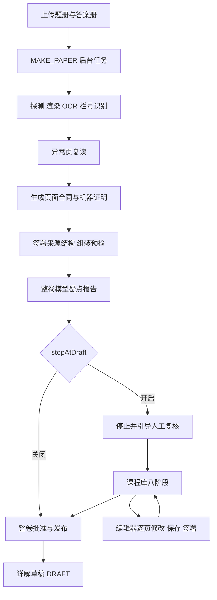
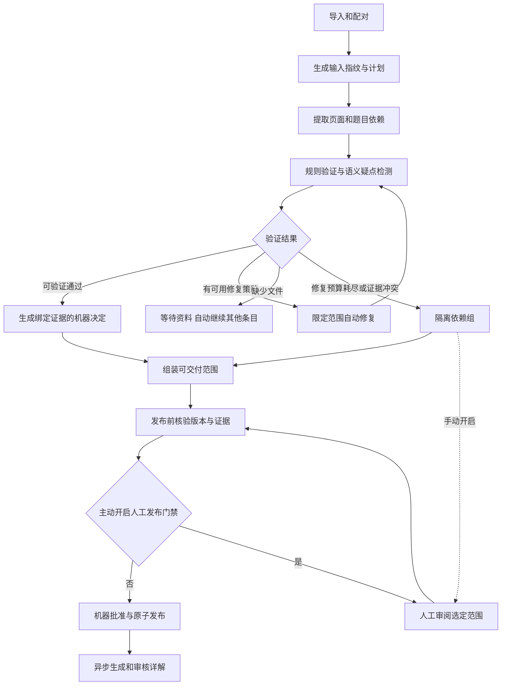

# EJU Bank 工作台分析与自动化改造实施规范

> 日期：2026-09-12。对象：本仓库当前制作工作台及其制作、复核、发布链路。
> 目标：正常制作自动完成；异常先自动修复；无法确认的内容自动隔离；人工复核保留为用户主动打开的能力。
> 本文是待执行的改造规范。除明确标注的现状核查、浏览器检查和测试外，文中的新接口、新表、新状态、新模块均未实现。本轮交付为文档及分析证据，没有修改业务代码或正式题库数据。

阅读建议：现状与问题见第 2–4 节；目标流程与自动复核见第 5–7 节；前端方案见第 8 节；后端、数据与 API 见第 9–12 节；代码工作包、验收和执行任务说明见第 13–16 节。

## 1. 核心判断与改造方向

当前系统已经具备自动制卷基础，不需要重新建设另一条独立流水线。`MAKE_PAPER` 已经能够从上传 PDF 一直执行到机器签署和私人题库发布，`stopAtDraft` 默认关闭。

真正妨碍减少人工的，是下面四件事：

1. **自动化没有闭环。**OCR、异常页复读、整卷疑点报告、页面复核、详解审核各自存在，但疑点没有稳定进入“自动修复—重新验证—继续发布”的统一流程。
2. **部分机器放行依据不足。**题答配对检查、机器证明绑定存在实际实现缺口。单纯取消人工按钮，会扩大现有问题，不能提高自动制作的可靠性。
3. **界面仍围绕人工推进步骤。**八阶段流水线、页码翻阅、字段编辑、签署身份成为主要操作内容；用户要判断卡在哪、去哪个页面、下一步按什么。
4. **状态和产物缺少统一视图。**清单、任务、候选、签署、发布版本、交付状态分别存储和推导；刷新、跨来源切换和自动重跑可能产生误导或重复工作。

建议最终工作方式：**上传资料 → 自动识别配对 → 自动制作与修复 → 自动发布通过校验的内容 → 汇总结果。**默认没有“请逐页签完”的任务。人工复核是可选工具；不开启时，疑点保留在隔离区，不将其伪装成已核对内容。

改造顺序：先修复自动放行与重跑的基础问题，再建立异常处理闭环，再简化界面，最后扩展批量制作和详解自动审核。保留现有 Python、SQLite、原生 HTML/CSS/JS 技术栈，优先复用现有领域逻辑。

## 2. 调查范围、证据与现状基线

### 2.1 依据与边界

本次核查直接阅读当前源码、测试和本地数据库，并访问了运行中的四个工作台页面。历史文档仅用于了解设计背景，不能替代代码事实。

| 证据 | 内容 | 解释边界 |
|---|---|---|
| [数据库基线](evidence/STUDIO_AUTOMATION_BASELINE_2026-09-12.json) | 使用 SQLite `mode=ro`、`query_only=ON` 的聚合统计及 SQL | 统计不是逐题正确性评价，也不是发布证书重新验证 |
| [浏览器检查](evidence/STUDIO_AUTOMATION_BROWSER_2026-09-12.json) | `/studio`、`/studio/library`、`/studio/editor`、`/studio/ops` | 桌面 1440×1000，四页 HTTP 200、未捕获 JS 异常、无横向溢出；未提交制作或发布 |
| [验证记录与源码摘要](evidence/STUDIO_AUTOMATION_VERIFICATION_2026-09-12.json) | 相关隔离测试结果、文档检查、核心源码 SHA-256 | 用于确认本次分析对应的代码状态，不代表新方案已经通过验收 |
| [当前制课页截图](evidence/STUDIO_CURRENT_BUILD_2026-09-12.png) | 上传、元数据、四组选模型、十一阶段进度 | 记录当前信息密度与操作层级 |
| [当前复核编辑器截图](evidence/STUDIO_CURRENT_EDITOR_2026-09-12.png) | 页码导航、原图、区域字段、签署表单 | 记录原始技术字段占据主要界面的现状 |
| [四模块历史说明](STUDIO_MODULES_2026-09-11.md) | 最近一次模块拆分的背景 | 本文基于源码补充和修正，不能沿用其全部效果描述 |

没有对所有真题逐页人工核对，也没有为本次分析调用模型重新制作整库。因而不报告“当前 OCR 准确率”“已减少多少人工时间”等没有测量的数据。

### 2.2 当前数据说明了什么

快照采集时间为 2026-09-12 UTC，确切时间见证据文件。

| 项目 | 当前数量 | 应如何理解 |
|---|---:|---|
| 数据库 schema | v8 | 后续需要正式迁移，不能随意改存量 JSON 状态 |
| 来源 / paper / paper 历史版本 | 216 / 217 / 819 | 三者不是同一计数对象 |
| 每个 paper 的最新版本 | 217 | 按该 paper 的最大 `version_number` 取一版 |
| 最新机器证明、无显式停用记录的版本 | 149 | 全部为 `PARTIAL`；“无停用记录”不代表本次重新验证通过 |
| 最新已停用版本 | 68 | 26 个 `COMPLETE`、42 个 `PARTIAL`；这些版本缺少 `reviewGrade` |
| 页面修订总数 / 最新页面数 | 19,364 / 8,169 | 最新页按 `(source_id, role, page_number)` 去重 |
| 最新机器署名页 / 无署名页 | 2,769 / 5,400 | 无署名页不能直接等同于待人工处理页，包含不收录范围和历史工作产物 |
| 整卷复核记录 | 286 | reviewer 均为保留机器身份；并不代表 286 套不同卷 |
| 清单条目 | 215 | 全部标 `PUBLISHED` 和 `REVIEWED`；26 个 `COMPLETE`、189 个 `PARTIAL` |
| 详解修订 | 1,754 | 均为存量 `REVIEWED`；不能据字段推断实际人工审核程度 |
| 内容问题 / 已登记音轨 | 0 / 0 | 不代表没有内容问题，也不代表磁盘上没有音频 |
| 持久任务 | 4 | 2 个 PROBE、1 个 OCR_TEXT、1 个 OCR_SLOTS；当前库没有 MAKE_PAPER 任务记录 |

两个直接结论：

- “清单全已发布”不能表达现在有多少套可以放心练习、多少是部分卷、哪些版本已停用。首屏必须使用明确的交付与质量状态。
- 数据已经大量使用机器署名。优化重点应是使机器判定更可靠、提高有效收录、减少异常后续操作，而不是把现有机器署名重新包装成自动化。

## 3. 当前工作方法与功能模块

### 3.1 当前两条主要操作路径



说明：上图表现主要编排关系；步骤是否启用由模型配置、选项和前置产物决定。当前整卷疑点报告并非自动发布的有效内容阻断器，详解草稿也没有自动审核后展示的完整通路。

### 3.2 四个模块的现状

| 模块 | 当前职责与入口 | 当前需要人做的事 | 建议定位 |
|---|---|---|---|
| 制课 | `/studio`、`/studio/build`；上传、模型档位、十一阶段任务 | 核对元数据、理解四类模型、等待当前任务、理解报告、决定后续操作 | 改名“自动制作”：批次入口与结果总览 |
| 课程库 | `/studio/library`；来源清单、八阶段、导入、结构、候选、签署、发布 | 逐步推进、手动重跑、查看 JSON、刷新失效状态 | 改名“题库与来源”：查看可用内容、缺口和制作记录 |
| 复核编辑器 | `/studio/editor`；按来源/角色/页码打开 | 翻页找问题、区域 ID/bbox/AST 编辑、保存、勾确认、签署 | 保留高级编辑器；日常改成可选“人工复核模式” |
| 运维 | `/studio/ops`；任务、问题、解析、rubric、备份、诊断 | 手工重试、填写版本 ID/JSON、找日志、处理数据 | 后台自动恢复与计划任务；人工仅处理配置和特殊操作 |

### 3.3 应保留的基础能力

- 来源文件哈希、媒体内容寻址、稳定题目 ID、不可变发布版本。
- 草稿与签署的区分；`MACHINE_ATTESTED` 与人工署名的区分。
- 页面、结构、整卷证书与发布门禁；修改后旧证书失效的思想。
- 官方答案独立提取，数学数字格严格对应，不能用模型猜测替代正解来源。
- `PARTIAL`、练习范围和完整卷的区分；历史答题和历史版本保留。
- 后台 worker、租约、任务事件、缓存、发布 outbox 的现有基础。
- 本地模型档位配置边界和现有私人题库发布通道。减少人工不需要扩大对外发布范围。

## 4. 优化问题清单与优先级

P0 表示扩大自动化前必须修复；P1 表示构成默认自动工作方式；P2 表示提高覆盖率、效率和体验。表中风险来自当前源码路径，不等于已证明所有正式题目发生了对应错误。

| 编号 | 优先级 | 现状、证据入口 | 改造要求 |
|---|---|---|---|
| F01 | P0 | [`slot_join.py`](../eju_bank/ocr/slot_join.py) `option_agreement()` 仅判断正确选项编号是否在 options 的键中 | 只能作为答案值合法性检查，不能证明题答配对；取消由它单独支持的顺序补号/缺口恢复放行 |
| F02 | P0 | [`attested_contracts.py`](../eju_bank/ocr/attested_contracts.py) `verify_attestation()` 主要验证证明自身摘要与结构 | 证明必须绑定合同正文、真实原文件、OCR/答案具体产物、规则版本；在放行边界重新核验 |
| F03 | P0 | [`attest.py`](../eju_bank/attest.py) `already_cleared()` 只复用机器签页；`clear_source()` 随后可 `save_page()` | 自动重跑不得覆盖人工修订或人签；人工页默认锁定，机器产物作为建议分支 |
| F04 | P0 | `baseline_and_candidate()` 重签结构；[`review.py`](../eju_bank/review.py) `sign_source_structure()` 撤销旧证书 | 内容和依赖不变时真正幂等；不能每次重跑都生成结构版本并挂起发布 |
| F05 | P0 | [`make_paper.py`](../eju_bank/make_paper.py) `register()` 按工作目录复用 manifest，未充分比较新上传内容身份 | 相同年份科目的不同文件版本使用不同来源指纹，拒绝静默使用旧输入 |
| F06 | P0 | `PROOFREAD_PAPER` 疑点主要落文件，发布仍继续 | 将报告转为结构化 findings；高风险疑点进入重新验证与隔离，不能仅留日志 |
| F07 | P0 | [`studio_library.js`](../eju_bank/web/studio_library.js) `stageExtra()` 使用全局 candidate/approved，切来源未充分清理 | 所有状态绑定 sourceId、generation、digest；后端校验身份；前端不能复用另一来源的候选或批准 |
| F08 | P1 | [`studio_shell.js`](../eju_bank/web/studio_shell.js) `computeStages()` 由 inventory、job、会话变量拼接 | 新增持久只读的来源总览接口；“曾发布”不能代替“当前可用” |
| F09 | P1 | [`studio_build.js`](../eju_bank/web/studio_build.js) 结果引导打开复核编辑器，疑点只给报告路径 | 结果说明系统已完成什么、自动处理什么、隔离什么；复核是次级可选操作 |
| F10 | P1 | 编辑器以“上一页/下一页”组织工作 | 引入按题目/依赖组归并的异常列表、原因、原图定位、候选差异和修复历史 |
| F11 | P1 | `currentPlan()` 只取第一份题册、第一份答案册；有 jobId 就禁用开始 | 多文件先配对成批次；允许继续排队；当前运行与新提交互不阻塞 |
| F12 | P1 | 前端无答案册即禁止开始，后端允许缺答案的请求进入任务 | 区分“可开始提取”和“可发布评分”；自动寻找已登记同场次答案，缺失时等待资料 |
| F13 | P1 | 缓存常按文件存在与 force 复用 | 统一输入指纹、产物依赖、参数/模型/规则版本；仅重跑失效阶段 |
| F14 | P1 | [`job_worker.py`](../eju_bank/job_worker.py) 全局一个运行任务，过期任务转 INTERRUPTED 后依赖后续重试 | 自动恢复可恢复阶段；持久重试计划与任务分类；长详解不占据主制作链 |
| F15 | P1 | [`explain.py`](../eju_bank/explain.py) 写 DRAFT；`_latest_annotations()` 仅取 REVIEWED/WITHDRAWN | 新增独立的机器审核详解状态和展示规则，不能将 AI 草稿直接伪标人审 |
| F16 | P2 | 页区域多为 `TEXT_ORDER_ONLY` 占位 bbox | 自动检测真实几何与图表缺失；不要让编辑器把占位区域显示成真实识别精度 |
| F17 | P2 | 数学类别在部分来源选择器里仅显示 MATHEMATICS，人工难区分 | 所有列表统一展示年份、回次、科目、数学类别、语言和版本 |
| F18 | P2 | 听力、图表、跨页材料需要更多人工关联 | 自动匹配和校验依赖；缺失部分隔离；不影响独立的已验证练习题 |
| F19 | P2 | 详解、任务、复核信息混在运维，常需复制 ID/路径 | 用题目/来源上下文打开侧栏，原始 JSON 与内部路径移到诊断详情 |
| F20 | P1 | `attest.py` 的自动组装/发布固定 `REVIEWED_PARTIAL` | 满足全部完整性门禁后自动选择 FULL，不让未来全量识别仍永久变部分卷 |

### 4.1 F01 的具体反例

四道题的选项编号都是 `1,2,3,4`，官方答案是 `1,2,3,4`。如果错误配对为 `2,3,4,1`，四个答案编号仍然都属于对应题的 options 集合。当前 `option_agreement()` 对正确配对与错位配对都可以得到 `4/4`。

因此，代码注释中的“错位只有约 1/5 概率通过”不适用于这个检查。后续代码和文档必须删除以此推导的置信度。应将证据拆成两项：

- `answer.value_in_options`：答案值合法；必要但不足。
- `answer.mapping_verified`：通过来源身份、印刷栏号、独立锚点及题目对应关系验证映射；发布必需。

### 4.2 F02 的边界

对当前 verifier 的内存探针表明：修改合同题干、替换 OCR 缓存，或者只构造能自洽的证明摘要，均不一定被其拒绝。证明对象的自校验只能发现部分格式或摘要变动，不能证明它确实绑定当前题文与来源。

这不是要求增加一个总能返回 true 的 `confidence` 字段。必须把依赖身份与具体规则结果保存下来，由服务端从允许的工作区证据重新计算和验证。对任意持有文件系统写权限的人进行密码学防伪不在本次范围；目标是防止流水线错误复用、普通管理请求伪造证明和内容变更后的失效遗漏。

## 5. 目标工作方式与产品默认值

### 5.1 用户日常流程

1. 拖入一份或一批资料，系统识别场次、科目、角色与数学类别，自动配对。
2. 信息齐全的条目直接进入队列；有歧义的条目保留待补资料，不影响其他条目。
3. 系统自行选择已配置的合适档位，完成提取、核对、修复和组装。
4. 满足发布条件的题目自动发布到私人题库。不能确认的内容进入隔离区，保留原因与证据。
5. 用户看到“新增可练题目、覆盖率、暂缺内容、自动修复进度”的汇总；可离开页面，任务继续运行。
6. 用户想检查时，点击“开启人工复核”，按异常或自己选定的题目检查；处理后系统自动继续后续阶段。

### 5.2 三个独立控制维度

不要用一个“自动/人工”开关同时表达运行、质量、发布三种含义。

| 配置 | 值 | 默认值与语义 |
|---|---|---|
| `reviewMode` | `AUTO` / `MANUAL_GATE` | `AUTO`。后者由用户主动开启，在自动校验后暂停新发布，等待明确的人工放行范围 |
| `humanReviewEnabled` | boolean | false，是当前用户/来源的界面偏好，不是后端发布授权；打开编辑器不等于暂停整批自动任务 |
| `publishPolicy` | `AUTO_VERIFIED` / `HOLD` | `AUTO_VERIFIED`，自动发布满足当前证据策略的内容；HOLD 只保留候选 |
| `partialPolicy` | `VERIFIED_SUBSET` / `COMPLETE_ONLY` | `VERIFIED_SUBSET`，按依赖完整的已验证范围生成部分练习卷 |
| `explanationPolicy` | `AUTO_VERIFIED` / `DRAFT_ONLY` / `OFF` | 首次迁移阶段 DRAFT_ONLY；独立验证通路验收后，新任务模板默认 AUTO_VERIFIED |

`humanReviewEnabled=false` 不能使后端忽略问题。默认自动模式下，没有证据的问题是 `QUARANTINED` 或 `WAITING_INPUT`，不会自动转为“等人工签完才能让整库继续”。

### 5.3 手动开启的准确行为

- 只读“查看原卷”始终可用，不需要开启人工模式。
- “开启人工复核”显示人工列表、编辑字段和签署操作；默认范围为当前来源，不是全库。
- “本批次发布前由我确认”才设置 `MANUAL_GATE`；明确显示影响范围、未发布数量。
- 如果任务正在发布事务中，模式修改先进行 generation/版本检查；已经提交的版本不会因为一个界面开关被回退。
- 关闭人工编辑模式不自动签署或放弃未提交修改。草稿保存策略明确：退出编辑先保存独立草稿，冲突时保留本地内容并提示重新对比。
- 解除 `MANUAL_GATE` 是可审计策略变更，在 `publishPolicy=AUTO_VERIFIED` 时重新验证后继续发布；如果用户单独选择 HOLD，仍保持不发布。不能把之前打开编辑器视为隐含批准。

## 6. 自动复核、修复与放行规则

### 6.1 新的主流程



实现时允许先在现有单个 MAKE_PAPER 内部使用上述阶段，不要求第一版就改成分布式任务系统。

### 6.2 按证据决定，不用一个分数统治所有问题

每条验证产生 `PASS / FAIL / UNKNOWN / NOT_APPLICABLE`，同时记录检查 ID、版本、对象、依赖、严重程度、证据和下一步动作。

| 检查面 | 必须验证什么 | 失败/未知时系统动作 |
|---|---|---|
| 来源身份 | PDF 哈希、场次、科目、类别、语言、题册/答案册角色一致 | 自动重识别/重新配对；冲突隔离，不随意采用第一份 |
| 页面完整性 | 页数、旋转、正文区域、空白/说明页、跨页关系 | 重渲染、局部识别；空白判断不能只看 OCR 是否为空 |
| 题目内容 | 题干、选项、共享材料完整；没有占位、截断和控制字符污染 | 裁区复读、跨页合并、模型候选比对 |
| 公式和图表 | 公式可解析、关键数值符号来自来源；图表引用完整且资产存在 | 原图裁切和区域识别；不能仅凭“看起来通顺”重写公式 |
| 题答映射 | 唯一印刷编号/栏号、答案表行列锚点、题目归属、场次身份 | 加强栏号检测；未证实顺序补号保持 UNKNOWN |
| 答案值 | 值来自已绑定答案册；在已读选项/数字格允许值范围内 | 重读具体答案区域，不用模型求解结果覆盖官方值 |
| 依赖闭合 | 共享材料、跨页题、子题、图、音频、答案项均齐全 | 隔离依赖组；其他独立题可继续 |
| 完整性声明 | 期望 form、题号/栏位覆盖、所需音频、题型全满足 | 只允许 PARTIAL/PRACTICE，不声明完整模考 |
| 发布证明 | 合同、结构、答案账本、媒体、策略与当前 generation 匹配 | 使旧决定失效并自动重评，不能复用旧签名 |

`confidence` 如保留，只用于排序和选择修复策略；模型自报 0.99、同一模型读两次一致、答案值合法都不能单独构成放行依据。两次读取共享同一 OCR 文本时，不应视作两个独立来源。

### 6.3 findings 的统一结构

新增制作期 findings，不直接复用当前 `content_issues` 表：后者需要已发布题目/版本，无法完整表达制作前的问题。

```json
{
  "findingId": "finding_example",
  "sourceId": "src_example",
  "generation": 3,
  "target": {
    "kind": "QUESTION_GROUP",
    "key": "PHYSICS_JA:group-04",
    "pages": [{"role": "QUESTION_BOOKLET", "page": 12}],
    "blockKeys": ["q12"],
    "fieldPath": "answerRef"
  },
  "code": "answer.mapping_unverified",
  "severity": "BLOCKER",
  "status": "AUTO_REPAIR_PENDING",
  "summary": "题目栏号与答案表对应关系尚未验证",
  "inputDigest": "sha256-example",
  "detector": {"id": "slot-mapping", "version": "2"},
  "evidenceRefs": ["artifact_example"],
  "repairStrategy": "REREAD_SLOT_CROP",
  "attemptsUsed": 0,
  "attemptsLimit": 2,
  "dedupKey": "sha256-of-target-code-generation"
}
```

状态至少包括 `OPEN`、`AUTO_REPAIR_PENDING`、`REPAIRING`、`RESOLVED_AUTO`、`QUARANTINED`、`WAITING_INPUT`、`RESOLVED_HUMAN`、`DISMISSED_WITH_EVIDENCE`、`SUPERSEDED`。输入换代后旧 findings 保留历史并标 superseded，不混入当前计数。

严重程度：

- `BLOCKER`：已证实违反发布规则，影响范围必须阻断。
- `SUSPECT`：尚未证实的高风险疑点。先追加独立检查；自动放行所需检查仍为 UNKNOWN 时隔离。
- `WARNING`：非核心内容或展示建议，不妨碍题目正确使用。
- `INFO`：例如空白页被正确跳过，不制造待办。

模型输出的严重程度是检测信号，最终由服务端规则分类；模型没有发现问题也不等于验证通过。findings 去重合并到最小完整依赖组，一处跨页问题只显示一项工作。

### 6.4 自动修复顺序与预算

| 顺序 | 策略 | 接受条件 |
|---|---|---|
| 1 | 确定性规范化：控制标记、明确空白、既有解析规则 | 有界、可逆，不改变数学含义、答案值、题号或否定词 |
| 2 | 原页旋转修正、提高局部渲染分辨率、重读疑点裁区 | 新候选通过相同规则，来源对应明确 |
| 3 | 已配置的更强视觉档位重新读取 | 对比字段级差异；关键冲突不能按“更长”或“更通顺”胜出 |
| 4 | 题册/答案册双向匹配、跨页材料合并、栏号重新定位 | 存在唯一可验证对应，依赖齐全 |
| 5 | 独立语义检查或适用的符号/数值验证 | 用于验证疑点，不生成未经来源支持的新题文或官方答案 |
| 6 | 仍不满足条件 | 隔离，保留全部候选与原因，正常完成其他内容 |

建议初始策略参数：每个问题最多 2 次改变策略的修复，每来源最多 3 轮聚合重评。具体模型超时、每批总时长、调用/token 上限和成本上限由配置定义，并通过试运行校准，不能写成已证明最优的值。

相同输入、相同策略、相同模型和参数失败后不得无限重试。只有检测到依赖变化、模型恢复或用户明确重试，才能开启新一轮预算。网络临时错误使用带抖动退避；内容冲突不能靠网络重试解决。

### 6.5 局部隔离与完整率

隔离单位不总是单题。一个阅读材料对应五个小问，材料缺一段时五题都受影响；同一道数学题跨页时不能只发布其中半页；答案表行错位可能影响整个编号区间。

当前已经存在“页级证明＋页内显式排除”：`build_question_contract()` 可以将无法验证的题转为带理由的 ignored/excludedOnThisPage，并在符合条件时证明同页剩余内容。第一阶段保留这项能力，不倒退为一题有疑点就整页否决；补齐排除项的依赖索引、findings 和自动补做，再扩展题组级决定。不能为了提升数量直接删掉错误块或把排除当作完整收录。

每个期望题目/答案栏位必须有一种处置：已验证收录、因缺证据隔离、已确认非题目、重复项排除。**解析失败不能改写成“本页没有题”。**原卷期望题量无法可靠确定时，覆盖率显示未知，不用已识别题数充当完整分母。

`PARTIAL` 可发布条件：至少一个完整可练单元、答案证据完整、没有未处理的组装阻断、范围明确、只开放适用练习模式。`COMPLETE` 还必须通过期望 form、所有题目依赖和音频等完整性检查，不能因“本次组装全通过”自动升级。

## 7. 机器证明与人工成果保护

### 7.1 证明 v2 的最小字段

```json
{
  "schemaVersion": 2,
  "decisionType": "MACHINE_ATTESTED",
  "sourceId": "src_example",
  "generation": 3,
  "target": {"role": "QUESTION_BOOKLET", "page": 12},
  "sourceFileSha256": "sha256-example",
  "contractDigest": "sha256-example",
  "dependencyDigest": "sha256-example",
  "evidence": [
    {"artifactId": "ocr_12", "kind": "OCR_TEXT", "sha256": "sha256-example"},
    {"artifactId": "slots_12", "kind": "SLOT_GEOMETRY", "sha256": "sha256-example"},
    {"artifactId": "key_03", "kind": "ANSWER_LEDGER", "sha256": "sha256-example"}
  ],
  "policyVersion": "auto-v2",
  "verifierVersion": "2",
  "checks": [
    {"id": "source.identity", "version": "1", "result": "PASS"},
    {"id": "answer.mapping_verified", "version": "2", "result": "PASS"}
  ],
  "limitations": ["机器校验，未逐页人工复核"],
  "createdAt": "2026-09-12T00:00:00Z"
}
```

以上只是契约示意；示例中两个 checks 不代表完整放行规则列表。实际必需集合按题型和政策登记在服务端 registry。未知 check ID、缺失必需检查、FAIL/UNKNOWN、缺失证据都不能获得证明。

`contractDigest` 对业务合同正文做规范化摘要，排除证明自身和纯显示时间，包含题干、选项、答案引用、图表、材料关系、处置、区域语义。摘要计算必须统一函数，并有固定测试向量，不能在前端、脚本、worker 分别实现。

页证明的 `dependencyDigest` 包括相关原始页、OCR/栏号产物、答案账本、共享材料、媒体资产与独立来源结构锚点。跨页题不能只绑定首页；答案证据不能只是一个目录路径。由页证明生成的最终组卷结构不能再反过来成为页证明的前置依赖；整卷资格才绑定最终结构、scope 和全部页决定，避免循环依赖。

### 7.2 验证与发布边界

1. 生成候选：服务端从注册产物读取证据，调用题型验证器，生成机器决定。
2. 应用决定：检查输入 generation、当前修订、策略版本、人工锁；匹配后写入新修订和决定记录。
3. 整卷组装：引用实际通过的修订和处置清单；生成结构摘要、整卷 content digest。
4. 发布前：重新确认必需决定有效、依赖哈希未变、证书未撤销、权利和范围符合现有门禁。
5. 发布事务：再次比较 generation/依赖指针，原子写批准、版本和 outbox，或复用同一已发布结果。

模型和耗时文件计算放在事务外；提交前的短事务执行 compare-and-swap。有效证据从已注册的不可变内容寻址快照读取，不能继续引用会原位覆盖的 `work/ocr_cache/pNNNN.json`。新内容注册新 artifact 并通过数据库指针更新 generation；仅比较 generation 不能防止未受管理的文件替换。发布边界校验实际读取的证据与摘要，发现损坏时拒绝放行。

证明不是浏览器可任意 POST 的可信结论，浏览器只能请求“重新验证”。保留机器保留身份，不给机器构造普通人名。

### 7.3 人工修改的保护规则

- 当前已人签页默认 `HUMAN_LOCKED`。人工已保存但未签署的修订同样必须受保护，需要记录其 actor/来源，不能仅靠 `signed_by` 判定。
- 自动制作保留人工内容作为受保护输入/候选，仍验证结构、依赖与来源是否过期。未签人工草稿不等于质量通过；只有有效人工签署或适用机器决定才能赋予发布资格。机器不得偷偷覆盖、降级或清空人工字段。
- 自动模型对人工内容有异议时，生成并列建议和 finding；当前人工结论不会因为“机器更自信”被替换。
- 用户主动“采用机器建议”后产生新的人工操作事件；是否需要重新签署根据变更范围判断。
- 第一版锁定整页，后续可细化到字段 ownership；先保证明确性，避免复杂合并导致静默覆盖。
- `force` 只使对应机器产物失效，不等于解锁人工成果。增加显式目标与 generation，不能全局 force 绕过保护。

### 7.4 无变化重跑必须零副作用

同一来源指纹、合同、结构、规则/策略版本和依赖全部相同时：

- 不新增页面或结构修订，不撤销既有证书，不挂起现有版本。
- 不重复生成详解，不重复发布同内容版本。
- 记录 `cacheHit/unchanged` 的任务事件即可。

结构幂等比较必须使用规范化业务字段，不能把每次新生成的时间戳放进比较核心。当前 `contentRevision` 会受到 `reviewSummary` 中批准记录 ID/时间变化影响，因此不能先重复 approve，再期待 `paper_versions` 自动去重。应在 approve 前按内容/依赖/范围/策略查找并复用有效资格和批准；新设计明确区分业务内容摘要与证书摘要，再复用现有版本幂等和 `publication_outbox`。

## 8. 前端界面与信息架构

### 8.1 导航与路由

保留多页结构与旧 URL，通过轻量重组实现。建议一级导航：**自动制作 / 题库与来源 / 自动处理 / 设置与运维**。人工编辑器通过来源或异常详情手动进入，不再暗示它是每次必经步骤。

| 路由 | 目标视图 | 兼容处理 |
|---|---|---|
| `/studio`、`/studio/build` | 自动制作：上传、批次、结果 | 继续用 `studio.html`、`studio_build.js` |
| `/studio/library` | 题库与来源 | 保留来源深链和八阶段高级详情 |
| `/studio/quality`（新增） | 自动处理：修复、隔离、待资料、人工可选列表 | 新增专页及脚本 |
| `/studio/editor` | 专家编辑器 | 旧地址继续可用；直接访问由用户主动发起，视为开启本地编辑视图，不改变发布政策 |
| `/studio/ops` | 设置与运维 | 保留备份、诊断、任务高级管理 |

建议深链：`/studio/build#/batches/<id>`、`/studio/library#/source/<id>`、`/studio/quality#/findings/<id>`。旧 `source/role/page` 深链继续解析，并携带返回列表和筛选条件。

### 8.2 自动制作页

默认首屏只做三件事：导入资料、选择制作偏好、看结果。

```text
自动制作                                      系统就绪
[拖入资料或选择文件]

已识别 12 套：10 套资料齐全；2 套等待补资料
偏好：标准自动制作        人工复核：关闭
[开始自动制作]            [高级设置]

正在处理 3 套 | 已完成 7 套 | 等待资料 2 套
2023 第2回 理科  自动修复中  已验证 42 题  隔离 2 题
2023 第2回 数学2 已发布      可练 6 题     覆盖率待确定
```

上述数字是布局示例，不是当前数据库结果。

具体交互要求：

- 四个模型下拉移入“高级设置”，默认使用服务端策略档位。普通用户选择“标准 / 高精度 / 节省资源”，实际模型与预算在详情可见。
- 首期新上传区只承诺 PDF；音频先通过已有音频导入流程关联。W15 完成音频上传契约后再开放统一拖入音频，不能让界面接受后端无法处理的格式。
- 上传后每个配对条目显示完整身份、文件角色、自动判断理由；唯一匹配直接接受，只突出冲突字段。
- 当前单任务只处理一组文件的问题未修好前，前端必须明确阻止多个题册被静默忽略。
- 缺答案允许先识别题册，显示“等待答案资料，尚不能发布评分题”；不能一边说答案可选一边禁止所有操作。
- 顶部模型状态只报告本次计划依赖是否就绪。一个未使用档位离线不应全局告警。
- 十一阶段压缩成“准备 → 识别 → 自动校验/修复 → 入库”四个阶段；技术子步骤可展开。
- 最近任务改为可见列表，使用稳定任务/批次 URL。刷新恢复当前选择，允许继续添加队列。
- 结果主按钮为“查看可练内容”；次级按钮为“查看自动处理详情”“开启人工复核”。
- 独立显示“题目已发布”和“详解处理中”，详解失败不能把已发布题目显示成整套失败。
- 日志折叠，默认只呈现实际进度、已完成数、当前问题和系统下一步；不要把文件路径当问题处理入口。

### 8.3 题库与来源页

列表由八个阶段小圆点改为面向结果的列/卡片：

| 字段 | 示例与规则 |
|---|---|
| 来源名称 | `2023 第2回 · 数学2 · 日语`，无需靠 sourceId 区分 |
| 当前交付 | 可练 / 部分可练 / 等待资料 / 处理中 / 已停用 |
| 题量与覆盖 | 可练 34；隔离 6；期望 40（仅当期望已验证） |
| 校验类型 | 机器校验 / 人工复核 / 混合；不要只写“已复核” |
| 自动处理 | 下一次动作、待重试数、处理中的依赖组 |
| 详解 | 已展示 / 自动审核中 / 草稿 / 不适用 |
| 最近结果 | 完成时间、版本；是否存在较新的未发布候选 |

默认排序优先需要关注的系统阻断和资料缺失，其次最近处理；年份、科目、完整性、交付状态均可筛选。搜索、过滤和分页写入 URL。

打开来源详情后默认显示结果总览；“制作记录”展示自动阶段；“高级操作”保留原八阶段单步重跑。用户不再需要学习阶段编号才能完成日常制作。

### 8.4 自动处理中心与可选人工复核

默认展示四个列表：自动修复中、已隔离、等待资料、已自动解决。默认没有要求逐页清空的人工待办。

每项必须回答：哪里有问题、为什么系统不能确认、已经试过什么、现在将做什么、影响几题、是否影响当前发布内容。失败原因使用业务中文；技术日志另行展开。

人工模式开启后采用三栏布局：

```text
左：问题/题目列表         中：原图与答案证据       右：候选与操作
答案映射未确认 × 3       对应页、局部放大          当前转写/重读候选差异
公式符号冲突 × 1         题册/答案册快速切换        检查结果与机器建议
资料缺失 × 2             跨页材料同步             [采用建议并重新校验]
已处理                   区域与题目联动           [手工修改] [保留隔离]
```

要求：

- 默认按异常依赖组跳转，保留“浏览全部页”作为查看模式。优先高影响的问题，避免逐页扫描。
- 普通人工操作只编辑题干、选项、答案关联、公式和图；`localKey`、regionIds、bbox 数字、AST JSON 放高级面板。
- 图形裁切通过拖拽框完成；坐标自动生成。没有真实几何时明确显示“定位未验证”，不伪装为精准框选。
- 差异按字段与字符呈现，避免展示整份 JSON 的大段前后变化。
- “保存并重新校验”由服务端触发后续任务；“人工确认此范围”显式记录人、范围、版本和来源比对确认。
- 人工确认一个题/组不能把整套所有页面标 HUMAN_SIGNED。保留当前严格页级规则，细粒度签署在专门迁移后启用。
- 批量操作优先是“重新验证”“使用同一确定性修复策略”；不得一键把未查看的所有疑点盖成人工已复核。
- 快捷键仅在非文本输入状态生效；支持下一问题、保存、切换证据；提供可见提示。
- 处理完成自动跳到下一个问题；关闭后保留列表位置和未提交草稿。

### 8.5 前端状态、性能和可访问性

- 服务端 summary 是阶段与发布状态的唯一权威。前端仅保存筛选、折叠、编辑草稿和用户当前选择。
- 每个异步响应附 sourceId、generation、request sequence；切来源时 abort 旧请求，丢弃过时响应。
- candidate/approval 按 `(sourceId, generation, scope, contentDigest)` 绑定，不能挂在未区分来源的全局变量上。
- 编辑成功广播 `source-changed`（可用 BroadcastChannel），其他工作台刷新摘要；后端版本校验仍不可省。
- 来源列表分页，不为每行执行完整 `candidate()` 组装。先使用 2–5 秒增量轮询；后台标签页降频，终态停止。
- 空、离线、部分失败、取消、恢复中都有明确视图；禁止只显示通用红色报错。
- 状态不只靠颜色；重要变化通过 `role=status`/适度 `aria-live` 公告，避免每一行日志打断读屏。参考 [W3C 状态消息说明](https://www.w3.org/WAI/WCAG22/Understanding/status-messages.html)。
- 桌面以双栏/三栏为主，窄屏转成“问题—证据—编辑”切换；不能为了塞下 JSON 使页面横向滚动。

## 9. 后端架构、任务与状态机

### 9.1 模块职责与复用边界

建议在现有包内增量拆分，名称可以调整，职责必须保持清楚。

```text
eju_bank/
  make_paper.py            保留入口，负责阶段编排，不直接判断全部质量规则
  automation_policy.py    新增：策略版本、预算、模型路由、人工门禁
  source_identity.py      新增：文件配对、来源指纹、来源版本与资料增补
  artifacts.py            新增：不可变阶段产物、摘要、依赖、缓存复用
  quality.py              新增：验证器 registry、findings、决定与证据校验
  repair.py               新增：按问题安排有界修复、接受候选、失效传播
  studio_summary.py       新增：工作台聚合读模型，不触发组装或写入
  attest.py               复用：机器页面决定与组装入口，改为调用统一 quality
  review.py               复用：人工修订、签署、撤证、候选与发布域服务
  jobs.py / job_worker.py  复用：队列、租约、取消、恢复、阶段事件
  proofread.py            复用：检测器；输出结构化且覆盖范围明确的结果
  explain.py              复用：生成器；增加独立验证和幂等缓存
  workflows.py            扩展：机器审核详解的交付与历史快照
  server.py               路由与请求边界，保持轻量
  http_workflows.py       参数契约与域服务调用，不在 HTTP 内执行长模型任务
```

禁止让 UI、CLI、批处理脚本各写一份放行规则。`scripts/attest_and_publish.py`、新自动制作和人工发布最终都调用同一个服务器端 qualification/publish gate。迁移保留老接口适配层，逐步减少对 `reviewer=machine` 的隐式分支依赖。

### 9.2 分开四类状态

| 维度 | 建议状态 | 说明 |
|---|---|---|
| 执行 `executionState` | QUEUED、RUNNING、WAITING_RETRY、WAITING_DEPENDENCY、SUCCEEDED、FAILED、CANCELLED、INTERRUPTED | 只描述程序执行；部分内容被隔离也可以正常执行完成 |
| 内容 `qualityState` | UNCHECKED、CHECKING、REPAIRING、VERIFIED、PARTIAL_VERIFIED、QUARANTINED | 描述内容可验证范围；与是否人工参与无关 |
| 发布 `publicationState` | NOT_PUBLISHED、HELD、PUBLISHED、PUBLISHED_PARTIAL、SUSPENDED | 从实际版本、范围与交付状态产生 |
| 人工参与 `manualState` | OFF、AVAILABLE、EDITING、GATE_PENDING | 只有用户明确的接管/门禁才改变该状态 |

另保留 `reviewGrade` 表达机器、人或混合的实际决定来源；`completeness` 表达内容完整性；`availableModes` 表达可用练习模式。它们不能被合并为一个绿色“成功”。

旧 `jobs.status` 和 `pipelineStatus` 暂时保留。新增状态通过旁表和结果字段映射；如果扩展旧枚举，必须同步迁移、校验、API、前端终态判断和测试。不要只在 Python 中返回一个旧 UI 无法识别的新状态。

本文 `WAITING_INPUT` 用于 finding/批次项目/下一步动作；映射到执行维度时为 `WAITING_DEPENDENCY` + `reasonCode=MISSING_INPUT`。等待资料不持续占用 worker lease，资料增补事件可以创建新代次或恢复适用的阶段。

### 9.3 generation 与幂等

- `logicalSourceKey`：场次、科目、数学类别、语言的规范化组合，用于聚合来源历史。
- `sourceFingerprint`：上述身份 + 按角色排序的文件 SHA-256。相同业务名称但文件变化，是新的来源版本。
- 新文件版本生成新的 manifest/sourceId，并记录 logicalSourceKey 关联；不能把两个目录登记成同一个 sourceId，使当前 `_sources()` 的唯一定位失效。
- `generation`：同一来源版本在输入依赖、人工内容或制作策略发生实质变化后的制作代次。每个阶段、决定、finding 与 job 引用它；人工锁另有 lockRevision/head CAS。无变化重跑不递增 generation，创建新候选也不自动撤销合格旧版，是否停用依据明确的证据失效原因。
- 后补答案册是输入依赖变化。可以复用未变题册的内容寻址产物，但必须重建题答对应和下游证明，不能继续沿用旧 manifest 的文件清单。

**来源版本与逻辑题目身份必须分开。**当前 `assemble.py` 的 questionId 包含 sourceId，新扫描产生新 sourceId 会使题目 ID 改变。实现来源版本时同步增加 lineage 映射：根据可验证的 `(logicalSourceKey, formCode, 印刷题号/栏号, 子题路径)` 对应既有 questionId，新扫描且题目身份一致时复用逻辑题 ID，发布内容仍产生新的 questionVersion。不能凭相同文本或相同 localKey 跨卷合并。映射有歧义时创建待核对关系，保留旧笔记/收藏，不能静默迁移。

paperId 的现有稳定规则优先复用，sourceId 变更并不必然使 paperId 改变。另记录来源前后版本映射，用于人工锁、音轨、答案依赖和质量证据的继承判断：有内容锚点才能继承保护/关系，证据资格必须重新验证。历史会话始终引用原 questionVersion/paperVersion。

建议幂等键：

```text
artifactKey = H(stageVersion, inputArtifactHashes, canonicalParams,
                modelIdentity, promptDigest)
qualityKey  = H(sourceFingerprint, generation, target, inputDigest,
                policyDigest, verifierVersion)
releaseKey  = H(sourceId, contentDigest, scopeDigest, dependencyDigest,
                policyDigest, channel)
```

请求 `requestId` 与语义幂等键分开：同 requestId + 相同参数返回原结果；同 requestId + 不同参数返回 409。新 requestId 但相同语义输入也能复用已完成的阶段/发布结果。

### 9.4 阶段执行、缓存和恢复

每个阶段保存开始、心跳、输入摘要、产物摘要、已完成目标、失败目标、退出原因。不能仅靠“目录中有这个 JSON 文件”判断完成。

尤其补齐：

- 渲染使用当前 render-index 指定产物，不枚举多个旧 profile 下的所有图片写同一个 OCR 缓存。
- 以 manifest/probe 的期望页集合减已成功页集合寻找漏页。异常复读必须包括缺缓存的失败页，不能只遍历已经存在的缓存。
- 中断留下的部分 render-index 不算全页渲染完成。
- 模型/提示词/关键参数变更产生新候选产物，不静默使用旧缓存。
- 缓存写入使用临时文件 + 原子替换，注册前验证可读与哈希。失败临时产物不可被当成成功缓存。
- `retryPages`、`failedOnly` 真正传到 MAKE_PAPER/OCR 对应目标选择，不能只是 jobs 表里有字段。
- 步骤失败保留前序进度和日志；不把整个 progress 覆盖为一条笼统 FAILED 消息。

### 9.5 无人值守恢复与取消

| 故障 | 自动处置 | 是否需要用户 |
|---|---|---|
| 模型短暂不可达/限流 | 退避、健康检查、同能力已配置档位切换 | 默认不需要 |
| worker 崩溃或 lease 过期 | 旧执行者失效；可恢复阶段自动排队 | 默认不需要 |
| PDF 损坏/资料不全 | 执行 WAITING_DEPENDENCY，reasonCode=MISSING_INPUT；问题标 WAITING_INPUT，保留产物 | 需要资料才能处理该条目，其余条目继续 |
| 内容冲突或预算耗尽 | QUARANTINED，汇总原因 | 用户可选人工处理，默认不阻塞其他内容 |
| 用户主动取消 | 停止排新调用，保存检查点 | 不允许自动恢复用户取消的任务 |

执行者携带递增 fencing token。lease 过期后旧 worker 即使模型返回，也不能写入当前代次或发布。人工策略变更在下一安全点生效；进入发布事务前必须重查最新策略。

统一 OCR 与 worker 的取消异常/信号。远程调用需要合理的请求期限和总体期限；若客户端无法中断已经发出的请求，UI 如实显示“正在等待当前请求结束”，此时不能继续启动其他请求。

发布已提交后，用户取消详解时返回“题目已发布，详解已取消”，不能显示“没有发布”。最后一个阶段也执行取消检查，避免最后一题之后错误标 SUCCEEDED。

### 9.6 并发实施顺序

第一阶段继续使用当前单 worker，只解除前端不能排队的限制，并把详解移为后续独立任务。不要在单 worker 内创建子任务后同步等待，否则可能死锁。

第二阶段在持久依赖与 fencing 验收后，按资源池调度：PDF/CPU、视觉推理、文字推理、短管理任务。按实际模型资源设并发上限；同一来源代次的提交串行，不同来源可独立推进。

SQLite 同一时刻仍只允许一个写事务；WAL 改善读写并发，不会变成多写者数据库。因此保持短事务、忙等待与有限重试，模型推理和文件渲染放在事务外。是否启用 WAL 应通过真实负载和备份/恢复测试决定，不作为本方案的先决条件。依据：[SQLite 事务](https://www.sqlite.org/lang_transaction.html)、[SQLite WAL](https://www.sqlite.org/wal.html)。

## 10. 数据模型与迁移契约

以下为最小实现蓝图，不是可直接在正式库粘贴执行的迁移脚本。实际 DDL 应按仓库迁移方式实现，处理外键、不可变触发器和旧枚举兼容。当前是 v8；使用实施时下一个空闲版本号，不假设 v9 永远空闲。

### 10.1 建议新增表

| 表 | 关键字段 | 约束/索引 |
|---|---|---|
| `automation_policy_revisions` | id、scope_key、revision、policy_json、digest、actor_kind、actor_id、created_at | `(scope_key, revision)` 唯一；策略历史不可变；active 指针单独管理 |
| `source_generations` | source_id、generation、logical_source_key、source_fingerprint、policy_revision_id、input_json、created_at | `(source_id, generation)` 主键；按 logical_source_key 查来源历史 |
| `source_lineage` / `question_lineage` | 前后 source_id、logical_source_key；logical_question_id、source_id、form_code、printed_identity_json、mapping_evidence_id、mapping_status | 显式记录来源和逻辑题对应；映射唯一性与歧义状态；不改历史会话外键 |
| `stage_runs` | id、job_id、source_id、generation、stage、target_key、input_digest、attempt_no、state、lease_token、output_refs_json、error_code、started_at、finished_at、next_attempt_at | 同语义阶段成功产物唯一；按待恢复状态、时间索引 |
| `evidence_artifacts` | id、kind、sha256、relative_path、producer_json、source_id、generation、target_json、created_at | 内容身份去重；路径在工作区内；注册后内容不可变 |
| `quality_findings` | id、source_id、generation、target_kind、target_key、code、severity、status、input_digest、evidence_refs_json、repair_json、revision、created_at、updated_at | `(source_id,generation,target_key,code,input_digest)` 唯一；状态/来源索引 |
| `quality_decisions` | id、source_id、generation、target_kind、target_key、content_digest、dependency_digest、policy_revision_id、decision_type、actor_kind、actor_id、evidence_json、created_at | 决定不可变；按摘要和有效策略查复用；撤销用独立事件 |
| `evidence_dependencies` | parent_kind、parent_id、child_kind、child_id、dependency_role | 组合主键；child 反向索引用于精确失效传播 |
| `manual_locks` | source_id、target_kind、target_key、base_revision_id、actor_id、lock_revision、state、created_at、updated_at | 一个目标一个当前锁；CAS 更新，锁定/解锁写事件 |
| `release_qualifications` | id、legacy_review_id、source_id、generation、content_digest、scope_digest、dependency_digest、policy_revision_id、channel、created_at | releaseKey 唯一；绑定现有 paper_reviews，不另造一套 paper_versions |
| `production_batches` / `production_batch_items` | batch_id、request_id、policy_revision_id；item_id、file_refs_json、detected_identity_json、state、source_id、job_id、reason | requestId 幂等；每文件有归属或解释；item 可独立失败 |

可合并部分表，但不得省略输入身份、策略版本、证据引用、决定来源、依赖索引和幂等约束。现有 `job_events`、适用的 `review_decisions`、证书撤销表和 `publication_outbox` 优先复用；人工锁、策略变更等不适用事件另建制作审计事件表。当前 `review_events` 是学习复习状态事件，不能复用来存内容审核或人工锁事件。

`stage_runs` 描述执行尝试，`quality_decisions` 描述内容决定；一次成功运行不等于内容可发布。`release_qualifications` 只补充新策略资格，实际发布仍落在现有证书与版本链中。

### 10.2 Schema 与 DTO

- `page-contract`：显式定义 attestation 引用、证据等级、regionEvidence、处置原因；新写入按新版本验证，旧版本仍可读取和诊断。
- `paper`：显式约束 reviewGrade、scope、qualification 引用、完整性和适用模式；范围与证据等级不得互相替代。
- 新建 findings、策略、阶段结果、证明的 schema，限制枚举、字段长度、数组数量、哈希格式和 JSON 大小。
- 同步根 `schemas/` 与 `eju_bank/schemas/`；使用现有 `scripts/sync_schemas.py`，不要改 `build/lib/` 构建副本。
- 内部证据可以含官方答案和路径，学习端 DTO 只能返回白名单字段。增加质量摘要时同时检查 `security.py`，不得把答案账本透传到作答页面。
- reviewer 文本只能是历史显示信息。新机器决定必须由服务端设置 actor_kind=SYSTEM；人工身份来自实际人工操作上下文，不能让客户端任意声称 SYSTEM/HUMAN 证明类型。

### 10.3 依赖失效矩阵

| 变化 | 需要重新验证的对象 | 对已发布版本的处理 |
|---|---|---|
| 新扫描件/新增答案文件 | 新来源版本及受影响的映射和证明 | 单纯导入新版不撤旧版；旧版有已证实问题时按范围停用 |
| 某页 OCR 内容变化 | 依赖该页的题、材料、答案、详解 | 候选重新验证；不能把仅生成候选当成正式纠错 |
| 答案映射/值发现错误 | 对应 `(formCode, answerRef)` 和依赖题/详解 | 立即阻断已证实错误范围；生成修正版本，历史不改写 |
| 人工编辑已发布内容 | 新草稿与依赖下游 | 现有直接编辑会撤证，第一期保留该语义并提示；候选分支实现后区分“建议修改”和“确认旧版有错” |
| 来源结构无变化 | 无 | 零副作用 |
| 来源结构/可发布范围变化 | 相应候选与资格 | 重新组装；避免所有 source 历史版本无差别撤销 |
| 已使用规则被证实有缺陷 | 使用该规则的决定及受影响内容 | 定向重评；不能将策略升级机械等同全库失效，也不能忽略已知错误 |
| 仅升级生成模型，旧证据不变 | 新运行的缓存键 | 不自动撤旧证书 |
| 打开原图/人工编辑视图 | 无 | 纯读取，不触发组装、签署或停用 |

依赖身份必须包含 formCode，不能把不同 form 中相同的 `answerRef` 当同一个答案。发布后发现的问题与制作期 finding 可建立关联，但保留各自版本和来源。

### 10.4 旧数据迁移

1. 在完整隔离副本验证迁移和回滚；备份正式库、清单、相关工作产物与媒体。
2. 附加新表/索引与版本解析，旧数据先标 `LEGACY_UNASSESSED`（质量旁表状态），不要修改历史发布 payload。
3. 对旧机器证明尝试定位对应的真实 OCR/答案证据。缺证据显示“待新策略评估”，不能补一个假的 digest 使其通过。
4. 对明确使用 F01 不足证据的顺序映射、F02 无绑定证明等进行定向回评，区分“证据不足”和“已证实错误”。问题传播到实际依赖范围。
5. 现有 `SUSPENDED` 版本保持停用，不能因为迁移初始化或重跑成功就自动恢复。
6. 不因 `reviewer=EJU-Expert-Reviewer` 或任意非空字符串回填 HUMAN_VERIFIED。已有脚本会自动使用这类文本，只能标历史来源待分类。
7. 使用新策略制作的新版本和旧版并存，保持 question/paper 的历史关联。会话、成绩、收藏、笔记和解析快照不改写。
8. 逐步切换新自动路径；可回退新调度入口，保留新增事实。不要依赖危险的删表/覆盖数据库降级。

## 11. API 契约与请求行为

路径以下列命名为建议标准，执行时可做少量合并；务必保持读写分离、版本校验和共享域逻辑。

### 11.1 接口清单

| 方法 / 路径 | 用途 | 关键规则 |
|---|---|---|
| `GET /api/v1/admin/studio/summary` | 首屏汇总 | 纯读，按实际当前交付/质量统计，返回统计口径 |
| `GET /api/v1/admin/studio/sources` | 分页来源列表 | 支持科目、类别、场次、执行/发布状态、cursor；不逐行组装候选 |
| `GET /api/v1/admin/sources/{id}/summary` | 单来源统一状态 | sourceId、generation、策略、候选、发布、coverage、nextAction |
| `POST /api/v1/admin/production-plans` | 配对并生成批次计划 | 输入 uploadId 列表；每文件都返回归属/冲突，幂等；不直接发布 |
| `GET/PUT /api/v1/admin/production-plans/{id}` | 查看/修订配对和身份 | PUT 含 baseRevision、pairingOverrides、identityOverrides；记录人工字段来源，返回新 planRevision |
| `POST /api/v1/admin/production-batches` | 按计划开始制作 | planId、planRevision、requestId、policyRevision；202 |
| `GET /api/v1/admin/production-batches/{id}` | 批次项目及结果 | 独立成功/失败/等待，不强制全成全败 |
| `GET /api/v1/admin/sources/{id}/quality` | 当前质量报告 | findings、各检查覆盖、证据等级、隔离组与实际数量 |
| `GET /api/v1/admin/quality/findings` | 全局分页问题列表 | status、sourceId、subject、severity、cursor、limit；默认仅各来源当前 generation；历史显式查询 |
| `GET /api/v1/admin/quality/findings/{id}` | 单个问题证据详情 | 受限管理 DTO，返回来源图像接口引用而非任意文件路径 |
| `POST /api/v1/admin/quality/findings/{id}/repair` | 创建/复用自动修复任务 | baseRevision、generation、requestId；服务端选允许策略 |
| `GET/PUT /api/v1/admin/automation-policies/{scope}` | 查询/更新策略 | PUT 必须 baseRevision，冲突 409，返回生效范围 |
| `POST /api/v1/admin/manual-locks` | 实际人工接管目标 | 与仅打开 UI 区分；baseRevision、scope、requestId |
| `POST /api/v1/admin/manual-locks/{id}/release` | 恢复自动处理资格 | lockRevision、requestId；不暗中丢弃人工草稿 |
| `POST /api/v1/admin/sources/{id}/revalidate` | 定向重新验证 | generation、target、requestId；202；不接受客户端传“已通过” |
| `POST /api/v1/admin/sources/{id}/release` | 新统一发布适配入口 | 引用服务端 qualificationId、generation、requestId、PRIVATE；拒绝过期证据 |
| `GET /api/v1/admin/explanations` | 按来源/状态查询详解 | 无需用户手输 questionVersionId，返回有效 revision |
| `POST /api/v1/admin/audio-uploads`（W15） | 统一批次接入音频 | 与现有 PDF uploads 分开；受支持格式白名单、实际解码/时长探测、独立大小上限、内容哈希，返回 type=AUDIO 的受限句柄 |

当前 `/admin/papers`、页面 PUT/sign、approve、review publish 等接口继续保留，但统一调用相同新门禁。禁止“新版入口强校验，旧接口仍能无条件签署”形成旁路。

### 11.2 来源 summary 示例

```json
{
  "sourceId": "src_example",
  "generation": 3,
  "revision": 18,
  "displayName": "2023 第2回 · 理科 · 日语",
  "executionState": "SUCCEEDED",
  "qualityState": "PARTIAL_VERIFIED",
  "publicationState": "PUBLISHED_PARTIAL",
  "reviewGrade": "MACHINE_ATTESTED",
  "policy": {"revisionId": "policy_2", "reviewMode": "AUTO"},
  "manualState": "OFF",
  "coverage": {
    "verifiedQuestions": 34,
    "quarantinedQuestions": 6,
    "expectedQuestions": 40,
    "expectedCountEvidenceId": "artifact_count",
    "ratio": 0.85
  },
  "findings": {"repairing": 0, "quarantined": 2, "waitingInput": 0},
  "published": {"paperVersionId": "pv_example", "completeness": "PARTIAL"},
  "candidate": null,
  "explanations": {"state": "RUNNING", "available": 18, "totalEligible": 34},
  "nextAction": {"type": "NONE", "message": "可练内容已发布，2 组疑点已隔离"},
  "updatedAt": "2026-09-12T00:00:00Z"
}
```

示例中 6 题属于 2 个依赖问题组，因此 findings 数不等于题数。`expectedQuestions` 无可靠证据时为 null，ratio 也为 null。`nextAction` 可以为 RETRY_SCHEDULED、WAITING_INPUT、OPTIONAL_HUMAN_REVIEW、MANUAL_GATE；不能由前端将未发布一律解释为人工待办。

### 11.3 兼容与错误响应

- 旧 `stopAtDraft=true` 映射为 `reviewMode=MANUAL_GATE`，保留其默认 `publishPolicy=AUTO_VERIFIED`，由人工门禁本身阻断新发布；仍执行自动检查。独立的“只制作不发布”选项才使用 HOLD。解除人工门禁后重新验证即可继续，不留下第二个隐藏的 HOLD 开关。
- 缺少新策略参数时，由服务端使用已验收的工作区默认策略。旧 UI 不得意外绕过新验证。
- 旧 proofread/模型开关不能关闭当前策略要求的必需检查；可关闭的只限非必需增强阶段。缺必需模型或检查失败应等待依赖/隔离，不能视作“用户未选，所以通过”。
- 409：baseRevision/generation/planRevision 不匹配，返回当前摘要，不自动覆盖。
- 422：输入组合不合法、未知策略、角色冲突等可解释问题。
- 202：异步已接受，附 jobId/result URL。需要较长验证的请求不在 HTTP 线程同步等待。
- 执行期服务离线以 WAITING_DEPENDENCY 返回到任务状态；请求参数错误不能伪装成可重试网络错误。
- GET summary/quality/findings 不得生成页面修订、结构、批准或发布；需要生成候选时使用显式任务接口。
- 所有管理接口沿用当前 Host/Origin/访问权限校验，不向学习端暴露内部证据。

## 12. 详解、图表、数学与听力专项

### 12.1 详解自动交付

当前详解是实际人工瓶颈之一：生成 DRAFT 后，必须转 REVIEWED 才被学习端读取。新流程：

```text
题目已验证 → 完整上下文生成草稿 → 独立验证 → 机器审核通过并展示
                                        ↘ 自动重写 → 再验
                                        ↘ 隔离详解，题目仍可练
```

实施要求：

1. 先统一 `explain.py` 的系统提示词与分段输出协议。当前 SYSTEM 要求 JSON、模板要求分段文本，存在冲突。
2. 新建完整 `explanation_context()`；不要复用当前整卷快检中截断题干/选项、将图表压为占位符的上下文。包含共享材料、必要图表、来源引用、官方答案与适用知识边界。
3. 生成与验证分别留证据。给了模型官方答案再要求解释它，属于条件生成，不能以“解释支持该答案”当独立正确性证明。
4. 适用时验证公式、数值、单位、代入、选项排除和引用；不能确定时保留草稿。通顺度检查和同模型自评不是唯一准入条件。
5. 新增详解状态 `MACHINE_REVIEWED`，同时携带验证决定和 `reviewGrade=MACHINE_ATTESTED`；旧 `REVIEWED` 不自动改为人审。
6. 同步修改 `save_explanation()`、`_latest_annotations()`、管理 API、学习端 DTO、schema、版本快照、撤回逻辑和 UI 标签。只修改一个 SQL 状态过滤不算完成。
7. 幂等目标按 `(questionVersionId, kind, language, inputDigest, generatorVersion)`；翻译草稿、失败详解或已有任意 revision 不应永久阻止新的正确解析生成。
8. 机器不得覆盖人工详解；新机器建议作为并列候选。旧会话的解析快照、显式查看最新版和撤回语义保持一致。
9. 详解任务独立于题目发布；失败/取消只影响详解状态。无需人工逐题点击“批准”才能交付机验通过的内容。

机审通过必须新增不可变 revision，不能 UPDATE 旧 DRAFT。`save_explanation()` 的 MACHINE_REVIEWED 写入仅由服务端验证过的 qualityDecision 驱动，普通管理请求单独传这个状态不具备授信效力。

交付选择也必须修改：有效人工已交付版本优先，机器候选不能仅凭更大的 revision 序号抢占它；需要按 kind/language/版本设置明确的有效交付选择或旁表指针。旧 REVIEWED 的人机来源未知时保留当前已交付选择，不推断为真人。撤回事件同时阻断被撤回选择，不能自动回退到同一缺陷的机器旧稿；新候选经验证、明确选择后才重新交付。

对无法可靠自动验证的题型，AUTO_VERIFIED 可以合法输出“暂缺详解”。不能为了达成自动化指标把不可信解析放出。

### 12.2 数学题与公式

- 数学类别进入来源身份和所有选择器，杜绝文数/理数同名混淆。
- 数字格使用准确 slot 集合、正负号/分数/组合规则，不能套用普通单选的选项域校验。
- 公式 AST 保留原文证据和显示结构；检测不能只看渲染是否成功，还需关注上/下标、负号、根号范围、单位等会影响答案的字段。
- 同一大题跨页的栏位、题干和图形作为依赖组，不按单页分别猜补。
- 无官方答案时可生成研究草稿，但不能形成自动评分答案或已验证详解。

### 12.3 图表与图片

- 在页面分析阶段产生真实区域，自动裁图、注册内容寻址资产、关联题目和材料。
- “图存在”与“图读得正确”分开验证；模糊、裁切缺轴、图例缺失形成 findings。
- 同页多个独立题可以各自绑定图；图缺失只影响依赖它的题组。
- `TEXT_ORDER_ONLY` 的旧证明继续如实显示局限，不用人工手填几何数量掩盖检测缺失。

### 12.4 听力与记述

- 音频文件进入批次配对，依据场次、分段顺序、时长、题号/听力原文等证据关联；先复用已有 `audio.py` 和音轨登记能力。
- 自动检测片段重叠、超界、缺片与重复文件；模糊对应保持未验证。
- 没有音频的日语资料仍可发布已经独立验证的读解练习，不能声明完整听力模考。
- 记述题使用相应 rubric；自动反馈与客观自动判分明确区分，不能强套唯一官方答案流程。

### 12.5 运维自动化

- 失败恢复、资料补齐触发重跑、自动备份与备份校验可以后台计划执行。
- 日常健康页只展示影响当前任务的依赖：模型是否真正加载、存储余量、失败恢复和未同步 outbox。
- 更精确校验 loopback URL，使用解析后的 hostname/IP，避免 `startswith('http://localhost')` 接受相似前缀地址；这是落实当前已有配置边界。
- 删除/恢复等操作保留明确的范围预览；正常自动制作不弹出这些运维确认，也不要求用户每天点健康检查。

## 13. 分阶段实施工作包

以下工作包可直接作为 issue/PR 拆分依据。估量用 S/M/L 表示相对复杂度，不作为工期承诺。依赖顺序优先于并行数量。

| 包 | 优先级 / 量级 | 改动范围 | 前置 | 完成标准 |
|---|---|---|---|---|
| W01 基础反例与基线 | P0 / S | tests、只读统计脚本/证据 | 无 | 固定题答错位、证明正文/缓存变化、人签重跑、结构无变化等失败场景 |
| W02 题答对应验证 | P0 / M | slot_join、answer_key_contracts、attested_contracts | W01 | 合法选项值不再单独支持顺序配对；有真实锚点可通过，缺锚点自动补证/隔离 |
| W03 证明绑定 | P0 / L | quality、artifacts、review、attest、schema、迁移 | W01 | 证据/hash/check registry/CAS 完整；旧 API 不能旁路 |
| W04 重跑保护 | P0 / M | attest、review、manual_locks、结构幂等 | W03 | 人工成果不被自动覆盖；相同输入重跑不新建修订、不撤证、不挂起 |
| W05 来源与缓存身份 | P0 / M | source_identity、make_paper、paper_naming、OCR、PDF、lineage | W01 | 新扫描件、后补答案、ja/en、partial render、模型变更均不误复用；逻辑题身份和人工保护正确关联 |
| W06 统一质量报告 | P1 / M | proofread、quality_findings、quality API | W02/W03 | 检查覆盖准确；失败/取消不显示无疑点；高风险疑点有自动处理状态 |
| W07 修复与隔离闭环 | P1 / L | repair、make_paper、quality、依赖索引 | W04/W05/W06 | 指定问题有界重试、重验、范围隔离、自动继续；默认无人工门槛 |
| W08 自动资格与发布 | P1 / M | attest、review、db、outbox、FULL/PARTIAL选择 | W07 | 满足条件自动批准发布；明确部分范围；完整条件满足时可自动 FULL；相同内容幂等 |
| W09 任务恢复与取消 | P1 / M | jobs、job_worker、stage_runs、模型客户端 | W05 | 中断自动恢复、取消不复活、fencing有效、只失败页重试生效 |
| W10 聚合读接口 | P1 / M | studio_summary、HTTP、查询索引 | W03/W06/W08 | 状态来自同一快照；GET纯读；来源列表不逐行组装 |
| W11 制作/题库界面 | P1 / M | studio_build、studio_library、studio_shell、HTML/CSS | W10 | 主流程自动完成；模型折叠；结果可解释；跨来源/刷新不污染 |
| W12 可选人工界面 | P1 / M | 新 quality 页面、studio_editor、锁与重验 API | W07/W10 | 手动开启；异常定位/差异；保存后自动推进；不要求回去重复⑥⑦⑧ |
| W13 批次与配对 | P1 / M | production plans/batches、uploads、制作页 | W05/W09/W11 | 每文件有归属；多套可排队；部分缺资料不阻塞其余 |
| W14 详解自动审核 | P1 / L | explain、workflows、schemas、快照、学习 DTO | W03/W09 | 机器审核通过的解析自动可见；草稿隐藏；人工保护；历史与撤回正确 |
| W15 复杂内容覆盖 | P2 / L | 图表、数学、音频、依赖组、局部处置 | W07/W08 | 提高实际覆盖，不能以漏题/猜答换取通过率 |
| W16 回归与渐进切换 | P0–P2 / M | 迁移、fixtures、browser、release脚本、文档 | 各已交付包 | 隔离回归、真实样本影子评估、版本兼容、可回退新入口 |

并行建议：W02 与 W05 可并行；W03 提供契约后 W06/W10 可按固定 fixture 先行；前端先做数据接入与展示，不提前实现一个“假自动通过”的按钮。W14 可以独立迭代，但必须等证明与版本机制就绪后交付机审内容。

### 13.1 第一批代码应交付什么

最小可用的第一批不追求全功能：

1. 补题答配对与证明绑定反例，修 F01/F02。
2. 保护人工修订、修复无变化结构重签、核对来源指纹。
3. 结构化整卷检查覆盖和 findings，自动隔离不能确认的范围。
4. 提供真实状态 summary，修复跨来源内存污染和结果区误导。
5. 默认 AUTO，人工入口手动打开；正常通过内容无需人工签名。

完成这批后再扩大自动重试、批量和解析交付，避免 UI 先宣称“全自动可靠”，后端仍存在基础错误。

### 13.2 文件修改地图

| 现有文件 | 实施要点 |
|---|---|
| `eju_bank/make_paper.py` | 简化编排；接入策略/阶段快照/findings；发布与详解分开；真实输入身份 |
| `eju_bank/attest.py` | 替换弱配对依据；机器决定调用统一 verifier；人工保护；结构与发布幂等；自动选择 FULL/PARTIAL |
| `eju_bank/review.py` | 保留人工语义；加入新资格校验/CAS/锁；读接口纯读；精确撤证 |
| `eju_bank/ocr/slot_join.py` | 选项域与映射验证拆分；保留不确定性，不捏造统计置信度 |
| `eju_bank/ocr/attested_contracts.py` | 证明 v2，绑定正文和实际证据；完整检查集合 |
| `eju_bank/ocr/answer_key_contracts.py` | 对应的答案页/条目身份、哈希、冲突与缺口处置 |
| `eju_bank/ocr/local_vision.py`、`pdf_pipeline.py` | 输入指纹、完整页集合、当前 render-index、失败页选择、取消 |
| `eju_bank/proofread.py` | 全量检查覆盖；严格响应校验；missing pages；候选选择不靠长度独断 |
| `eju_bank/explain.py`、`workflows.py` | 提示协议、完整上下文、机审、幂等、历史快照和撤回 |
| `eju_bank/jobs.py`、`job_worker.py` | 阶段恢复、重试分类/预算、fencing、精确取消 |
| `eju_bank/db.py`、`migrations.py` | 附加表/索引/约束；发布原子性；旧数据兼容；不删除历史 |
| `eju_bank/server.py`、`http_workflows.py` | 新路由和参数白名单，调用共享域服务；旧入口兼容 |
| `eju_bank/security.py` | 管理证据/学习 DTO 白名单分离 |
| `eju_bank/web/studio*.html/js/css` | 聚合状态、异常页、人工可选、批次、路由与请求竞态处理 |
| `schemas/`、`eju_bank/schemas/` | 同步新契约和版本；旧数据可读 |
| `scripts/attest_and_publish.py`、解析/批处理入口 | 全部接入同一新门禁，废止虚构专家名代表机器审核 |
| `tests/`、`scripts/verify_release.py`、README | 新反例、关键流程回归、打包清单与实际状态文档 |

## 14. 验收与验证计划

### 14.1 本次已经执行的检查

2026-09-12 在隔离 fixtures 上执行：

```bash
python -m pytest -o addopts= -q \
  tests/test_make_paper.py \
  tests/test_machine_attestation.py \
  tests/test_jobs.py
```

结果：**23 passed in 2.95s**。另完成四个工作台页面的只读浏览器访问，以及 F01/F02 的纯函数/临时目录反例检查。

这些测试证明既有基础行为与相应 fixtures 通过，不能证明新方案已实现，不能外推模型质量或 MAKE_PAPER 真正全链路无人值守能力。本次没有运行全量真题制作或整库发布。

### 14.2 必须新增的反例与回归

| 用例组 | 验收场景 | 期望结果 |
|---|---|---|
| T01 配对反例 | 所有题均四选项，故意错位答案、漏题或重题 | 不能靠 100% 选项域通过率自动接受；有真实锚点的正例可通过 |
| T02 证明失效 | 修改题干/选项/answerRef/答案页/OCR/跨页材料/源文件 | 旧证明失效；同一代次不能继续发布；缺必需 check 一律拒绝 |
| T03 人工保护 | 机器发布→人工改页签署→自动重跑 | 人工修订、签名、锁与有效结果不被覆盖；机器异议写候选 |
| T04 全链幂等 | 同输入、同策略重跑及重复 HTTP 请求 | 页面/结构/批准/发布/解析不无谓增加；不撤证或停用 |
| T05 来源身份 | 同名新扫描、ja/en、文数/理数、后补答案 | 新输入被正确使用；可复用未变产物；不会撞目录 |
| T06 断点缓存 | 渲染半途取消、缺缓存、坏 JSON、多渲染 profile | 补齐缺失页；不把 partial index 或旧模型缓存当完整成功 |
| T07 复核覆盖 | 模型超时、返回 `{}`、缺字段、未检查页、错误题号 | 显示 FAILED/UNKNOWN/覆盖不足；不能报告“全卷无疑点” |
| T08 自动修复 | OCR缺页、栏号冲突、公式断裂、缺图 | 只重跑需要的依赖；有界升级；耗尽后隔离并继续其他题 |
| T09 部分范围 | 共享材料缺一段、跨页题缺后半、答案表局部错位 | 整个受影响依赖组隔离；独立题发布；分母和排除理由正确 |
| T10 完整发布 | 全部必需资料、题型、页处置和音频真实齐全 | 自动选 FULL；缺一项只能 PARTIAL/限定模式，不能永远固定 PARTIAL |
| T11 取消/恢复 | 杀 worker、过期 lease、最后阶段取消、用户取消后重启 | 可恢复任务自动续跑；旧 worker 无写权；主动取消不复活 |
| T12 并发/策略 | 编辑与 worker 同时提交，发布前开启 MANUAL_GATE | CAS 冲突安全失败/重评；新策略生效；没有过期自动发布 |
| T13 纯读与状态 | 刷新/查看 summary/quality/原图，来源 A 切 B | 不产生修订或撤证；UI不复用A候选；显示真实交付 |
| T14 批次 | 多题册、多答案册、跨科共享正解表、缺资料、重复上传 | 每文件有明确归属；共享关系有来源证据；一项失败其余继续 |
| T15 详解 | 正确生成、公式错误、缺图、伪引用、输入变更 | 仅机验通过可见；失败不阻碍练习；旧会话和人工版本保持 |
| T16 学习数据边界 | 作答前请求题目、quality字段扩展、历史停用 | 不泄露答案/内部证据；停用不新开练习；历史可解释且不改写 |
| T17 Schema/迁移 | v8副本迁移、旧证明/旧详解读取、备份恢复 | 历史数量/关系保留；旧来源不伪升人审；停用不复活 |
| T18 前端恢复 | 网络闪断、queued刷新、标签后台恢复、未保存修改 | 自动重连、恢复正确批次、焦点稳定、草稿不丢失 |
| T19 来源沿袭 | 同题新扫描、同 localKey 不同题、跨版本人工锁和音轨 | 唯一证据可映射逻辑题；歧义不误并；历史记录/收藏/笔记保留且新版本关系明确 |

### 14.3 测试组织建议

- 扩展现有 `test_machine_attestation.py`、`test_make_paper.py`、`test_jobs.py`，加入真实失败机制反例，而非只测试返回字段是否存在。
- 新增 `test_quality_policy.py`、`test_repair_pipeline.py`、`test_automation_idempotency.py`、`test_explanation_quality.py`、`test_studio_summary.py`；名称为建议。
- 以可控模型 stub 测超时、缺字段、冲突和取消；用隔离来源 PDF/答案 fixtures 测证据绑定，不依赖持续在线模型才能跑 CI。
- 增补浏览器主流程：正常 AUTO 零人工复核、异常自动隔离、手动接管后自动推进、跨页/跨来源/刷新、批次排队。
- 执行与改动相符的现有 review、workflow、content、session、browser 测试；最后运行 `scripts/verify_release.py` 检查打包与跨目录启动。其数据工作区必须保持隔离。
- 新 schema 和静态资源要进入 wheel；不能只在源码目录看起来可用。

### 14.4 真实样本评估与目标指标

先建立覆盖不同年份/版式的固定回归集：普通单选、数学数字格、跨页材料、表格选项、图题、扫描质量差页、非题目页、听力缺资料。将同来源的近似页分组，避免将用于调规则的页同时当独立验证集。

用一轮离线人工标注或既有可靠真值建立评价基准，后续每次发布自动回归。此处是开发验收成本，不要求日常制作逐卷人工复核。不得把机器输出同时当预测和真值。

| 指标 | 定义 | 目标/约束 |
|---|---|---|
| 人工触达率 | 发布流程中发生人工编辑或签署的来源数 / 已完成来源数 | 正常资料路径 0；整体下降，先测基线后定阶段比例 |
| 人工操作成本 | 每套来源实际人工编辑/签署次数及活跃时长 | 排除等待模型时间；首次基线后比较 |
| 自动通过质量 | 固定真值集上自动发布题的正确性 | 阻断类反例全部拦截；不能用总体均分掩盖错配答案 |
| 真实覆盖率 | 已验证可交付题 / 经证据确认的期望题 | 不用删分母提升指标；未知分母明确显示未知 |
| 自恢复率 | 可恢复故障中无人工点击完成恢复的数量 / 可恢复故障数量 | 固定故障注入用例全部达到预期 |
| 解析自动可用率 | 可交付机审解析 / 具备充分材料的合格题 | 分题型统计；错误解析不能为了凑覆盖率放行 |
| 幂等性 | 同输入重跑新增无意义修订/发布数 | 0 |
| 人工保护 | 自动覆盖已保护人工结果数 | 0 |
| 资源开销 | 每题调用数、各阶段耗时、超时和预算耗尽数 | 有预算上限；使用真实负载确定性能目标 |

验收报告必须同时报自动通过量、正确性、隔离量和完整率，避免通过“全部隔离”获得零错误，也避免通过“全部放行”获得零人工。

## 15. 可直接交给代码执行者的任务说明

```text
请按 docs/STUDIO_AUTOMATION_OPTIMIZATION_SPEC_2026-09-12.md 实施 EJU 工作台自动化改造。

用户目标：正常制作尽量无需人介入，人工复核默认关闭且可手动开启。
先完成 W01–W05 的可靠性基础，再完成质量报告、自动修复、发布和工作台改造。
复用已有 MAKE_PAPER、ContentWorkspace、JobManager、证书和 publication_outbox。

实施约束：
1. 先阅读当前源码和迁移版本，禁止以 build/lib 或历史完成文档为事实。
2. 为题答错位、证明内容变化、人签重跑、结构幂等添加有意义的反例。
3. 不允许降低答案来源、内容完整性、媒体、证书、权利和版本门禁。
4. 机器不能伪装成人，不直接把 DRAFT 或历史 reviewer 文本改为人工已审核。
5. 默认自动修复；修不了就隔离影响范围，其他已验证内容自动继续。
6. 人工修订和历史会话保留；force 不覆盖人工锁，不改写已发布历史 payload。
7. 新旧 API、CLI 和脚本必须共享质量门禁，GET 不产生制作副作用。
8. 页面状态来自后端 summary，绑定 sourceId/generation/digest。
9. 支持中断恢复、幂等和取消；不要在单 worker 中等待自己排出的子任务。
10. 每个工作包完成相应隔离测试并更新状态，最终做浏览器、迁移、打包回归。

第一批优先交付 P0 修复和真实状态 API。新策略先在隔离样本与影子运行中验证，
通过后才切换对应工作区的默认路径。不要在没有证据的情况下整库重签或恢复停用版。
文档中的路径/状态属于目标契约，未实现前不得在交付说明中宣称已实现。
```

## 15.1 实施进度（2026-09-12 更新）

本节记录本仓库当前**已实现**的部分。未列为已完成的条目仍属目标契约，交付说明中
不得宣称已实现。每条对应一个独立提交，`git log` 可查。

| 编号 | 状态 | 落点 |
|---|---|---|
| F01 | 已完成 | `ocr/slot_join.py` 拆开值合法性与映射证据，新增 `distinguishes()`；删去无依据的置信度表述 |
| F02 | 已完成 | `ocr/attested_contracts.py` 证明绑定 `contractDigest` 与真实证据；检查项改为封闭登记表；`review.attest_page` 传入工作目录重新哈希 |
| F03 | 已完成 | `attest.human_locked()` / `publishable()`；schema v9 记录 `actor_kind`/`authored_by` |
| F04 | 已完成 | `review.sign_source_structure()` 结构未变即空操作 |
| F05 | 已完成 | `make_paper.register()` 按 sha256 判定来源身份；后补答案册照常接受 |
| F06 | 已完成 | 新增 `quality.py`（Coverage / classify / 隔离范围）；`attest.quarantine_questions()` |
| F07 | 已完成 | `stageExtra(sourceId)` 绑定来源；`openSeq` 丢弃过时响应 |
| F08 | 已完成 | 新增 `studio_summary.py` 与两个纯读 GET |
| F09 | 已完成 | 结果面板改为「系统做了什么」，主按钮为查看可练内容 |
| F10 | **未实现** | 编辑器仍按页码组织；按异常依赖组归并的列表属 W12 |
| F11 | 部分完成 | 多份题册不再静默丢弃（明确拒绝）；批次配对与排队（W13）未实现 |
| F12 | 已完成 | 缺答案册改为警告，可先识别题册 |
| F13 | 已完成 | OCR 缓存记录模型/提示词/原图摘要并在复用前比对 |
| F14 | 已完成 | 中断任务自动排回队列；取消不复活；重试有预算（schema v10） |
| F15 | 已完成 | 新增 `explanation_quality.py`；`MACHINE_REVIEWED` 需服务端验证；人工版本优先 |
| F16 | 已完成 | 未验证几何的区域框改虚线并常驻说明 |
| F17 | 已完成 | `core.js` 的 `sourceLabel()` 统一各处显示 |
| F18 | 部分完成 | 材料级依赖组隔离已实现；音频与图表的依赖校验未实现 |
| F19 | 部分完成 | 内容问题可带上下文跳转到解析表单；侧栏与诊断详情分层未实现 |
| F20 | 已完成 | `attest.choose_scope()` 满足门禁即选 FULL |

未实施的工作包：W07（有界自动修复与重新验证闭环）、W12（可选人工复核界面）、
W13（批次与配对 API）、W15 的图表/数学/音频覆盖、W16 的真实样本影子评估。

两点必须记录在案：

1. **schema v9/v10 已应用到正式库。**测试套件会打开工作区数据库，迁移随测试执行。
   两次迁移均为纯增列、无回填，行数与 §2.2 基线一致。未按 §10.4 先在隔离副本验证。
2. **存量机器证明在新验证下一律不通过。**3926 条机器署名页修订均无 `contractDigest`，
   其中 2896 条使用已废止的 `answer.is_a_read_option`。这符合 §10.4 第 3–4 条的
   定向回评要求。已发布内容不受影响——`verify_attestation` 只在签发新证明时调用——
   但任何来源重跑都会重新签发，且缺少独立锚点的题不再收录，首次重跑覆盖率会下降。
   那不是新的损坏，是原先未经验证的映射变得可见。

## 16. 交付定义

当下面的用户场景全部成立，才认为“工作台减少人工”已经落地：

- 一批资料进入系统后，资料齐全且满足校验的内容自动变成可练题目，无需逐页签署、签结构、签整卷或点发布。
- 短暂故障自动恢复；内容疑点先自动处理；无法确认的部分隔离且有理由，其他内容继续。
- 用户可以一直不开人工复核；打开时直接定位问题、看到证据和候选，修改后自动完成后续流程。
- 自动重跑不覆盖人工成果，不因无变化而撤证，不误用旧扫描件，不重复创建同内容版本。
- 界面清楚区分可练、部分可练、已停用、等待资料、详解状态以及机器/人工决定来源。
- 质量不足不能靠降低校验或伪造人审身份掩盖；减少人工与保持可追溯正确性同时成立。
