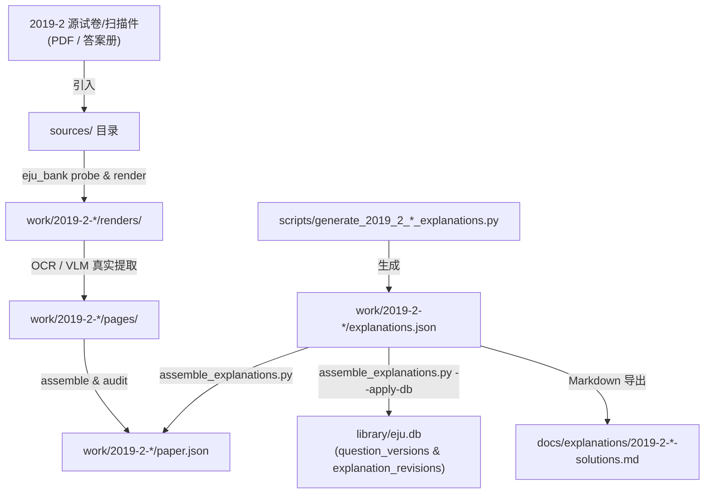

# EJU 2019-2 (2019年第2回) 解析装配与真题入库实操指南

## 1. 架构总览

本套体系针对 **2019年第2回（2019-2）** 的全部理科（物理、化学、生物）与数学（Course 1、Course 2）试题，建立了标准 AST 数据结构与全自动装配管道。



---

## 2. 核心资产清单

### 2.1 详解数据文件
- `work/2019-2-math-c1/explanations.json`：文科数学（Course 1）4大問 8小問标准解析
- `work/2019-2-math-c2/explanations.json`：理科数学（Course 2）4大問 8小問标准解析
- `work/2019-2-science/explanations.json`：理综全科（物理19题、化学20题、生物18题）标准解析

### 2.2 详解生成脚本
- `scripts/generate_2019_2_math_c1_explanations.py`
- `scripts/generate_2019_2_math_c2_explanations.py`
- `scripts/generate_2019_2_science_explanations.py`

### 2.3 教学阅读版 Markdown 详解
- `docs/explanations/2019-2-math-c1-solutions.md`
- `docs/explanations/2019-2-math-c2-solutions.md`
- `docs/explanations/2019-2-physics-solutions.md`
- `docs/explanations/2019-2-chemistry-solutions.md`
- `docs/explanations/2019-2-biology-solutions.md`

---

## 3. 一键装配入库命令

当源试卷组装或发布入库后，执行下列命令即可将全量详解注入题库：

```bash
# 校验并生成装配映射
python scripts/assemble_explanations.py --session 2019-2

# 写入生产数据库 (library/eju.db)
python scripts/assemble_explanations.py --session 2019-2 --apply-db

# 更新 work 目录下的 paper.json
python scripts/assemble_explanations.py --session 2019-2 --update-paper-json
```
